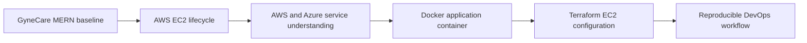

# DevOps GyneCare

GyneCare is an existing MERN hospital-management application progressively extended with cloud, containerization, and Infrastructure as Code practices. The original application remains in `client/` and `server/`; DevOps work is organized around it rather than replacing it.

## Project Overview

GyneCare is a hospital-management MERN application extended through a continuous DevOps learning path: AWS EC2, cloud-service comparison, Docker, and Terraform. The original application is preserved in `client/` and `server/`.

## Existing MERN Application

- `client/`: React 19, TypeScript, Vite, TanStack Router, and Tailwind CSS
- `server/`: Node.js, Express, Mongoose, MongoDB, and the REST API
- Backend health endpoint: `GET /api/health`
- Development frontend: `http://localhost:5173`
- Development backend: `http://localhost:5000`
- Environment values: `server/.env.example`

For complete application architecture, see [SYSTEM_ARCHITECTURE.md](SYSTEM_ARCHITECTURE.md) and [ARCHITECTURE_EXPLAINED.md](ARCHITECTURE_EXPLAINED.md).

## DevOps Objectives

- Apply a real EC2 lifecycle to the existing application.
- Understand AWS and Azure service categories without claiming unnecessary deployments.
- Build and validate the required Python Docker application.
- Define bounded, secure EC2 infrastructure with Terraform.
- Keep implementation, validation, evidence, security, cost, and cleanup traceable.

## Assignment Roadmap

| Assignment | Topic | Detailed documentation | Implementation | Validation | Evidence | Status |
|---|---|---|---|---|---|---|
| 1 | MERN baseline | Existing source and architecture | [Application docs](SYSTEM_ARCHITECTURE.md) | Local setup commands | Not applicable | DOCUMENTED |
| 2 | AWS EC2 | [Assignment 2 README](docs/assignments/assignment-2-aws-ec2/README.md) | `infrastructure/terraform/aws-ec2/` | EC2 and `/api/health` checks | [A2 register](evidence/assignment-2/README.md) | CONFIGURATION READY |
| 3 | AWS/Azure services | [Assignment 3 README](docs/assignments/assignment-3-cloud-services/README.md) | Service designs in README | Service-specific checks if executed | [A3 register](evidence/assignment-3/README.md) | DOCUMENTED |
| 4 | Docker | [Assignment 4 README](docs/assignments/assignment-4-docker/README.md) | `docker/python-app/` | Docker lifecycle commands | [A4 register](evidence/assignment-4/README.md) | REQUIRES TOOLING |
| 5 | Terraform IaC | [Assignment 5 README](docs/assignments/assignment-5-terraform/README.md) | `infrastructure/terraform/aws-ec2/` | `fmt`, `validate`, and reviewed `plan` | [A5 register](evidence/assignment-5/README.md) | REQUIRES TOOLING |

## DevOps Progression



## Repository Structure

| Area | Purpose |
|---|---|
| `docs/assignments/` | Complete source-of-truth README for each assignment |
| `docs/architecture/` | Existing and target architecture diagrams |
| `docs/security/` | Secret, access, network, and state protection guidance |
| `docs/troubleshooting/` | Cross-assignment potential failure modes |
| `docker/python-app/` | Mandatory Python Docker application |
| `infrastructure/terraform/aws-ec2/` | Terraform EC2 configuration |
| `evidence/` | Short registers for actual implementation and validation artifacts |
| `scripts/` | Reserved for reproducible operational helpers when needed |

## Local Setup

Prerequisites: Node.js 18+, npm, MongoDB, and a configured `server/.env`.

```bash
cp server/.env.example server/.env
cd server && npm install && npm run dev
```

In another terminal:

```bash
cd client && npm install && npm run dev
```

The default database is `mongodb://127.0.0.1:27017/hospitalDB`. Keep real values in ignored environment files only. See [setup guidance](docs/setup/README.md).

## Assignment Documentation

- [Assignment 2 - AWS EC2](docs/assignments/assignment-2-aws-ec2/README.md)
- [Assignment 3 - AWS and Azure Cloud Services](docs/assignments/assignment-3-cloud-services/README.md)
- [Assignment 4 - Docker](docs/assignments/assignment-4-docker/README.md)
- [Assignment 5 - Terraform](docs/assignments/assignment-5-terraform/README.md)

## Validation

```bash
npm run build
npm run typecheck
npm run check
curl http://localhost:5000/api/health
```

The commands above require dependencies and MongoDB where applicable. Actual results are tracked in the assignment evidence registers; unavailable tools or services remain explicitly marked.

## Security, Cost, and Cleanup

- [Security policy](docs/security/security.md)
- [Cost management](docs/cost-management.md)
- [Implementation status](docs/DEVOPS-IMPLEMENTATION-STATUS.md)
- [Troubleshooting](docs/troubleshooting/README.md)

AWS credentials, SSH keys, `.env` files, Docker secrets, and Terraform state must never be committed. Cloud resources are configuration-ready until they have real execution evidence.

## Evidence, Git, and Traceability

- [Git history](docs/git-history.md)
- [Evidence index](evidence/README.md)

Each assignment README maps requirement -> repository file -> implementation -> validation -> evidence -> status. No live cloud result, screenshot, metric, endpoint, or commit hash is recorded until it exists.
