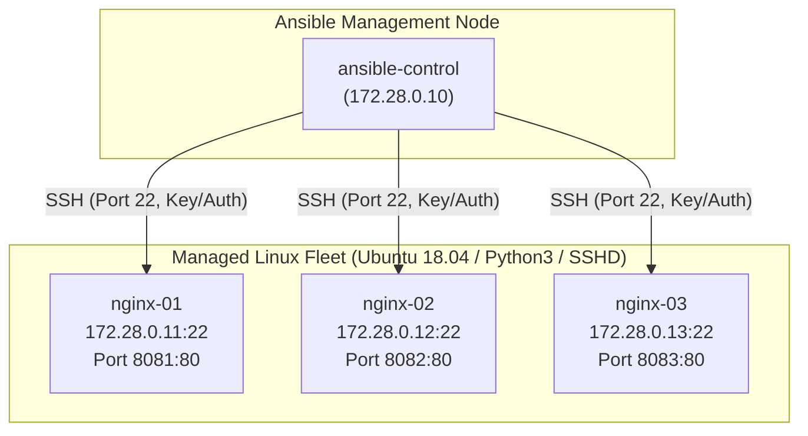

# Ansible Multi-Server Configuration Management Lab (Assignment 8)

This directory contains the production-grade Ansible automation assets and reproducible Docker-based multi-host testbed for **Assignment No. 8 (Part B: Automated Installation & Configuration of Nginx Web Server)**.

---

## 1. Directory Structure

```
ansible/assignment-08/
├── README.md                          # Implementation and execution guide
├── docker-compose.ansible-lab.yaml    # 4-node containerized testbed (1 control + 3 targets)
├── ansible.cfg                        # Ansible engine configuration
├── inventory.ini                      # INI inventory defining the [webservers] fleet
├── install-nginx.yml                  # Playbook deploying Nginx & GyneCare portal
└── files/
    └── index.html                     # Customized GyneCare hospital portal landing page
```

---

## 2. Laboratory Architecture



---

## 3. Quickstart & Execution Procedure

### Step 1: Launch the 4-Node Testbed
```bash
docker compose -f docker-compose.ansible-lab.yaml up -d
```

### Step 2: Access the Control Node
```bash
docker exec -it ansible_control_node bash
```

### Step 3: Test Fleet Connectivity (Ping)
```bash
ansible all -i inventory.ini -m ping
```
*Expected response: All three nodes return `SUCCESS => {"changed": false, "ping": "pong"}`.*

### Step 4: Dry-Run / Check Mode
```bash
ansible-playbook -i inventory.ini install-nginx.yml --check
```

### Step 5: Execute Automated Deployment (First Run)
```bash
ansible-playbook -i inventory.ini install-nginx.yml
```
*Notice: `changed=3` on all hosts as packages are installed, services enabled, and pages deployed.*

### Step 6: Verify Idempotency (Second Run)
```bash
ansible-playbook -i inventory.ini install-nginx.yml
```
*Notice: `changed=0` across all hosts, proving state convergence without redundant operations.*

### Step 7: Verify Service Access from Host Browser / CLI
```bash
curl http://localhost:8081
curl http://localhost:8082
curl http://localhost:8083
```
Each endpoint renders the GyneCare Hospital Management System portal page configured via Ansible.
