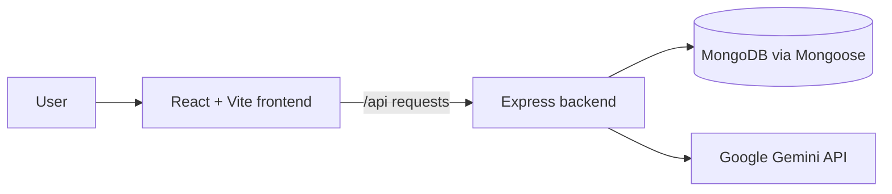
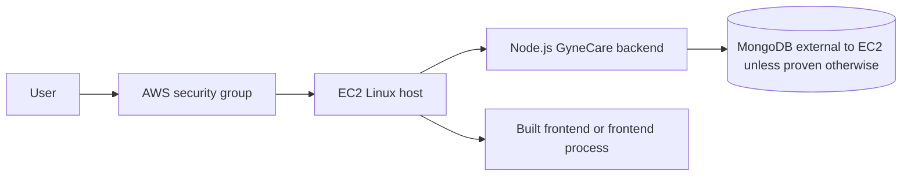
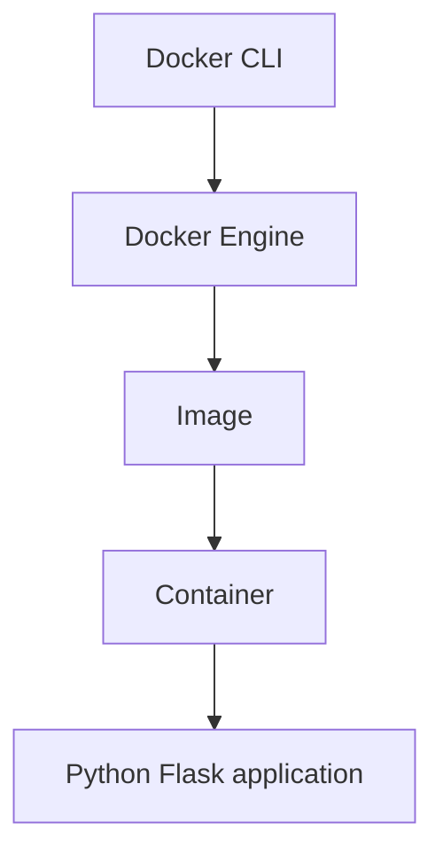
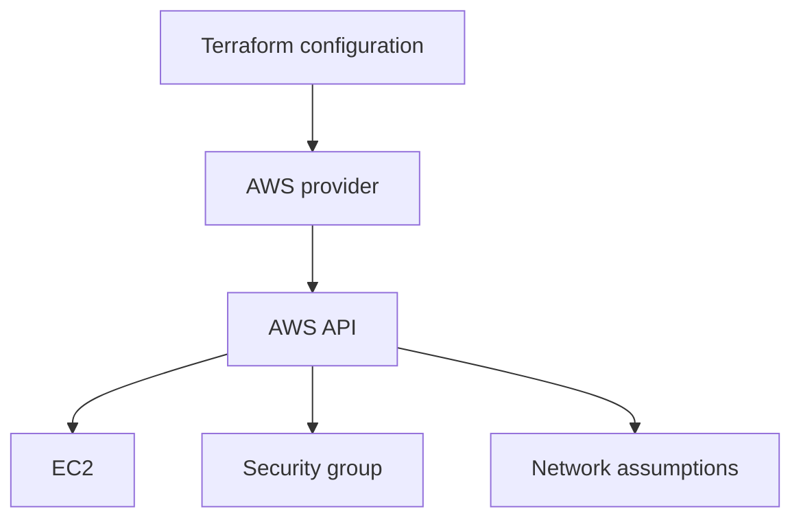

# Architecture

## Existing application

The development frontend proxies `/api` to the backend. The backend connects to MongoDB before listening and seeds baseline records.

## EC2 target architecture

This is a target architecture. It becomes deployment evidence only after an actual EC2 deployment is performed.

## Docker architecture

## Terraform architecture

Terraform resources are configuration-ready until `plan` or `apply` is actually executed.
