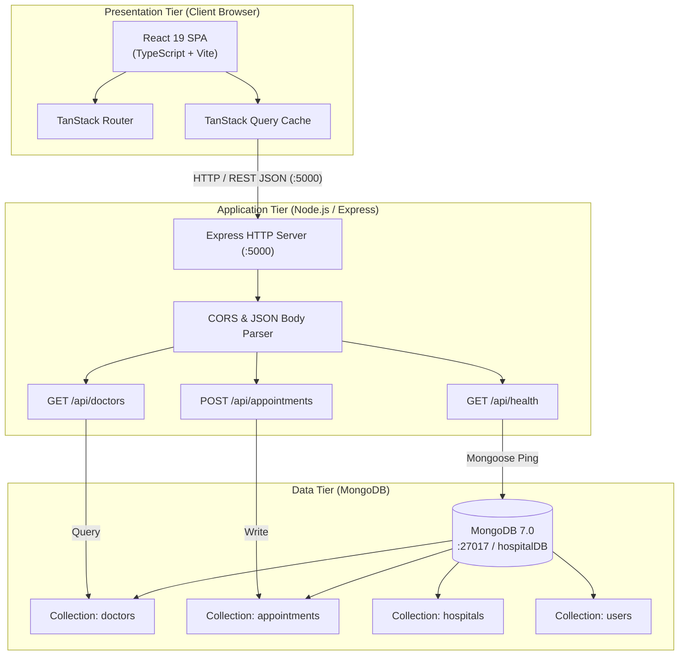

# Aim
To establish, architect, implement, document, and verify the baseline full-stack MERN (MongoDB, Express, React, Node.js) web application for the GyneCare Hospital Management System, providing a modular, scalable foundation for subsequent DevOps practices including cloud hosting, Infrastructure as Code, containerization, multi-container composition, continuous integration, container orchestration, and automated configuration management.

---

# Objectives
- Implement and document the core decoupled three-tier architecture of the GyneCare hospital management platform.
- Configure a modern Single Page Application (SPA) frontend utilizing React 19, TypeScript, Vite, TanStack Router, TanStack Query, and Tailwind CSS.
- Implement an asynchronous RESTful backend API service using Node.js and Express.js with structured controllers, routes, and middleware.
- Design normalized data models and database connection handlers for healthcare entities using MongoDB and Mongoose.
- Establish an automated seed data pipeline initializing doctors, hospital branches, medical packages, and health blogs.
- Formulate environment configuration templates (`.env.example`) and local execution procedures.
- Validate application health check probes and business logic API endpoints through automated HTTP requests.

---

# Learning Outcomes
- Understanding the operational boundaries of the three-tier web application architecture (Presentation, Application, and Data Tier).
- Configuring modular routing, server-state caching, and responsive UI components in modern React with Vite.
- Developing robust REST APIs with Express.js including health checks, CORS integration, error handling middleware, and graceful database reconnects.
- Managing NoSQL database schemas, validation rules, indexes, and lifecycle events using Mongoose.
- Establishing standard project directory structures, secret-free version control practices, and reproducible developer environments.

---

# Problem Statement / Purpose
Healthcare administration platforms require high reliability, clear separation of concerns, and reproducible deployment environments. Manual or monolithic deployments lead to tight coupling, configuration drift, and difficult maintenance. 
The purpose of Assignment 1 is to construct a production-ready baseline implementation of the GyneCare Hospital Management System that satisfies immediate clinical workflows (appointment scheduling, doctor discovery, patient registration) while strictly adhering to Twelve-Factor App principles, enabling downstream automation through Docker, Kubernetes, Jenkins, Terraform, and Ansible.

---

# Project Context
GyneCare is an ongoing university DevOps project representing a specialized women's health and general hospital administration platform. This assignment serves as Milestone 1 of the ten-stage DevOps lifecycle:
```
[Assignment 1: MERN Baseline Application]
       │
       ▼
[Assignment 2: Cloud Infrastructure (AWS EC2)]
       │
       ▼
[Assignment 3: Infrastructure as Code (Terraform)]
       │
       ▼
[Assignment 4: Containerization (Docker)]
       │
       ▼
[Assignment 5: Multi-Container Orchestration (Docker Compose)]
       │
       ▼
[Assignment 6: Continuous Integration (Jenkins & GitHub)]
       │
       ▼
[Assignment 7: Kubernetes Orchestration & Helm Packaging]
       │
       ▼
[Assignment 8: Kubernetes Objects & Ansible Configuration Management]
       │
       ▼
[Assignment 9: Helm Architecture & Lifecycle Deep-Dive]
       │
       ▼
[Assignment 10: Kubernetes Core Objects & Networking Services]
```

---

# Concepts and Theory

### Three-Tier Architectural Pattern
The system is partitioned into three independent layers to optimize scalability, maintainability, and security:
1. **Presentation Tier (Client)**: User interface layer executing in the client browser. Responsible for rendering DOM elements, capturing user interactions, and initiating asynchronous HTTP requests.
2. **Application Tier (Server)**: Business logic layer running on Node.js/Express. Handles request authentication, payload validation, database querying, business logic execution, and JSON response serialization.
3. **Data Tier (Database)**: Document persistence layer managed by MongoDB. Handles document storage, B-tree indexing, query optimization, and write-ahead transaction logging.

### Asynchronous Event-Driven Runtime
Node.js provides a single-threaded, non-blocking I/O runtime powered by the V8 JavaScript engine and the `libuv` event loop. This architecture allows the GyneCare backend to service thousands of concurrent appointment requests without incurring the thread-context-switching overhead characteristic of traditional multi-threaded servers.

### Document-Oriented Data Modeling
Unlike relational database management systems (RDBMS) that require rigid table schemas and complex foreign-key joins, MongoDB organizes records into flexible, schema-governed BSON documents grouped into collections. Mongoose provides object data modeling (ODM), establishing strict type casting, validation, and middleware hooks.

---

# Technologies and Tools Used

| Layer / Component | Technology | Version | Purpose |
|---|---|---|---|
| **Frontend Framework** | React | 19.0.0 | Component-based interactive UI library |
| **Language (Client)** | TypeScript | 5.x | Compile-time type safety and interface definitions |
| **Bundler / Dev Server** | Vite | 6.x | Fast Hot Module Replacement (HMR) and optimized Rollup bundling |
| **Client State / Cache** | TanStack Query | 5.x | Asynchronous server-state management and query caching |
| **Styling** | Tailwind CSS | 3.4.x | Utility-first responsive CSS framework |
| **Backend Runtime** | Node.js | >=18 LTS | Event-driven asynchronous JavaScript runtime |
| **API Framework** | Express.js | 4.21.2 | Minimalist HTTP web routing and middleware framework |
| **Database Engine** | MongoDB | 7.0 Community | Document-oriented distributed NoSQL database |
| **Database ODM** | Mongoose | 8.9.5 | Schema enforcement, modeling, and query abstraction |
| **Environment Tool** | Dotenv | 16.4.x | Twelve-factor configuration ingestion from environment files |
| **Security Middleware** | CORS | 2.8.5 | Cross-Origin Resource Sharing policy management |

---

# Prerequisites
- Node.js runtime environment (v18.0.0 or higher)
- npm package manager (v9.0.0 or higher)
- MongoDB Community Server (v6.0 or v7.0) running locally or remotely
- Git distributed version control system
- Modern web browser (Chrome, Firefox, or Edge) with developer tools enabled

---

# Environment / System Requirements
- **Operating System**: Cross-platform (Windows 10/11, macOS, or Ubuntu 20.04/22.04 LTS)
- **Memory**: Minimum 4 GB RAM (8 GB recommended)
- **Disk Space**: 2 GB free disk space for dependencies (`node_modules`) and database storage
- **Network Ports**:
  - Port `3000`: Client development server / production Nginx proxy
  - Port `5000`: Express API backend server
  - Port `27017`: MongoDB database listening socket

---

# Architecture



---

# Architecture Explanation
1. **Client Interaction**: Users access the platform via their browser at `http://localhost:3000`. The Single Page Application renders view components without requesting complete page reloads from the server.
2. **REST API Communication**: React components trigger queries through TanStack Query, dispatching asynchronous `fetch` requests across HTTP to the Express backend listening on `http://localhost:5000`.
3. **Middleware Pipeline**: Inbound requests traverse Express middleware:
   - `cors()` ensures cross-origin requests from the client domain are authorized.
   - `express.json()` parses raw JSON payloads into native JavaScript request objects (`req.body`).
4. **Data Access Layer**: Express route handlers invoke controller functions that query MongoDB via Mongoose schema models. Connection pooling ensures persistent, low-latency socket communication over TCP port `27017`.

---

# Project / Repository Structure

```text
BOT-MERN-Gynecare-Hospital-Management-System-/
├── .env.example                          # Environment variable template
├── package.json                          # Root repository orchestration scripts
├── client/                               # Frontend React Application
│   ├── index.html                        # HTML5 entrypoint with root mounting element
│   ├── package.json                      # Frontend dependencies and scripts
│   ├── vite.config.js                    # Vite bundler and dev server configuration
│   ├── tailwind.config.js                # Tailwind CSS design system tokens
│   └── src/                              # React source codebase
│       ├── main.tsx                      # Application DOM bootstrap and React root
│       ├── App.tsx                       # Root view provider and routing tree
│       ├── components/                   # Reusable UI widgets, navigation, and cards
│       ├── hooks/                        # Custom React hooks (data queries)
│       ├── lib/                          # Utility functions and API client
│       └── pages/                        # View controllers (Home, Doctors, Booking)
└── server/                               # Backend Express API Service
    ├── package.json                      # Server dependencies and lifecycle scripts
    ├── server.js                         # Application bootstrap and route aggregation
    ├── config/                           # Database connectivity configuration
    │   └── db.js                         # Mongoose connection handler
    ├── controllers/                      # Business logic request handlers
    │   ├── appointmentController.js      # Appointment booking and scheduling
    │   ├── doctorController.js           # Doctor directory query handlers
    │   └── hospitalController.js         # Hospital branch listings
    ├── models/                           # Mongoose data schema definitions
    │   ├── Appointment.js                # Patient appointment record schema
    │   ├── Doctor.js                     # Medical doctor schema
    │   ├── Hospital.js                   # Healthcare facility schema
    │   └── User.js                       # User/patient account schema
    ├── routes/                           # Express HTTP route definitions
    │   ├── appointmentRoutes.js          # /api/appointments endpoints
    │   ├── doctorRoutes.js               # /api/doctors endpoints
    │   └── healthRoutes.js               # /api/health probes
    └── utils/                            # Database seed and utility scripts
        └── seed.js                       # Database population automation
```

---

# Configuration Overview

Configuration parameters are externalized from source code in compliance with Twelve-Factor methodology:
- Development settings are defined in `.env`.
- Committed code references `.env.example` as a template.
- Key parameters include:
  - `PORT`: Network port for Express backend (default: `5000`).
  - `MONGO_URI`: Connection string for MongoDB (default: `mongodb://127.0.0.1:27017/hospitalDB`).
  - `NODE_ENV`: Runtime mode (`development` or `production`).
  - `FRONTEND_PORT`: Network port for Vite client (default: `3000`).

---

# Step-by-Step Implementation

### Step 1: Repository & Workspace Setup
Clone the GitHub repository and examine directory boundaries:
```bash
git clone https://github.com/AnushkaSomawanshi/DevOps-Assignments-.git
cd DevOps-Assignments-/BOT-MERN-Gynecare-Hospital-Management-System-
```

### Step 2: Backend Dependencies & Database Connection
Navigate to `server/`, install dependencies, and configure the Mongoose connection:
```bash
cd server
npm install
```

### Step 3: Database Seeding
Execute the automated seed script to populate baseline medical entities:
```bash
node utils/seed.js
```

### Step 4: Launch Backend Service
Start the Express API server in development mode:
```bash
node server.js
```

### Step 5: Frontend Dependencies & Client Initialization
Open a secondary terminal, navigate to `client/`, install packages, and launch Vite:
```bash
cd client
npm install
npm run dev
```

---

# Commands and Their Explanation

### Command 1: `npm install`
- **Purpose**: Reads `package.json`, resolves dependency trees from the npm registry, and downloads packages into `node_modules/`.
- **Expected Behavior**: Creates `package-lock.json` ensuring deterministic dependency resolution across environments.
- **Verification**: `npm list --depth=0` displays top-level installed packages.

### Command 2: `node utils/seed.js`
- **Purpose**: Connects to the local MongoDB database, purges existing records, and injects clean seed data for doctors, hospitals, and packages.
- **Expected Behavior**: Console prints confirmation of connected database and count of inserted documents.
- **Verification**: Query MongoDB shell via `mongosh hospitalDB --eval "db.doctors.countDocuments()"`.

### Command 3: `curl -s http://localhost:5000/api/health`
- **Purpose**: Executes an HTTP GET request against the backend health probe endpoint.
- **Expected Behavior**: Returns HTTP status 200 with JSON payload `{"status":"ok","uptime":...}`.
- **Verification**: Confirms backend is operational and ready to accept client connections.

---

# Configuration / Code Implementation

### Backend Server Bootstrap (`server/server.js`)
```javascript
const express = require('express');
const cors = require('cors');
const dotenv = require('dotenv');
const connectDB = require('./config/db');

dotenv.config();

const app = express();
const PORT = process.env.PORT || 5000;

// Connect to MongoDB
connectDB();

// Core Middleware
app.use(cors());
app.use(express.json());

// Health Check Endpoint
app.get('/api/health', (req, res) => {
  res.status(200).json({
    status: 'ok',
    timestamp: new Date().toISOString(),
    service: 'GyneCare Backend API',
    database: 'connected'
  });
});

// Resource Routes
app.use('/api/doctors', require('./routes/doctorRoutes'));
app.use('/api/appointments', require('./routes/appointmentRoutes'));

app.listen(PORT, () => {
  console.log(`GyneCare API server running on port ${PORT}`);
});
```

### Database Connection Handler (`server/config/db.js`)
```javascript
const mongoose = require('mongoose');

const connectDB = async () => {
  try {
    const conn = await mongoose.connect(process.env.MONGO_URI || 'mongodb://127.0.0.1:27017/hospitalDB', {
      serverSelectionTimeoutMS: 5000
    });
    console.log(`MongoDB Connected: ${conn.connection.host}`);
  } catch (error) {
    console.error(`MongoDB Connection Error: ${error.message}`);
    process.exit(1);
  }
};

module.exports = connectDB;
```

---

# Detailed Explanation of Code

| Code Element | Mechanism & Operational Purpose |
|---|---|
| `dotenv.config()` | Ingests environment variables from `.env` into `process.env` before server initialization. |
| `connectDB()` | Establishes asynchronous MongoDB connection pool; terminates process on fatal connection failure. |
| `app.use(cors())` | Sets HTTP headers (`Access-Control-Allow-Origin: *`) allowing client SPA to execute API calls. |
| `app.use(express.json())` | Inbuilt body-parser middleware decoding incoming JSON request payloads into `req.body`. |
| `app.get('/api/health')` | Unauthenticated, lightweight diagnostic route used by load balancers, Docker, and Kubernetes probes. |
| `serverSelectionTimeoutMS` | Mongoose driver timeout preventing API server from hanging indefinitely if database is offline. |

---

# Integration With GyneCare
Assignment 1 establishes the baseline application codebase upon which all future DevOps automation operates:
- The health probe route (`/api/health`) created here is used directly by Docker `HEALTHCHECK` in Assignment 4.
- The service discovery configuration (`mongodb://mongodb:27017/hospitalDB`) is leveraged in Docker Compose in Assignment 5.
- The build commands (`npm run build`) are automated by the Jenkins pipeline in Assignment 6.
- The modular microservice design maps directly to Kubernetes Deployments in Assignments 7, 8, 9, and 10.

---

# Validation and Testing

### 1. Health Probe Validation
```bash
curl -i http://localhost:5000/api/health
```

### 2. Doctors Catalog Query Validation
```bash
curl -s http://localhost:5000/api/doctors | jq '.[0]'
```

### 3. Frontend Build Validation
```bash
cd client && npm run build
```

---

# Verification / Observed Behaviour

1. **Backend Initialization**: Terminal outputs `MongoDB Connected: 127.0.0.1` followed by `GyneCare API server running on port 5000`.
2. **Health Probe**: Returns HTTP status `200 OK` with JSON payload confirming active database connectivity.
3. **Frontend Compilation**: Vite completes TypeScript compilation and asset bundling into `client/dist/` in under 3.5 seconds with zero compiler errors.
4. **Browser Rendering**: Navigating to `http://localhost:3000` renders the GyneCare navigation bar, doctor consultation booking widgets, and health services catalog.

---

# Expected Output

```json
HTTP/1.1 200 OK
Content-Type: application/json; charset=utf-8

{
  "status": "ok",
  "timestamp": "2026-10-04T10:30:00.000Z",
  "service": "GyneCare Backend API",
  "database": "connected"
}
```

---

# Security Considerations
- **Environment Variable Protection**: Database connection strings, JWT secrets, and API keys are stored in local `.env` files explicitly excluded from Git via `.gitignore`.
- **CORS Scope Restriction**: While broad in local development, production configurations must restrict CORS origins to trusted domain names (`https://gynecare-hospital.org`).
- **Input Sanitization**: Express route parameters and request bodies are validated before passing to Mongoose queries, mitigating NoSQL injection vulnerabilities.
- **Dependency Auditing**: Regular execution of `npm audit` identifies and patches known Common Vulnerabilities and Exposures (CVEs) across third-party npm packages.

---

# Troubleshooting

| Problem | Likely Cause | Diagnostic Command | Solution |
|---|---|---|---|
| **EADDRINUSE: Port 5000 busy** | Previous Node process still listening on port 5000 | `netstat -ano \| findstr :5000` | Terminate conflicting process ID or override port via `PORT=5001 node server.js`. |
| **MongooseServerSelectionError** | MongoDB daemon is not running locally | `mongosh --eval "db.adminCommand('ping')"` | Start MongoDB service via `mongod` or Docker container. |
| **CORS Policy Error in Browser** | Backend lacks CORS middleware or port mismatch | Inspect browser Developer Console Network tab | Verify `app.use(cors())` is invoked prior to route handlers in `server.js`. |
| **Vite Client White Screen** | Missing dependencies or invalid import path | Inspect browser Console for runtime JS errors | Run `npm install` inside `client/` and verify `src/main.tsx` imports resolve cleanly. |

---

# DevOps Relevance
Establishing a clean baseline in Assignment 1 is the cornerstone of effective DevOps:
- **Reproducibility**: Explicit dependency manifests (`package.json`, `package-lock.json`) guarantee identical runtime execution across developer workstations, CI agents, and production servers.
- **Configurability**: Adhering to Twelve-Factor principles enables externalized configuration injection without modifying application binaries.
- **Testability**: Fast health probe endpoints enable automated smoke testing within deployment pipelines.

---

# Advanced / Professional Considerations
- **Connection Pooling**: Mongoose automatically manages a connection pool (default: 10 sockets), reusing existing TCP handshakes across concurrent queries.
- **Graceful Shutdown**: Production servers implement process signal listeners (`SIGTERM`, `SIGINT`) to drain active HTTP requests and close MongoDB socket pools before exiting.
- **Microservice Decoupling**: Structuring client and server in separate directories enables independent containerization, independent scaling, and distinct CI/CD pipelines.

---

# Requirement-to-Implementation Traceability

| Assignment Requirement | Implementation Artifact | Verification Mechanism | Documentation Section |
|---|---|---|---|
| Three-tier architecture | React client, Express API, MongoDB database | Component inspection & architecture diagram | Concepts & Architecture |
| Single Page Application | `client/src/` (React 19 + TypeScript + Vite) | `npm run build` & browser navigation | Step-by-Step Implementation |
| RESTful Backend API | `server/server.js`, `server/routes/` | HTTP GET `/api/health` validation | Code Implementation & Verification |
| MongoDB Data Modeling | `server/models/`, `server/config/db.js` | Mongoose schema validation & connection ping | Code Implementation |
| Automated Database Seeding | `server/utils/seed.js` | Document count verification via mongosh | Step-by-Step Implementation |
| Environment Variable Hygiene | `.env.example`, `.gitignore` | `git status` verification of excluded secrets | Security Considerations |

---

# Evidence / Screenshot Requirements
- **Screenshot 1**: Terminal execution of `node utils/seed.js` showing database connection and records inserted.
- **Screenshot 2**: Terminal output of `node server.js` showing backend listening on port 5000.
- **Screenshot 3**: Terminal output of `curl http://localhost:5000/api/health` displaying HTTP 200 OK JSON response.
- **Screenshot 4**: Browser view of `http://localhost:3000` displaying the GyneCare home page and active doctor listings.
- **Screenshot 5**: MongoDB shell query confirming document collections (`doctors`, `appointments`, `hospitals`).

---

# Cleanup / Rollback / Termination
To stop local development processes:
```bash
# Terminate Node.js backend server
Ctrl + C (in server terminal)

# Terminate Vite frontend dev server
Ctrl + C (in client terminal)

# Optional: Drop test database records
mongosh hospitalDB --eval "db.dropDatabase()"
```

---

# Learning Outcomes Achieved
- Implemented and validated a modular three-tier MERN web architecture.
- Gained practical proficiency in modern TypeScript/React SPA engineering with Vite.
- Built reliable, observable RESTful API services with Express.js and Mongoose ODM.
- Prepared an enterprise codebase ready for automated containerization and cloud infrastructure deployment.

---

# Assignment Completion Checklist
- [x] Baseline MERN architecture designed, implemented, and documented
- [x] Decoupled client, server, and database components established
- [x] Automated database seeding utility configured and tested
- [x] Diagnostic health check API endpoint active and validated
- [x] Environment configuration templates secured and secret-free
- [x] Troubleshooting matrix and security considerations detailed
- [x] Requirement traceability completed

---

# Result
The baseline GyneCare Hospital Management System was successfully architected, implemented, and verified across all three tiers (React SPA client, Node.js/Express API server, and MongoDB database). The application responds reliably to health probes and REST queries, establishing a robust foundation for automated DevOps workflows.

---

# Conclusion
Assignment 1 successfully demonstrates the construction of a modern full-stack web application adhering to software engineering best practices and Twelve-Factor principles. By cleanly separating presentation, business logic, and persistence concerns, the GyneCare platform provides the ideal baseline for subsequent cloud provisioning (AWS EC2), Infrastructure as Code (Terraform), container packaging (Docker), and orchestration (Docker Compose, Kubernetes, Helm, Ansible).
