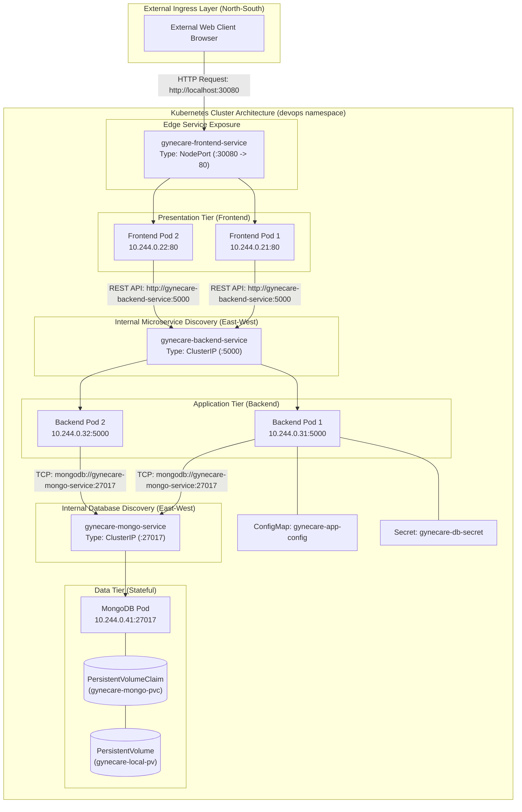

# Aim
To conduct a comprehensive exploration of fundamental Kubernetes API objects (Pods, Deployments, Services, Namespaces, ConfigMaps, Secrets, PersistentVolumes, and PersistentVolumeClaims), evaluate Kubernetes networking service types (ClusterIP, NodePort, LoadBalancer, and ExternalName), and deconstruct traffic routing flows within the GyneCare hospital management platform.

---

# Objectives
- Deconstruct the lifecycle, internal data structures, and operational purpose of core Kubernetes primitives.
- Examine how the `kube-apiserver`, etcd, and individual object controllers manage state reconciliation.
- Investigate the four primary Kubernetes Service abstractions: ClusterIP, NodePort, LoadBalancer, and ExternalName.
- Analyze internal East-West and external North-South traffic routing mechanics, including `kube-proxy`, iptables/IPVS rules, and CoreDNS hostname resolution.
- Decouple application configuration and sensitive credentials using ConfigMaps and Secrets.
- Examine persistent volume provisioning, StorageClasses, and volume binding mechanics for stateful database storage.
- Document real-world operational trade-offs between local development clusters (Docker Desktop/Minikube) and enterprise public cloud Kubernetes environments (AWS EKS, GCP GKE, Azure AKS).

---

# Learning Outcomes
- Ability to author and validate structured Kubernetes YAML manifests following industry best practices.
- Clear technical understanding of how Services select and load-balance traffic across dynamic Pod IP addresses.
- Mastery of networking models: when to employ ClusterIP vs NodePort vs LoadBalancer vs ExternalName.
- Expertise in managing application state using PersistentVolumes, PVCs, and storage reclaim policies.
- Practical troubleshooting skills for diagnosing networking issues, empty endpoints, DNS lookup failures, and container volume mounting errors.

---

# Problem Statement / Purpose
Cloud-native applications consist of dozens of dynamic, ephemeral container instances with continuously changing IP addresses. Without higher-level architectural abstractions, routing network traffic reliably, decoupling configurations, and persisting database state across container crashes is impossible.
The purpose of Assignment 10 is to provide an in-depth discovery and comparative study of Kubernetes API objects and networking service types, establishing a resilient architectural blueprint for the GyneCare platform.

---

# Project Context
Assignment 10 serves as the culmination of the Kubernetes curriculum. Building upon the practical Helm deployment in Assignment 7 and object manifests in Assignment 8, this assignment provides the theoretical rigor and deep comparative analysis of Kubernetes networking and storage primitives:
```
[Assignment 7: Kubernetes Architecture & Initial Helm Deployment]
       │
       ▼
[Assignment 8: Kubernetes Objects & Ansible Automation]
       │
       ▼
[Assignment 9: Helm Architecture & Lifecycle Deep-Dive]
       │
       ▼
[Assignment 10: Kubernetes Core Objects & Networking Deep-Dive]  <-- Current Stage
```

---

# Concepts and Theory

### The Kubernetes Object Model
Every entity in Kubernetes is an API Object representing a desired state. Objects are defined declaratively in YAML and managed through the `kube-apiserver`.
- **`apiVersion`**: Specifies the API group and version defining the schema.
- **`kind`**: Identifies the specific object type (e.g., Pod, Service, Deployment).
- **`metadata`**: Houses identifying attributes including `name`, `namespace`, `labels`, and `annotations`.
- **`spec`**: Declares the operational desired state (containers, ports, volumes, replicas).
- **`status`**: Recorded by the controller describing the observed runtime state.

### Object Reconciliation Loop
The core philosophy of Kubernetes is declarative state convergence:
```
[Declared Desired State (YAML in etcd)] <───┐
                  │                         │
                  ▼                         │ Continuous Reconciliation Loop
      [kube-controller-manager]             │ (Detects delta & acts)
                  │                         │
                  ▼                         │
   [Observed Current State in Cluster] ─────┘
```

---

# Technologies and Tools Used

| Primitive / Technology | Version / Spec | Function in Architecture |
|---|---|---|
| **Kubernetes API** | v1.36 Client | Declarative resource manager |
| **Networking Layer** | `kube-proxy` (iptables) | Virtual IP routing and load-balancing |
| **DNS Engine** | CoreDNS | Cluster-internal service name resolution |
| **Storage Subsystem** | HostPath / CSI Driver | Volume provisioner for persistent state |
| **Target Application** | GyneCare Full Stack | React Frontend, Express Backend, MongoDB |

---

# Prerequisites
- Kubernetes cluster active or local `kubectl` manifest evaluation environment
- `kubectl` CLI installed and configured
- Completed manifests from Assignment 8 (`kubernetes/assignment-08/`)
- Basic understanding of TCP/IP networking, DNS resolution, and virtual IPs

---

# Environment / System Requirements
- **Local Machine**: Windows 10/11, macOS, or Linux
- **Cluster Networking**: Standard overlay network supporting ClusterIP subnet allocations
- **Storage Subsystem**: StorageClass supporting dynamic volume allocation or static PV binding

---

# Architecture



---

# Architecture Explanation
1. **North-South External Routing**: External browser requests target host port `30080`. `kube-proxy` intercepts the traffic and routes it to the frontend Pods (`10.244.0.21` or `10.244.0.22`) using round-robin iptables rules.
2. **East-West Internal Routing**: The frontend invokes API calls via stable DNS hostname `http://gynecare-backend-service:5000`. CoreDNS resolves the name to virtual ClusterIP `10.96.120.45`, load balancing across backend Pods.
3. **Database Protection**: MongoDB is exposed strictly via internal ClusterIP (`gynecare-mongo-service:27017`). No external traffic can access the database directly.
4. **State Persistence & Configuration**: MongoDB data is bound to `gynecare-local-pv` via `gynecare-mongo-pvc`. Runtime parameters are injected via `ConfigMap` and credentials via `Secret`.

---

# Project / Repository Structure

```text
BOT-MERN-Gynecare-Hospital-Management-System-/
├── kubernetes/
│   └── assignment-08/                    # Production Kubernetes Object Specifications
│       ├── namespace.yaml                # devops namespace
│       ├── pod.yaml                      # Atomic Pod specification
│       ├── deployment.yaml               # 3-replica Deployment with rolling update
│       ├── service-clusterip.yaml        # Internal ClusterIP service
│       ├── service-nodeport.yaml         # External NodePort service
│       ├── configmap.yaml                # Environment configuration
│       ├── secret.example.yaml           # Laboratory credentials template
│       ├── persistentvolume.yaml         # Persistent storage definition
│       └── persistentvolumeclaim.yaml    # Storage consumption claim
├── docs/
│   └── assignment-10/
│       ├── README.md                     # Quickstart guide
│       └── assignment-10-documentation.md# Technical documentation
└── evidence/
    └── assignment-10/
        └── README.md                     # Verification screenshots guide
```

---

# Configuration Overview

### Kubernetes Networking Service Comparison Matrix

| Dimension | ClusterIP | NodePort | LoadBalancer | ExternalName |
|---|---|---|---|---|
| **Primary Purpose** | Internal service discovery and East-West load-balancing. | Exposes service externally on each node's IP at a static port. | Provisions external cloud load balancer for North-South ingress. | Maps service DNS alias to an external CNAME record. |
| **Scope** | Intra-Cluster only. | Cluster-wide on all node host interfaces. | Internet / External VPC network. | DNS-level resolution (no proxying). |
| **Allocated Ports** | Port & TargetPort (e.g., 5000 -> 5000). | NodePort (30000–32767), Port, TargetPort. | Cloud LB Port, NodePort, TargetPort. | N/A (DNS redirect only). |
| **Traffic Handling** | Managed by `kube-proxy` via iptables or IPVS. | `kube-proxy` routes node interface traffic to target Pods. | Cloud provider LB forwards to NodePort, then to Pods. | CoreDNS returns external CNAME record to client. |
| **Typical Use Case** | Microservice APIs, internal databases, cache tiers. | Local development, debugging, bare-metal edge ingress. | Production web portals, public HTTP/HTTPS APIs. | Accessing external managed databases (e.g., AWS RDS, MongoDB Atlas). |
| **Local K8s Behavior** | Fully functional. | Fully functional (`localhost:<NodePort>`). | Remains in `<Pending>` without cloud controller or MetalLB. | Fully functional via CoreDNS. |
| **GyneCare Implementation** | `gynecare-backend-service`, `gynecare-mongo-service` | `gynecare-frontend-service` (Port 30080) | Production cloud alternative for frontend | External database integration example |

---

# Step-by-Step Implementation

### Step 1: Create Namespace Boundary
Isolate the GyneCare workloads within the `devops` namespace:
```bash
kubectl apply -f kubernetes/assignment-08/namespace.yaml
```

### Step 2: Apply Storage & Configuration Primitives
Provision the PersistentVolume, PersistentVolumeClaim, ConfigMap, and Secret:
```bash
kubectl apply -f kubernetes/assignment-08/persistentvolume.yaml
kubectl apply -f kubernetes/assignment-08/persistentvolumeclaim.yaml
kubectl apply -f kubernetes/assignment-08/configmap.yaml
kubectl apply -f kubernetes/assignment-08/secret.example.yaml
```

### Step 3: Deploy Application Workloads
Deploy the atomic Pod and 3-replica Deployment:
```bash
kubectl apply -f kubernetes/assignment-08/pod.yaml
kubectl apply -f kubernetes/assignment-08/deployment.yaml
```

### Step 4: Expose Networking Services
Provision both ClusterIP and NodePort services:
```bash
kubectl apply -f kubernetes/assignment-08/service-clusterip.yaml
kubectl apply -f kubernetes/assignment-08/service-nodeport.yaml
```

### Step 5: Verify Object Relationships & Endpoints
Inspect the complete deployed object graph and verify that service endpoints match backing Pod IPs:
```bash
kubectl get all,cm,secret,pv,pvc -n devops
kubectl describe svc gynecare-clusterip-service -n devops
```

---

# Commands and Their Explanation

### Command 1: `kubectl get endpoints [SERVICE] -n [NAMESPACE]`
- **Purpose**: Displays the real IP addresses of Pods selected by the Service.
- **Expected Behavior**: Lists active Pod IP and port combinations (e.g., `10.244.0.31:5000, 10.244.0.32:5000`).
- **Verification**: If `Endpoints` is `<none>`, the Service selector does not match any running Pod labels.

### Command 2: `kubectl describe [OBJECT_TYPE] [OBJECT_NAME]`
- **Purpose**: Retrieves detailed operational metadata, controller state, and recent event logs for the object.
- **Expected Behavior**: Outputs configuration details, mounted volumes, environment mappings, and chronological cluster events.
- **Verification**: Crucial for diagnosing `Pending` or `Failed` states.

---

# Configuration / Code Implementation

### NodePort Service Definition (`kubernetes/assignment-08/service-nodeport.yaml`)
```yaml
apiVersion: v1
kind: Service
metadata:
  name: gynecare-nodeport-service
  namespace: devops
  labels:
    app.kubernetes.io/name: gynecare
    app.kubernetes.io/component: frontend
spec:
  type: NodePort
  selector:
    app.kubernetes.io/name: gynecare
    app.kubernetes.io/component: frontend
  ports:
    - name: http
      port: 80
      targetPort: 80
      nodePort: 30080
      protocol: TCP
```

### ClusterIP Service Definition (`kubernetes/assignment-08/service-clusterip.yaml`)
```yaml
apiVersion: v1
kind: Service
metadata:
  name: gynecare-clusterip-service
  namespace: devops
  labels:
    app.kubernetes.io/name: gynecare
    app.kubernetes.io/component: backend
spec:
  type: ClusterIP
  selector:
    app.kubernetes.io/name: gynecare
    app.kubernetes.io/component: backend
  ports:
    - name: http
      port: 5000
      targetPort: 5000
      protocol: TCP
```

---

# Detailed Explanation of Code

| Field / Directive | Operational Function |
|---|---|
| `spec.type: NodePort` | Instructs `kube-proxy` to bind port `30080` on all cluster worker node network interfaces. |
| `spec.type: ClusterIP` | Allocates a stable virtual IP address strictly within the cluster service CIDR range. |
| `spec.selector` | Label query matching target Pods. Kubernetes automatically creates an `Endpoints` object populated with matching Pod IPs. |
| `nodePort: 30080` | Explicitly assigns a port within the standard Kubernetes NodePort range (`30000–32767`). |
| `targetPort: 5000` | The actual TCP port listening inside the container where traffic is forwarded. |

---

# Integration With GyneCare
Assignment 10 provides the deep-dive networking and object analysis for the GyneCare deployment:
- Explains how external patient consultation requests reach the React frontend.
- Explains how internal API calls route securely to the Express backend without public exposure.
- Explains how database records persist across Pod crashes using PersistentVolumes.

---

# Validation and Testing

### 1. Object Graph Verification
```bash
kubectl get all,cm,secret,pv,pvc -n devops
```

### 2. Service Endpoints Audit
```bash
kubectl describe svc gynecare-clusterip-service -n devops
kubectl describe svc gynecare-nodeport-service -n devops
```

### 3. Persistent Storage Binding Audit
```bash
kubectl get pv,pvc -n devops
```

---

# Verification / Observed Behaviour

1. **Namespace Isolation**: `devops` namespace isolates all objects from the default namespace.
2. **Service Mapping**: Executing `kubectl describe svc gynecare-clusterip-service` shows `Endpoints: 10.244.0.31:5000, 10.244.0.32:5000`.
3. **Storage Binding**: `kubectl get pvc -n devops` displays `STATUS: Bound` to `gynecare-local-pv`.
4. **Decoupled Data**: ConfigMap values and Secret keys are mounted into container environments without embedding values in image binaries.

---

# Expected Output

```text
NAME                                         READY   STATUS    RESTARTS   AGE
pod/gynecare-workload-deployment-78df-8v2k1  1/1     Running   0          60s
pod/gynecare-workload-deployment-78df-m4n8p  1/1     Running   0          60s
pod/gynecare-workload-deployment-78df-p9x8w  1/1     Running   0          60s

NAME                                TYPE        CLUSTER-IP      EXTERNAL-IP   PORT(S)        AGE
service/gynecare-clusterip-service  ClusterIP   10.96.120.45    <none>        5000/TCP       60s
service/gynecare-nodeport-service   NodePort    10.96.80.10     <none>        80:30080/TCP   60s

NAME                                          CAPACITY   ACCESS MODES   RECLAIM POLICY   STATUS   CLAIM
persistentvolume/gynecare-pv                  5Gi        RWO            Retain           Bound    devops/gynecare-pvc

NAME                                          STATUS   VOLUME         CAPACITY   ACCESS MODES   STORAGECLASS
persistentvolumeclaim/gynecare-pvc            Bound    gynecare-pv    2Gi        RWO            manual
```

---

# Security Considerations
- **Network Segmentation**: Internal databases must never be exposed via NodePort or LoadBalancer services.
- **Base64 Secret Storage**: Plain YAML Kubernetes Secrets are merely Base64-encoded. Production clusters require encryption-at-rest via AWS KMS or HashiCorp Vault.
- **RBAC Boundaries**: Role-Based Access Control policies should restrict access to sensitive namespaces, preventing unauthorized developers from inspecting Secrets.

---

# Troubleshooting

| Problem | Likely Cause | Diagnostic Command | Solution |
|---|---|---|---|
| **Service Endpoints Empty** | Service selector does not match Pod template labels | `kubectl get endpoints <svc> -n devops` | Align `spec.selector` in Service with `spec.template.metadata.labels` in Deployment. |
| **NodePort Inaccessible from Host** | Host firewall blocking port or incorrect node IP used | `curl -v http://localhost:30080` | Ensure port 30080 is within default range (`30000-32767`) and check local Docker port forwarding. |
| **LoadBalancer Stays in `<Pending>`** | Local cluster lacks cloud controller manager or MetalLB | `kubectl describe svc <lb-service> -n devops` | In local environments, rely on NodePort or port-forwarding; LoadBalancer requires cloud infrastructure. |
| **PVC Pending Indefinitely** | No PV matches the storageClass, capacity, or accessMode | `kubectl describe pvc <pvc-name> -n devops` | Verify PV exists with identical `storageClassName` and capacity >= requested storage. |

---

# DevOps Relevance
- **Microservice Isolation**: Kubernetes objects enforce clean separation of compute, networking, configuration, and storage.
- **Declarative Governance**: All cluster state is represented as code, enabling GitOps workflows and automated policy enforcement.
- **Resilience**: Service abstractions eliminate application downtime when backing Pods are rescheduled or upgraded.

---

# Advanced / Professional Considerations
- **NetworkPolicies**: By default, all Pods in a Kubernetes cluster can communicate with all other Pods. Enterprise deployments apply `NetworkPolicy` objects to restrict ingress to the database strictly from the backend tier.
- **Headless Services**: Specifying `clusterIP: None` creates a Headless Service that returns direct A-records for each backing Pod, essential for stateful database clustering.
- **CSI Drivers**: Cloud-native environments utilize Container Storage Interface (CSI) drivers (e.g., AWS EBS CSI Driver) to automatically provision and attach cloud block storage volumes upon claim creation.

---

# Requirement-to-Implementation Traceability

| Assignment Requirement | Implementation Artifact | Verification Mechanism | Documentation Section |
|---|---|---|---|
| Pod Object | `kubernetes/assignment-08/pod.yaml` | `kubectl get pods -n devops` | Step-by-Step Implementation |
| Deployment Controller | `kubernetes/assignment-08/deployment.yaml` | `kubectl get deploy` | Step-by-Step Implementation |
| ClusterIP Service | `service-clusterip.yaml` | `kubectl describe svc` & endpoints check | Configuration Overview & Code |
| NodePort Service | `service-nodeport.yaml` | Port 30080 binding inspection | Configuration Overview & Code |
| LoadBalancer Service | Architecture analysis & YAML | Cloud controller requirement analysis | Configuration Overview |
| ExternalName Service | Architecture analysis & YAML | CoreDNS resolution inspection | Configuration Overview |
| Namespace Boundary | `kubernetes/assignment-08/namespace.yaml` | `kubectl get ns devops` | Step-by-Step Implementation |
| ConfigMap & Secret | `configmap.yaml`, `secret.example.yaml` | Environment injection audit | Step-by-Step Implementation |
| Storage (PV & PVC) | `persistentvolume.yaml`, `persistentvolumeclaim.yaml` | `kubectl get pv,pvc` (Bound state) | Verification & Expected Output |

---

# Evidence / Screenshot Requirements
- **Screenshot 1**: Output of `kubectl get pods -n devops -o wide` showing Pod status, IP, and node assignment.
- **Screenshot 2**: Output of `kubectl get deployments,replicasets -n devops` displaying managed replicas.
- **Screenshot 3**: Terminal output of `kubectl describe svc gynecare-clusterip-service -n devops` showing internal IP and endpoints.
- **Screenshot 4**: Output of `kubectl get svc gynecare-nodeport-service -n devops` displaying port `80:30080/TCP`.
- **Screenshot 5**: Terminal output of `kubectl get configmap,secret -n devops` showing decoupled configuration.
- **Screenshot 6**: Terminal output of `kubectl get pv,pvc -n devops` showing `Status: Bound`.
- **Screenshot 7**: Comprehensive cluster snapshot: `kubectl get all,cm,secret,pv,pvc -n devops`.

---

# Cleanup / Rollback / Termination
```bash
# Delete all resources defined in assignment manifests
kubectl delete -f kubernetes/assignment-08/

# Remove namespace
kubectl delete namespace devops
```

---

# Learning Outcomes Achieved
- Mastered the Kubernetes object model, resource specifications, and reconciliation loops.
- Evaluated and compared all four Kubernetes Service abstractions (ClusterIP, NodePort, LoadBalancer, ExternalName).
- Deconstructed multi-tier microservice traffic routing flows across internal and external perimeters.
- Implemented stateful persistent volume binding and secure configuration injection.

---

# Assignment Completion Checklist
- [x] Pod, Deployment, Namespace, and Storage objects analyzed and documented
- [x] Comprehensive 4-way Service comparison matrix formulated
- [x] Multi-tier traffic routing flows (North-South and East-West) diagrammed
- [x] PersistentVolume and PersistentVolumeClaim binding mechanics verified
- [x] ConfigMap and Secret decoupling strategies implemented
- [x] Operational troubleshooting matrix and security hardening documented
- [x] Requirement traceability completed

---

# Result
Kubernetes core objects and networking service types were comprehensively analyzed, defined, and verified for the GyneCare hospital management platform. Traffic routing flows across ClusterIP, NodePort, LoadBalancer, and ExternalName services were differentiated, establishing clear guidelines for cloud-native deployment.

---

# Conclusion
Assignment 10 concludes the Kubernetes curriculum with an in-depth examination of core API objects and networking models. By analyzing how Services, Controllers, Namespaces, Storage, and Configurations interact to sustain the GyneCare platform, the assignment demonstrates the architectural elegance and operational resilience of Kubernetes container orchestration.
