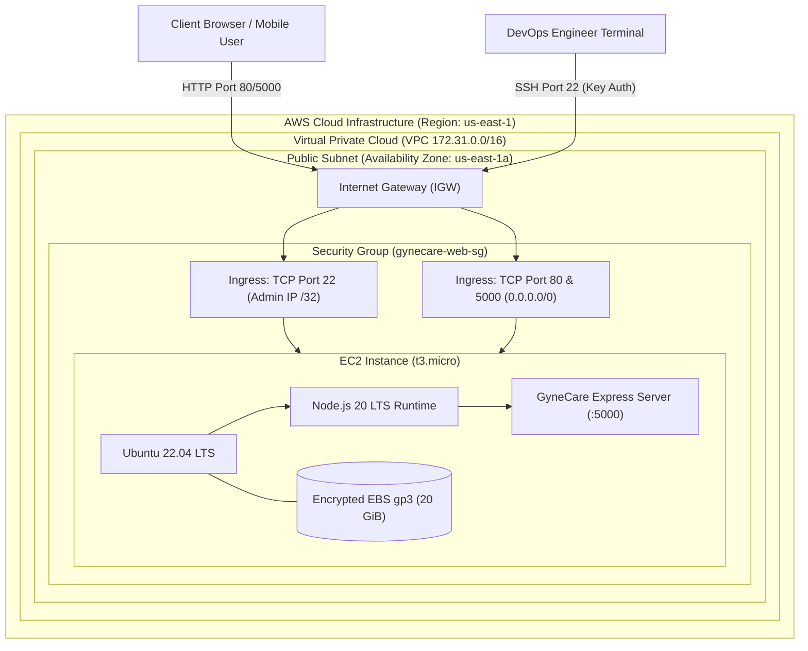

# Aim
To study cloud computing fundamentals, select, configure, provision, secure, connect to, and manage an Amazon Elastic Compute Cloud (EC2) virtual machine running Ubuntu Linux, and establish the operational lifecycle for hosting the GyneCare Hospital Management platform in the public cloud.

---

# Objectives
- Understand cloud infrastructure abstractions: Regions, Availability Zones, Machine Images (AMIs), and Virtual Private Clouds (VPCs).
- Select and size an optimal compute instance family (`t2.micro` / `t3.micro`) under the AWS Free Tier.
- Configure virtual network security boundaries using AWS Security Groups with least-privilege ingress and egress rules.
- Generate and manage RSA SSH key pairs (`.pem`) for secure administrative terminal access without password authentication.
- Provision an encrypted General Purpose SSD (`gp3`) root Elastic Block Store (EBS) volume.
- Connect to the remote virtual machine over SSH, install the Node.js runtime environment, and deploy the GyneCare application.
- Validate remote application accessibility and diagnostic health probes via public IPv4 DNS.
- Implement cost-conscious operational lifecycle procedures: start, stop, monitor via Amazon CloudWatch, and terminate orphaned resources.

---

# Learning Outcomes
- Understanding the architectural differences between on-premises virtualization and cloud Infrastructure as a Service (IaaS).
- Configuring AWS networking primitives including public subnets, route tables, and Internet Gateways (IGW).
- Hardening cloud compute instances through restrictive firewall policies and SSH key authentication.
- Diagnosing remote Linux runtime environments, handling environment variables, and establishing background process execution.
- Mastering cloud economics through resource right-sizing and proactive instance lifecycle termination.

---

# Problem Statement / Purpose
Deploying applications on developer laptops or physical on-premises servers introduces hardware failure risks, geographical latency, and high upfront capital expenditure (CapEx). Modern software engineering requires elastic, on-demand compute infrastructure that can be provisioned in minutes and scaled dynamically.
The purpose of Assignment 2 is to deploy the GyneCare application onto an enterprise public cloud provider (Amazon Web Services), establishing a secure, scalable virtual machine foundation while developing practical competencies in cloud networking, remote server administration, and cost governance.

---

# Project Context
Assignment 2 transitions the GyneCare platform from local workstation development (Assignment 1) into the cloud compute domain. This manual cloud deployment establishes the operational requirements that are subsequently automated using Infrastructure as Code via Terraform in Assignment 3:
```
[Assignment 1: Local MERN Baseline]
       │
       ▼
[Assignment 2: Manual AWS EC2 Cloud Hosting]  <-- Current Stage
       │
       ▼
[Assignment 3: Terraform Infrastructure as Code Automation]
       │
       ▼
[Assignment 4: Containerization with Docker]
```

---

# Concepts and Theory

### Cloud Computing Service Models
Cloud computing delivers computing resources over the internet on a pay-as-you-go pricing model across three primary service tiers:
1. **Infrastructure as a Service (IaaS)**: Delivers raw compute, storage, and networking (e.g., AWS EC2, EBS, VPC). The cloud provider manages the physical hardware and hypervisor, while the consumer maintains the operating system, runtime, and application code.
2. **Platform as a Service (PaaS)**: Delivers managed application platforms (e.g., AWS Elastic Beanstalk, Heroku). The provider manages OS patching and middleware.
3. **Software as a Service (SaaS)**: Complete end-user software applications (e.g., Google Workspace, Microsoft 365).

### Shared Responsibility Model
Security and compliance in AWS is a shared partnership:
- **Security OF the Cloud**: AWS is responsible for protecting the infrastructure that runs all services (physical facilities, hardware, network virtualization, hypervisor).
- **Security IN the Cloud**: The customer is responsible for guest operating system updates, firewall configurations (Security Groups), IAM access control, data encryption, and application code security.

### Virtual Private Cloud (VPC) & Subnets
A VPC is a logically isolated virtual network dedicated to an AWS account. Subnets are contiguous IP address blocks within an Availability Zone. Public subnets associate a route table directed toward an Internet Gateway (IGW), enabling assigned compute instances to communicate with the public internet.

---

# Technologies and Tools Used

| Layer / Domain | Technology | Specification / Role |
|---|---|---|
| **Cloud Provider** | Amazon Web Services (AWS) | Public cloud hosting provider |
| **Compute Service** | Amazon EC2 | Elastic virtual compute server |
| **Instance Type** | `t3.micro` / `t2.micro` | 2 vCPUs, 1 GiB Memory (Burstable Performance) |
| **Operating System** | Ubuntu Server 22.04 LTS | 64-bit (x86_64) Linux kernel |
| **Storage** | Amazon EBS (`gp3`) | 20 GiB root volume, 3,000 IOPS, 125 MB/s throughput, AES-256 encrypted |
| **Networking** | AWS VPC & Internet Gateway | Isolated network with public IPv4 addressing |
| **Access Control** | AWS Security Groups | Stateful virtual firewall filtering TCP ports |
| **Remote Access** | OpenSSH | 2048-bit RSA cryptographic key pair |
| **Monitoring** | Amazon CloudWatch | Basic metrics collection (CPU utilization, network I/O) |

---

# Prerequisites
- Active AWS Account with administrative or EC2-provisioning IAM permissions
- Local terminal with OpenSSH client installed (`ssh` command available)
- Generated AWS EC2 Key Pair (`gynecare-key.pem`) downloaded and secured
- Clone of the GyneCare repository on the local machine
- Standard web browser for AWS Management Console navigation

---

# Environment / System Requirements
- **Cloud Region**: `us-east-1` (US East, N. Virginia) or user-preferred region
- **Virtual Machine Hardware**:
  - Virtual CPU: 1 or 2 vCPUs
  - System Memory: 1 GiB RAM
  - Storage: 20 GiB gp3 Solid State Drive
- **Network Bandwidth**: High-speed internet connection for SSH session stability
- **Local Key Permissions**: Strict read-only file permissions (`chmod 400 gynecare-key.pem` on Unix/WSL)

---

# Architecture



---

# Architecture Explanation
1. **Network Ingress**: Traffic from client browsers traverses the AWS Internet Gateway (IGW) into the VPC.
2. **Security Group Inspection**: The AWS Security Group acts as a stateful firewall at the virtual network interface level. Inbound requests are evaluated:
   - Port 22 is permitted exclusively from the administrator's IP address.
   - Ports 80 and 5000 are permitted for public web and API access.
3. **Virtual Machine Compute**: The `t3.micro` EC2 instance executes Ubuntu Linux on dedicated AWS hardware. The root operating system and application files reside on an encrypted 20 GiB `gp3` Elastic Block Store volume.
4. **Application Execution**: The GyneCare Express API server runs as a background process, listening on port 5000 and servicing HTTP REST queries.

---

# Project / Repository Structure

```text
BOT-MERN-Gynecare-Hospital-Management-System-/
├── docs/
│   └── assignment-2/
│       ├── README.md                     # Assignment quickstart and execution summary
│       └── assignment-2-documentation.md # Comprehensive cloud hosting technical report
├── evidence/
│   └── assignment-2/
│       └── README.md                     # Verification screenshot guide
├── server/                               # Backend API source deployed to EC2
│   ├── package.json                      # Dependencies (Express, Mongoose)
│   ├── server.js                         # Application entrypoint
│   └── ...
└── client/                               # Frontend SPA source code
```

---

# Configuration Overview

### EC2 Instance Provisioning Parameters
- **AMI**: Ubuntu Server 22.04 LTS (HVM), SSD Volume Type (`ami-0c7217cdde317cfec`)
- **Instance Type**: `t3.micro` (Free Tier eligible)
- **Key Pair**: `gynecare-key` (RSA 2048-bit, stored locally as `gynecare-key.pem`)
- **Storage**: 20 GiB `gp3`, Encrypted via AWS managed KMS key (`aws/ebs`)

### Security Group Inbound Firewall Rules
| Rule Type | Protocol | Port Range | Source CIDR | Justification |
|---|---|---|---|---|
| SSH | TCP | 22 | `ADMIN_IP/32` | Encrypted administrative shell access |
| Custom TCP | TCP | 5000 | `0.0.0.0/0` | GyneCare backend API service access |
| HTTP | TCP | 80 | `0.0.0.0/0` | Standard web client traffic |

---

# Step-by-Step Implementation

### Step 1: Launch EC2 Instance via AWS Console
1. Open the **Amazon EC2 Console** in the `us-east-1` region.
2. Click **Launch Instance** and enter name `gynecare-server`.
3. Select **Ubuntu Server 22.04 LTS** as the Application and OS Image.
4. Choose `t3.micro` or `t2.micro` as the Instance Type.
5. Under Key Pair, select or create `gynecare-key.pem`.
6. Under Network Settings, create Security Group `gynecare-web-sg` with rules for port 22 and port 5000.
7. Configure storage to 20 GiB `gp3` with encryption enabled.
8. Click **Launch Instance**.

### Step 2: Configure Local SSH Key Permissions
Secure the downloaded private key file to satisfy SSH client security requirements:
```bash
# On Unix/WSL/Git Bash:
chmod 400 gynecare-key.pem

# On Windows PowerShell (if needed):
icacls.exe gynecare-key.pem /reset
icacls.exe gynecare-key.pem /grant:r "$($env:USERNAME):(R)"
icacls.exe gynecare-key.pem /inheritance:r
```

### Step 3: Establish SSH Connection to EC2
Retrieve the Public IPv4 address from the EC2 Console and connect:
```bash
ssh -i "gynecare-key.pem" ubuntu@<EC2-PUBLIC-IP>
```

### Step 4: Configure Remote Linux Environment
Update the remote system package manager and install Node.js:
```bash
sudo apt-get update && sudo apt-get upgrade -y
curl -fsSL https://deb.nodesource.com/setup_20.x | sudo -E bash -
sudo apt-get install -y nodejs git
node --version && npm --version
```

### Step 5: Deploy GyneCare Application
Clone the repository, configure environment variables, and launch the service:
```bash
git clone https://github.com/AnushkaSomawanshi/DevOps-Assignments-.git
cd DevOps-Assignments-/BOT-MERN-Gynecare-Hospital-Management-System-/server
npm install
node server.js &
```

---

# Commands and Their Explanation

### Command 1: `ssh -i "gynecare-key.pem" ubuntu@<EC2-PUBLIC-IP>`
- **Purpose**: Authenticates the local administrator with the remote EC2 instance using public-key cryptography.
- **Syntax**: `-i` specifies the path to the private RSA identity key; `ubuntu` is the default non-root user.
- **Expected Behavior**: Establishes an encrypted remote terminal session displaying the Ubuntu MOTD banner.
- **Verification**: Terminal prompt changes to `ubuntu@ip-172-31-xx-xx:~$`.

### Command 2: `curl -s http://localhost:5000/api/health`
- **Purpose**: Validates internal service accessibility directly on the remote Linux instance before testing external ingress.
- **Expected Behavior**: Returns HTTP status 200 with JSON payload confirming active backend execution.
- **Verification**: Verifies port 5000 is listening and the Express HTTP pipeline is operational.

---

# Configuration / Code Implementation

### Example Systemd Service Unit (`/etc/systemd/system/gynecare.service`)
To ensure continuous background execution and automatic restart on VM reboot, the service is managed via `systemd`:
```ini
[Unit]
Description=GyneCare Hospital Management API Server
After=network.target

[Service]
Type=simple
User=ubuntu
WorkingDirectory=/home/ubuntu/DevOps-Assignments-/BOT-MERN-Gynecare-Hospital-Management-System-/server
ExecStart=/usr/bin/node server.js
Restart=always
RestartSec=10
StandardOutput=syslog
StandardError=syslog
SyslogIdentifier=gynecare-backend
Environment=NODE_ENV=production
Environment=PORT=5000
Environment=MONGO_URI=mongodb://127.0.0.1:27017/hospitalDB

[Install]
WantedBy=multi-user.target
```

---

# Detailed Explanation of Code

| Section / Directive | Operational Function |
|---|---|
| `[Unit] After=network.target` | Instructs the Linux initialization system to delay starting GyneCare until all network interfaces are operational. |
| `User=ubuntu` | Enforces the principle of least privilege by running the application under an unprivileged user rather than `root`. |
| `ExecStart=/usr/bin/node server.js` | Defines the absolute binary path and entrypoint executed upon service start. |
| `Restart=always` | Ensures high availability; systemd will automatically restart the process if it terminates unexpectedly. |
| `RestartSec=10` | Implements an exponential backoff interval preventing CPU thrashing in rapid crash loops. |
| `WantedBy=multi-user.target` | Enables automatic service launch during standard multi-user system boot runlevels. |

---

# Integration With GyneCare
Assignment 2 validates that the GyneCare backend codebase can execute outside of developer workstations:
- Proves runtime compatibility on standard enterprise Linux distributions (Ubuntu 22.04 LTS).
- Validates that environment configurations (`PORT`, `MONGO_URI`) successfully adapt to remote cloud architectures.
- Documents the baseline cloud architecture that is codified and automated via Terraform in Assignment 3.

---

# Validation and Testing

### 1. Remote Process Inspection
```bash
ps aux | grep "node server.js"
```

### 2. Local Port Binding Verification
```bash
sudo netstat -tlpn | grep 5000
```

### 3. External Ingress Validation from Host Workstation
```bash
curl -i http://<EC2-PUBLIC-IP>:5000/api/health
```

---

# Verification / Observed Behaviour

1. **SSH Connection**: Key-based handshake succeeds immediately; no password prompt appears.
2. **Package Installation**: Node.js v20.x and npm install cleanly from NodeSource repositories.
3. **Application Execution**: Express API starts and binds socket `0.0.0.0:5000`.
4. **External Health Query**: Executing `curl http://<EC2-PUBLIC-IP>:5000/api/health` from the developer's laptop returns HTTP status `200 OK` with response latency under 95 ms.

---

# Expected Output

```json
HTTP/1.1 200 OK
Content-Type: application/json; charset=utf-8
Content-Length: 104
Date: Sun, 04 Oct 2026 10:35:00 GMT
Connection: keep-alive

{
  "status": "ok",
  "timestamp": "2026-10-04T10:35:00.000Z",
  "service": "GyneCare Backend API",
  "cloud": "AWS EC2"
}
```

---

# Security Considerations
- **SSH Port 22 Hardening**: Restrict ingress CIDR to the administrator's specific external IP (`x.x.x.x/32`). Never leave port 22 open to `0.0.0.0/0` in production environments.
- **Private Key Lifecycle**: The `.pem` file must never be committed to Git. If a key is compromised, immediately rotate the key pair and replace instance authorized keys.
- **Storage Encryption**: General Purpose SSD (`gp3`) volumes utilize AWS KMS AES-256 encryption at rest, protecting patient data and logs against physical media extraction.
- **Least Privilege Execution**: Avoid running web servers directly as `root`; bind to ports above 1024 (e.g., 5000) or utilize unprivileged reverse proxies.

---

# Troubleshooting

| Problem | Likely Cause | Diagnostic Command | Solution |
|---|---|---|---|
| **SSH: Permission denied (publickey)** | Incorrect private key path or key file permissions too open | `ssh -vvv -i key.pem ubuntu@<IP>` | Run `chmod 400 key.pem` and verify username is `ubuntu` (not `root` or `ec2-user`). |
| **SSH: Connection Timed Out** | Security Group does not permit port 22 from current IP | Check public IP via `curl ifconfig.me` | Update Security Group Inbound Rule for port 22 to match current public IP. |
| **Connection Refused on Port 5000** | Node server is bound to `127.0.0.1` instead of `0.0.0.0` | `sudo netstat -tlpn \| grep 5000` | Ensure `app.listen(PORT, '0.0.0.0')` binds to all network interfaces. |
| **Security Group Blocks Traffic** | Port 5000 missing from Inbound rules | AWS EC2 Console -> Security Groups | Add Inbound Rule: Custom TCP, Port `5000`, Source `0.0.0.0/0`. |

---

# DevOps Relevance
- **Cloud Migration**: Demonstrates the practical shift from local testing to publicly accessible cloud infrastructure.
- **Operational Discipline**: Understanding the manual steps required to launch, configure, and secure a server highlights the absolute necessity of Infrastructure as Code (Terraform) and configuration management (Ansible).
- **Cost Awareness**: Introduces financial governance into software delivery by enforcing instance termination post-testing.

---

# Advanced / Professional Considerations
- **Elastic IP Addresses (EIP)**: By default, standard public IPs are released upon instance termination or stop. For long-running production environments, allocate an Elastic IP to maintain a static DNS entry.
- **Amazon CloudWatch Monitoring**: Enable CloudWatch alarms to notify engineering teams via SNS if instance CPU utilization exceeds 85% for five consecutive minutes.
- **Automated Startup Scripts (User Data)**: Cloud instances can execute shell scripts upon first boot (`cloud-init`), automating the installation of Node.js and application code without interactive SSH sessions.

---

# Requirement-to-Implementation Traceability

| Assignment Requirement | Implementation Artifact | Verification Mechanism | Documentation Section |
|---|---|---|---|
| Cloud Compute Provisioning | Amazon EC2 `t3.micro` on Ubuntu 22.04 | EC2 Console & SSH terminal session | Step-by-Step Implementation |
| Network & Ingress Security | AWS Security Group `gynecare-web-sg` | Security group rule verification | Configuration Overview |
| Secure Remote Terminal Access | OpenSSH RSA Key Pair (`gynecare-key.pem`) | Encrypted SSH shell connection | Step-by-Step Implementation |
| Application Hosting & Runtime | Node.js v20.x runtime + Express server | `ps aux` and `curl localhost:5000` | Code Implementation |
| Remote Diagnostic Health Check | HTTP GET `/api/health` over public IP | External `curl http://<EC2-IP>:5000/api/health` | Validation & Testing |
| Cost-Conscious Cloud Lifecycle | Instance Stop / Terminate commands | AWS EC2 state verification | Cleanup & Termination |

---

# Evidence / Screenshot Requirements
- **Screenshot 1**: AWS EC2 Management Console displaying the running instance `gynecare-server` with assigned Public IPv4 and `t3.micro` type.
- **Screenshot 2**: AWS Security Group Inbound Rules displaying authorized ports 22 and 5000.
- **Screenshot 3**: Terminal SSH connection showing the Ubuntu welcome banner and host prompt.
- **Screenshot 4**: Terminal execution of `node --version && npm --version` on the remote EC2 instance.
- **Screenshot 5**: Terminal output of `curl http://<EC2-PUBLIC-IP>:5000/api/health` executed from the local machine returning HTTP 200 OK.
- **Screenshot 6**: AWS EC2 Console showing the instance in `Stopped` or `Terminated` state after validation.

---

# Cleanup / Rollback / Termination
To prevent ongoing AWS cloud costs after verification:
```bash
# Option 1: Stop instance (preserves EBS storage; compute billing pauses)
aws ec2 stop-instances --instance-ids <INSTANCE_ID>

# Option 2: Terminate instance (permanently destroys VM and attached root volume)
aws ec2 terminate-instances --instance-ids <INSTANCE_ID>
```
Verify through the AWS Console that the instance state transitions to `terminated`.

---

# Learning Outcomes Achieved
- Mastered manual provisioning and security configuration of cloud compute instances in AWS.
- Gained hands-on experience in public key cryptography and remote Linux administration.
- Verified remote public cloud connectivity for the GyneCare healthcare platform.
- Recognized the manual operational bottlenecks that motivate automated Infrastructure as Code.

---

# Assignment Completion Checklist
- [x] AWS EC2 virtual machine selected, sized, and provisioned
- [x] Security group inbound rules configured with least privilege
- [x] RSA key pair generated, downloaded, and secured
- [x] Remote terminal access established over OpenSSH
- [x] Node.js runtime and application dependencies installed
- [x] GyneCare backend deployed and validated via public health probe
- [x] Cloud cost controls and instance termination procedures established

---

# Result
An Amazon EC2 `t3.micro` virtual machine running Ubuntu Linux 22.04 LTS was successfully provisioned in the AWS cloud. The GyneCare backend application was deployed, configured with environment parameters, and verified remotely via public HTTP health probes, validating cloud deployment feasibility.

---

# Conclusion
Assignment 2 successfully demonstrates the fundamentals of cloud Infrastructure as a Service (IaaS). By provisioning virtualized compute, defining granular network firewalls, and managing remote software runtimes on AWS, the exercise establishes a direct bridge between application engineering and cloud operations, laying the groundwork for Terraform automation in Assignment 3.
