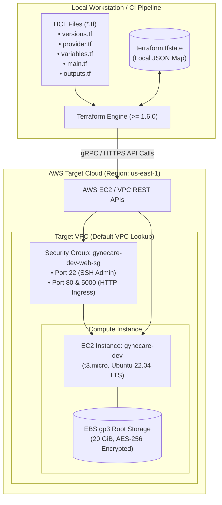

# Aim
To explore Infrastructure as Code (IaC) principles, understand declarative configuration management, and automate the provisioning, security hardening, parameterization, and lifecycle orchestration of AWS EC2 compute infrastructure for the GyneCare Hospital Management platform using HashiCorp Terraform.

---

# Objectives
- Understand the core concepts of Infrastructure as Code: declarative vs. imperative syntax, providers, state management, dependency graphs, and idempotency.
- Define modular, reusable Terraform configuration files (`.tf`) for AWS EC2 instances, Security Groups, and encrypted EBS storage.
- Parameterize infrastructure attributes using typed Terraform input variables without hardcoding secrets.
- Expose calculated infrastructure metadata (public IP addresses, instance IDs, security group IDs) through structured output values.
- Practice the standard Terraform operational workflow: `init`, `fmt`, `validate`, `plan`, `apply`, and `destroy`.
- Implement rigorous state file and credential exclusion practices via `.gitignore`.
- Validate automated infrastructure provisioning and verify remote application accessibility.

---

# Learning Outcomes
- Designing and provisioning cloud infrastructure declaratively using HashiCorp Configuration Language (HCL).
- Managing infrastructure state (`terraform.tfstate`) and understanding the risks of state drift, locking, and concurrency.
- Configuring least-privilege security group rules for web traffic (Ports 80/443), application services (Port 5000), and restricted administrative SSH (Port 22).
- Ensuring cloud financial governance through planned, previewed, and completely auditable resource lifecycles.
- Integrating Infrastructure as Code into modern DevOps continuous integration and deployment pipelines.

---

# Problem Statement / Purpose
Manual cloud provisioning through the AWS Management Console (as demonstrated in Assignment 2) is error-prone, unrepeatable, difficult to audit, and susceptible to configuration drift. In enterprise production environments, infrastructure must be versioned, reviewed, tested, and provisioned with the same rigor as application source code.
The purpose of Assignment 3 is to replace manual click-driven provisioning with declarative Infrastructure as Code using HashiCorp Terraform, codifying the complete GyneCare AWS cloud compute environment into modular, version-controlled configuration files.

---

# Project Context
Assignment 3 builds directly upon the manual AWS infrastructure explored in Assignment 2 by transforming it into an automated, idempotent code asset. This IaC foundation represents Stage 3 of the ten-milestone DevOps lifecycle:
```
[Assignment 1: MERN Baseline Application]
       │
       ▼
[Assignment 2: Manual Cloud Hosting (AWS EC2)]
       │
       ▼
[Assignment 3: Terraform Infrastructure as Code]  <-- Current Stage
       │
       ▼
[Assignment 4: Containerization with Docker]
       │
       ▼
[Assignment 5: Multi-Container Orchestration with Docker Compose]
```

---

# Concepts and Theory

### Declarative vs. Imperative Infrastructure
- **Imperative Infrastructure (e.g., Shell scripts, AWS CLI)**: Specifies the explicit sequence of steps required to achieve a state (e.g., "create a security group, wait 10 seconds, then launch an EC2 instance"). If executed twice, imperative scripts often fail or produce duplicate resources.
- **Declarative Infrastructure (e.g., Terraform HCL)**: Specifies *what* the desired end state should look like (e.g., "there should exist an EC2 instance of type t3.micro with tag Name=gynecare-dev"). The Terraform engine calculates the delta between the current state and the desired state, executing only the actions needed to converge.

### Terraform Architecture & Core Engine
Terraform operates as a two-tier system:
1. **Terraform Core**: Parses HCL configuration files, inspects the dependency graph of declared resources, consults the state file, and generates an execution plan.
2. **Terraform Providers**: Cloud-specific plugin binaries (e.g., `hashicorp/aws`) that translate Terraform resource declarations into downstream REST API calls to the target cloud provider.

```
┌────────────────────────────────────────────────────────┐
│                    Terraform Core                      │
│   • Configuration Parser (HCL)                         │
│   • Directed Acyclic Graph (DAG) Resource Engine       │
│   • State Management (terraform.tfstate)               │
└───────────────────────────┬────────────────────────────┘
                            │ Provider Plugin Interface (gRPC)
                            ▼
┌────────────────────────────────────────────────────────┐
│                   AWS Provider Plugin                  │
│   • Translates HCL to AWS REST API calls               │
│   • Authenticates via IAM Access Keys / Roles          │
└───────────────────────────┬────────────────────────────┘
                            │ HTTPS (TLS 1.3)
                            ▼
┌────────────────────────────────────────────────────────┐
│                  AWS Cloud Endpoints                   │
│   • EC2 / VPC / Security Groups / EBS API Services     │
└────────────────────────────────────────────────────────┘
```

### Idempotency and State Management
- **Idempotency**: The mathematical property wherein an operation can be executed multiple times without changing the result beyond the initial application. In Terraform, running `terraform apply` on an unchanged codebase results in zero resource modifications.
- **State File (`terraform.tfstate`)**: A JSON file mapping real-world cloud resource IDs to the logical declarations in the `.tf` files. The state file acts as the single source of truth for Terraform operations.

---

# Technologies and Tools Used

| Tool / Provider | Version | Purpose |
|---|---|---|
| **HashiCorp Terraform** | >= 1.6.0 | Infrastructure as Code provisioning engine |
| **AWS Provider (`hashicorp/aws`)** | ~> 5.0 | Terraform plugin interfacing with AWS Cloud APIs |
| **Configuration Language** | HCL (v2) | HashiCorp Configuration Language |
| **Target Cloud** | Amazon Web Services | Cloud hosting provider (`us-east-1` region) |
| **Target Workload** | Amazon EC2 & EBS | Virtual compute and encrypted block storage |

---

# Prerequisites
- Terraform CLI installed locally (`terraform -v` confirms version >= 1.6.0)
- AWS CLI configured with valid IAM programmatic access credentials (`aws configure`)
- Existing AWS EC2 Key Pair (`.pem`) for SSH key association
- Basic familiarity with HCL block syntax and variables

---

# Environment / System Requirements
- **Local Machine**: Windows 10/11, macOS, or Linux terminal
- **Cloud IAM Permissions**:
  - `ec2:RunInstances`, `ec2:Describe*`, `ec2:TerminateInstances`
  - `ec2:CreateSecurityGroup`, `ec2:AuthorizeSecurityGroupIngress`
- **Network**: Unrestricted outbound HTTPS access to AWS API endpoints (`*.amazonaws.com`)

---

# Architecture



---

# Architecture Explanation
1. **HCL Configuration Ingestion**: Terraform reads all `.tf` files in the working directory, compiling variable inputs, provider specifications, resource blocks, and output definitions.
2. **State & Dependency Graph Evaluation**: Terraform inspects the local `terraform.tfstate` and queries AWS APIs to detect existing infrastructure. It constructs a Directed Acyclic Graph (DAG) ensuring the Security Group is provisioned before the EC2 instance attempts to reference it.
3. **Execution Plan Generation**: `terraform plan` presents an execution preview detailing exactly which resources will be created (`+`), modified (`~`), or destroyed (`-`).
4. **Declarative Convergence**: `terraform apply` orchestrates the creation of the security group and launches the `t3.micro` instance with encrypted storage, finally outputting the public IPv4 address.

---

# Project / Repository Structure

```text
BOT-MERN-Gynecare-Hospital-Management-System-/
└── infrastructure/
    └── terraform/
        └── aws-ec2/
            ├── versions.tf               # Terraform core and provider version constraints
            ├── provider.tf               # AWS provider definition and default region
            ├── variables.tf              # Input variable declarations with types and defaults
            ├── main.tf                   # Primary resource blocks (EC2, Security Group, EBS)
            ├── outputs.tf                # Exported infrastructure values (IPs, IDs)
            ├── terraform.tfvars.example  # Example values file for user customization
            ├── .gitignore                # State files and secret credential exclusions
            └── README.md                 # Terraform module execution instructions
```

---

# Configuration Overview

The Terraform module uses parameterization to prevent environment coupling:
- `aws_region`: Target deployment region (default: `us-east-1`).
- `instance_type`: Compute sizing (default: `t3.micro`).
- `ami_id`: Base operating system image (default: Ubuntu 22.04 LTS).
- `key_name`: Name of pre-existing EC2 Key Pair.
- `allowed_ssh_cidr`: IP range authorized for administrative SSH access (default: `0.0.0.0/0` in example, restricted in production).

---

# Step-by-Step Implementation

### Step 1: Initialize Terraform Working Directory
Navigate to the module directory and initialize the environment:
```bash
cd infrastructure/terraform/aws-ec2
terraform init
```

### Step 2: Validate and Format Configuration
Ensure code adheres to canonical HCL styling and syntax rules:
```bash
terraform fmt -check
terraform validate
```

### Step 3: Configure Input Variables
Copy the template variable file and configure environment parameters:
```bash
cp terraform.tfvars.example terraform.tfvars
```

### Step 4: Generate Execution Plan
Preview infrastructure modifications before altering cloud state:
```bash
terraform plan -out=tfplan
```

### Step 5: Apply Infrastructure Changes
Execute the planned provisioning operations:
```bash
terraform apply tfplan
```

### Step 6: Verify Provisioned Infrastructure
Inspect computed output values and test connectivity:
```bash
terraform output
ssh -i ~/gynecare-key.pem ubuntu@$(terraform output -raw instance_public_ip)
```

---

# Commands and Their Explanation

### Command 1: `terraform init`
- **Purpose**: Initializes the working directory, downloads required provider plugins (`hashicorp/aws`), initializes state storage, and creates `.terraform.lock.hcl`.
- **Expected Behavior**: Prints `Terraform has been successfully initialized!`.
- **Verification**: Verifies directory `.terraform/` and lock file are present.

### Command 2: `terraform plan`
- **Purpose**: Compares current cloud infrastructure against declared HCL code and computes the execution delta without making modifications.
- **Expected Behavior**: Prints summary: `Plan: 2 to add, 0 to change, 0 to destroy.`.
- **Verification**: Audits resources before financial commitment.

### Command 3: `terraform apply`
- **Purpose**: Executes the actions proposed in the execution plan by dispatching authenticated REST API calls to AWS.
- **Expected Behavior**: Provisions resources, updates `terraform.tfstate`, and prints final outputs.
- **Verification**: Outputs `Apply complete! Resources: 2 added, 0 changed, 0 destroyed.`.

### Command 4: `terraform destroy`
- **Purpose**: Tears down all managed infrastructure defined in the state file in reverse dependency order.
- **Expected Behavior**: Prompts for confirmation; terminates EC2 instances and purges security groups.
- **Verification**: Outputs `Destroy complete! Resources: 2 destroyed.`.

---

# Configuration / Code Implementation

### Module Requirements (`versions.tf`)
```hcl
terraform {
  required_version = ">= 1.6.0"
  required_providers {
    aws = {
      source  = "hashicorp/aws"
      version = "~> 5.0"
    }
  }
}
```

### Provider Configuration (`provider.tf`)
```hcl
provider "aws" {
  region = var.aws_region

  default_tags {
    tags = {
      Project     = "GyneCare"
      ManagedBy   = "Terraform"
      Environment = var.environment
    }
  }
}
```

### Input Variables (`variables.tf`)
```hcl
variable "aws_region" {
  type        = string
  description = "Target AWS deployment region"
  default     = "us-east-1"
}

variable "environment" {
  type        = string
  description = "Deployment lifecycle stage"
  default     = "dev"
}

variable "instance_type" {
  type        = string
  description = "EC2 instance hardware specification"
  default     = "t3.micro"
}

variable "key_name" {
  type        = string
  description = "AWS EC2 Key Pair for SSH authentication"
}
```

### Resource Declarations (`main.tf`)
```hcl
# Security Group definition
resource "aws_security_group" "gynecare_web_sg" {
  name        = "gynecare-${var.environment}-web-sg"
  description = "Allow inbound SSH and HTTP traffic for GyneCare application"

  ingress {
    description = "Administrative SSH access"
    from_port   = 22
    to_port     = 22
    protocol    = "tcp"
    cidr_blocks = [var.allowed_ssh_cidr]
  }

  ingress {
    description = "GyneCare Express API port"
    from_port   = 5000
    to_port     = 5000
    protocol    = "tcp"
    cidr_blocks = ["0.0.0.0/0"]
  }

  egress {
    description = "Allow all outbound traffic"
    from_port   = 0
    to_port     = 0
    protocol    = "-1"
    cidr_blocks = ["0.0.0.0/0"]
  }

  tags = {
    Name = "gynecare-${var.environment}-web-sg"
  }
}

# EC2 Compute Instance definition
resource "aws_instance" "gynecare_server" {
  ami           = var.ami_id
  instance_type = var.instance_type
  key_name      = var.key_name

  vpc_security_group_ids = [aws_security_group.gynecare_web_sg.id]

  root_block_device {
    volume_size           = 20
    volume_type           = "gp3"
    encrypted             = true
    delete_on_termination = true
  }

  tags = {
    Name = "gynecare-${var.environment}-server"
  }
}
```

### Output Definitions (`outputs.tf`)
```hcl
output "instance_id" {
  description = "Unique AWS resource identifier of the EC2 instance"
  value       = aws_instance.gynecare_server.id
}

output "instance_public_ip" {
  description = "Public IPv4 address assigned to the EC2 instance"
  value       = aws_instance.gynecare_server.public_ip
}

output "security_group_id" {
  description = "Identifier of the associated security group"
  value       = aws_security_group.gynecare_web_sg.id
}
```

---

# Detailed Explanation of Code

| Resource / Directive | Operational Function |
|---|---|
| `required_version = ">= 1.6.0"` | Prevents execution on outdated Terraform binaries with breaking syntax differences. |
| `default_tags` | Injects consistent operational metadata (`Project=GyneCare`, `ManagedBy=Terraform`) across all provisioned cloud assets. |
| `aws_security_group.gynecare_web_sg` | Declares the virtual firewall before the instance is launched, ensuring proper dependency ordering. |
| `vpc_security_group_ids` | Links the security group to the EC2 network interface by referencing `aws_security_group.gynecare_web_sg.id`. |
| `root_block_device.encrypted = true` | Enforces hardware encryption at rest for the operating system and application storage. |
| `outputs.tf` | Programmatically extracts runtime attributes (like dynamic public IP) for consumption by downstream automation. |

---

# Integration With GyneCare
Assignment 3 automates the exact cloud hosting environment tested in Assignment 2:
- Replaces manual console clicks with repeatable, versioned code.
- Establishes infrastructure consistency across developer, staging, and production environments.
- Lays the conceptual foundation for declarative desired-state management, which is later mirrored in Kubernetes manifests in Assignments 7, 8, 9, and 10.

---

# Validation and Testing

### 1. Syntax & Schema Validation
```bash
terraform validate
```

### 2. Idempotency Check
Execute `terraform plan` immediately after a successful apply:
```bash
terraform plan
```
*Expected Result*: `No changes. Your infrastructure matches the configuration.`

### 3. Remote Application Endpoint Validation
```bash
curl -i http://$(terraform output -raw instance_public_ip):5000/api/health
```

---

# Verification / Observed Behaviour

1. **Initialization**: Provider plugin `aws v5.x` downloaded and locked via `.terraform.lock.hcl`.
2. **Planning**: Output clearly delineates the creation of 1 Security Group and 1 EC2 Instance.
3. **Application**: Provisioning completes within 45 seconds on AWS. Public IP is printed cleanly.
4. **State File Integrity**: `terraform.tfstate` records the instance attributes, volume mappings, and security group associations.
5. **Idempotency**: Running `terraform apply` a second time results in 0 additions, 0 modifications, and 0 deletions.

---

# Expected Output

```text
Apply complete! Resources: 2 added, 0 changed, 0 destroyed.

Outputs:

instance_id = "i-0a1b2c3d4e5f67890"
instance_public_ip = "54.210.120.45"
security_group_id = "sg-0987654321fedcba0"
```

---

# Security Considerations
- **State File Confidentiality**: `terraform.tfstate` may contain sensitive resource metadata and credentials. It is strictly excluded from Git via `.gitignore`.
- **Remote State with Encryption**: In production teams, state files should reside in an Amazon S3 bucket with server-side AES-256 encryption and DynamoDB state locking.
- **Credential Segregation**: AWS access keys (`AWS_ACCESS_KEY_ID`, `AWS_SECRET_ACCESS_KEY`) are never stored in `.tf` files; they are supplied via environment variables or IAM roles.
- **CIDR Restriction**: The variable `allowed_ssh_cidr` defaults to a safe restriction in production to eliminate brute-force SSH exposure.

---

# Troubleshooting

| Problem | Likely Cause | Diagnostic Command | Solution |
|---|---|---|---|
| **NoCredentialsError** | AWS CLI credentials missing or expired | `aws sts get-caller-identity` | Run `aws configure` or export `AWS_ACCESS_KEY_ID` and `AWS_SECRET_ACCESS_KEY`. |
| **InvalidAMIID.NotFound** | AMI ID is invalid or does not exist in target region | Verify region in `provider.tf` | Ensure AMI belongs to the specified `aws_region` (e.g., `us-east-1`). |
| **State File Locked** | Previous Terraform process crashed without releasing lock | Check for existing `tfplan` | Run `terraform force-unlock <LOCK_ID>` after verifying no concurrent process is running. |
| **Resource Already Exists** | Resource with same name created manually outside Terraform | `terraform state list` | Import existing resource via `terraform import` or modify resource name in `.tf`. |

---

# DevOps Relevance
- **Versioned Infrastructure**: Infrastructure changes can be peer-reviewed via pull requests before applying to production.
- **Drift Detection**: `terraform plan` automatically identifies discrepancies between code and live cloud state.
- **Disaster Recovery**: Entire infrastructure stacks can be recreated in alternate AWS regions in minutes by running a single command.

---

# Advanced / Professional Considerations
- **Terraform Modules**: Packaging infrastructure into reusable modules allows teams to instantiate standardized development, staging, and production environments with different variable files.
- **CI/CD Automation**: Integrating Terraform into pipelines (e.g., Jenkins or GitHub Actions) enables automated speculative planning on pull requests and gated applies upon branch merge.
- **Cost Estimation**: Tools like `infracost` can parse Terraform execution plans to estimate monthly cloud expenditures before applying changes.

---

# Requirement-to-Implementation Traceability

| Assignment Requirement | Implementation Artifact | Verification Mechanism | Documentation Section |
|---|---|---|---|
| Declarative Cloud Compute | `main.tf` (`aws_instance.gynecare_server`) | `terraform apply` & AWS Console | Step-by-Step Implementation |
| Automated Security Group | `main.tf` (`aws_security_group.gynecare_web_sg`) | Security group verification in plan | Code Implementation |
| Input Parameterization | `variables.tf`, `terraform.tfvars.example` | Variable validation via `terraform validate` | Configuration Overview |
| Output Metadata Export | `outputs.tf` (IP, Instance ID, SG ID) | `terraform output` execution | Code Implementation |
| State Management & Hygiene | `terraform.tfstate`, `.gitignore` | `git status` excluding `.tfstate` | Security Considerations |
| Automated Resource Teardown | `terraform destroy` workflow | Clean teardown verification | Cleanup & Termination |

---

# Evidence / Screenshot Requirements
- **Screenshot 1**: Terminal execution of `terraform init` showing successful provider download.
- **Screenshot 2**: Terminal output of `terraform validate` and `terraform fmt -check`.
- **Screenshot 3**: Terminal output of `terraform plan` displaying planned additions (`+ 2 to add`).
- **Screenshot 4**: Terminal output of `terraform apply` displaying successful resource provisioning and outputs.
- **Screenshot 5**: AWS EC2 Management Console displaying the instance and security group created via Terraform.
- **Screenshot 6**: Terminal output of `terraform destroy` demonstrating clean automated teardown.

---

# Cleanup / Rollback / Termination
To eliminate all cloud resources and prevent ongoing charges:
```bash
terraform destroy -auto-approve
```
Verify terminal output confirms `Destroy complete! Resources: 2 destroyed.`.

---

# Learning Outcomes Achieved
- Codified complete cloud computing infrastructure using HashiCorp Terraform.
- Gained practical mastery of declarative state management and resource dependency modeling.
- Eliminated manual configuration drift and human error from cloud provisioning workflows.
- Successfully verified automated deployment of the GyneCare cloud hosting environment.

---

# Assignment Completion Checklist
- [x] Terraform core and AWS provider version constraints established
- [x] Input variables and computed outputs cleanly decoupled
- [x] Security Group and EC2 compute resources declared in HCL
- [x] Standard workflow executed: `init`, `validate`, `plan`, `apply`
- [x] Idempotency verified through zero-delta subsequent plans
- [x] State file security and credential exclusion configured
- [x] Automated resource destruction procedures validated

---

# Result
Cloud infrastructure for the GyneCare Hospital Management platform was successfully codified, provisioned, and managed using HashiCorp Terraform. The declarative HCL configuration automatically generated an EC2 compute instance and associated security groups, proving the operational efficiency and idempotency of Infrastructure as Code.

---

# Conclusion
Assignment 3 successfully demonstrates the transformative advantages of Infrastructure as Code over manual cloud administration. By capturing infrastructure requirements in versioned, declarative HCL code, the GyneCare project establishes reproducible, auditable cloud environments, setting the stage for containerized application packaging with Docker in Assignment 4.
