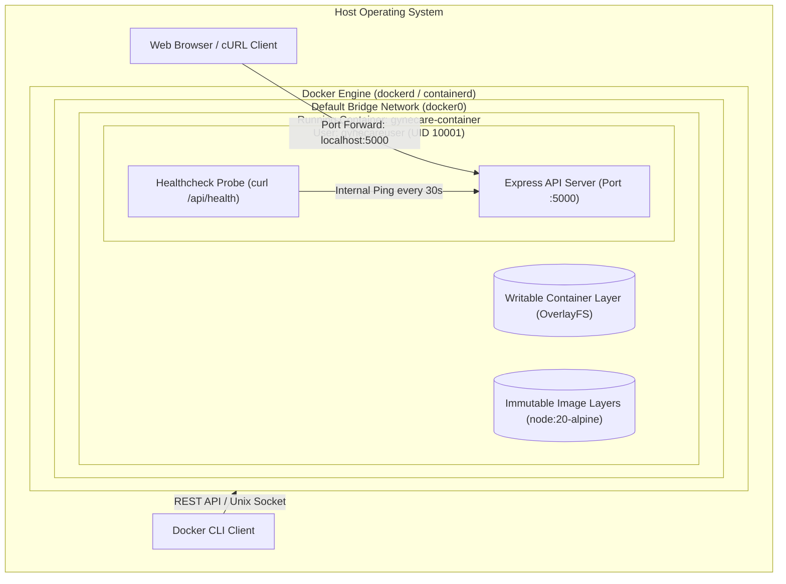

# Aim
To explore operating-system-level virtualization principles, analyze Docker Engine architecture, containerize the GyneCare Hospital Management backend application using a production-grade, secure, multi-stage Dockerfile, and manage the full container lifecycle (build, run, monitor, inspect, stop, and clean up) while verifying application health.

---

# Objectives
- Understand containerization concepts and contrast OS-level virtualization against hardware virtualization (Hypervisors/VMs).
- Examine Docker Engine internal architecture: Docker Daemon (`dockerd`), `containerd`, OCI runtime (`runc`), and container registries.
- Author a hardened, production-ready `Dockerfile` implementing Alpine Linux base images, layer caching, non-root user execution (`gynecareuser`), and built-in health probes.
- Configure `.dockerignore` to exclude local caches, `node_modules`, and sensitive environment credentials from the build context.
- Build, tag, and inspect the GyneCare Docker container image (`gynecare-app:v1`).
- Execute and manage container instances with network port forwarding (`5000:5000`) and environment parameter injection.
- Validate internal container health checks using native `HEALTHCHECK` directives querying `/api/health`.
- Practice standard Docker lifecycle commands: `build`, `run`, `ps`, `logs`, `exec`, `stop`, and `rm`.

---

# Learning Outcomes
- Understanding kernel namespaces (PID, NET, IPC, MNT, UTS) and Control Groups (cgroups) for container isolation.
- Designing minimal, secure OCI container images with minimal attack surfaces.
- Analyzing Docker image layers, copy-on-write (CoW) union file systems (OverlayFS), and build caching mechanisms.
- Securing container runtime environments through unprivileged user execution and read-only file systems.
- Troubleshooting container lifecycle events, crash loops, port collisions, and health check failures.

---

# Problem Statement / Purpose
Traditional application deployments suffer from the classic "it works on my machine" dilemma caused by differing operating system libraries, Node.js version disparities, and conflicting system dependencies between developer laptops and cloud servers. Furthermore, running applications directly on host operating systems lacks process isolation and resource governance.
The purpose of Assignment 4 is to encapsulate the GyneCare application, its runtime, dependencies, system tools, and configurations into a self-contained, immutable Docker container image that executes identically across any environment supporting the Docker runtime.

---

# Project Context
Assignment 4 represents the containerization milestone of the DevOps engineering progression. The standalone container image created here serves as the basic deployable artifact that is subsequently orchestrated via Docker Compose in Assignment 5, tested in Jenkins CI in Assignment 6, and deployed across Kubernetes clusters in Assignments 7 through 10:
```
[Assignment 1: MERN Baseline Application]
       │
       ▼
[Assignment 2: Cloud Infrastructure (AWS EC2)]
       │
       ▼
[Assignment 3: Infrastructure as Code (Terraform)]
       │
       ▼
[Assignment 4: Docker Containerization]  <-- Current Stage
       │
       ▼
[Assignment 5: Multi-Container Orchestration (Docker Compose)]
       │
       ▼
[Assignment 6: Continuous Integration (Jenkins)]
```

---

# Concepts and Theory

### Virtual Machines vs. Containers
- **Virtual Machines (Hardware Virtualization)**: Each VM encapsulates a complete guest operating system, virtual hardware drivers, and application binaries managed by a Type-1 or Type-2 Hypervisor (e.g., VMware, KVM, Hyper-V). This introduces high memory overhead, large image sizes (gigabytes), and slow boot times (minutes).
- **Containers (OS-Level Virtualization)**: Containers share the underlying host Linux kernel. Isolation is achieved natively via Linux kernel primitives:
  - **Namespaces**: Provide process isolation across process IDs (`pid`), network interfaces (`net`), mount points (`mnt`), and user IDs (`user`).
  - **Control Groups (cgroups)**: Enforce hardware resource limits (CPU throttling, memory quotas, I/O rates).
  - Containers start in milliseconds and require minimal disk footprint (megabytes).

```
┌──────────────────────────────────────┐      ┌──────────────────────────────────────┐
│       Virtual Machine Model          │      │          Container Model             │
│                                      │      │                                      │
│  ┌────────────────────────────────┐  │      │  ┌────────────────────────────────┐  │
│  │   Application & Dependencies   │  │      │  │   Application & Dependencies   │  │
│  ├────────────────────────────────┤  │      │  ├────────────────────────────────┤  │
│  │     Guest Operating System     │  │      │  │        Container Engine        │  │
│  ├────────────────────────────────┤  │      │  │     (Docker / containerd)      │  │
│  │           Hypervisor           │  │      │  ├────────────────────────────────┤  │
│  ├────────────────────────────────┤  │      │  │       Host Linux Kernel        │  │
│  │     Host Hardware / System     │  │      │  │     (cgroups & namespaces)     │  │
│  └────────────────────────────────┘  │      │  ├────────────────────────────────┤  │
│                                      │      │  │     Host Hardware / System     │  │
│                                      │      │  └────────────────────────────────┘  │
└──────────────────────────────────────┘      └──────────────────────────────────────┘
```

### Docker Engine Architecture
Docker utilizes a client-server architecture:
1. **Docker CLI (`docker`)**: Command-line interface accepting user commands and communicating with the daemon over REST APIs via a Unix socket (`/var/run/docker.sock`) or named pipe.
2. **Docker Daemon (`dockerd`)**: Persistent background service managing images, containers, networks, and storage volumes.
3. **Containerd & Runc**: Industry-standard OCI container runtime executing and monitoring containers directly via Linux kernel namespaces.

### Image Layers and Union File Systems
Docker images consist of stacked, read-only filesystem layers. Each instruction in a `Dockerfile` (e.g., `RUN`, `COPY`) creates a new immutable layer. When a container launches, Docker adds a thin, read-write container layer on top using an OverlayFS union filesystem. Unchanged layers are cached during builds, drastically accelerating build times.

---

# Technologies and Tools Used

| Component / Tool | Version | Purpose |
|---|---|---|
| **Docker Engine** | v29.7.2 | Container runtime and daemon engine |
| **Docker CLI** | v29.7.2 | User command-line client |
| **Base Image** | `node:20-alpine` | Lightweight, secure Alpine Linux image (~170 MB) |
| **Package Manager** | npm v10.x | Package manager installing production dependencies |
| **Diagnostic Utility** | `curl` | Lightweight HTTP client for container health checking |
| **Target Application** | GyneCare Server | Node.js/Express RESTful API server |

---

# Prerequisites
- Docker Desktop or Docker Engine installed and running (`docker --version`)
- Local clone of the GyneCare repository
- Available host port `5000` (free from local processes)
- Basic familiarity with Linux terminal commands and shell execution

---

# Environment / System Requirements
- **Operating System**: Windows 10/11 (WSL2 backend), macOS, or Ubuntu 20.04/22.04 LTS
- **Host Memory**: Minimum 4 GB RAM allocated to Docker Engine
- **Disk Storage**: At least 5 GB free space for Docker image layers and cache
- **Network Access**: Outbound internet connectivity to Docker Hub (`registry-1.docker.io`)

---

# Architecture



---

# Architecture Explanation
1. **Build Execution**: Docker reads `Dockerfile` and `.dockerignore`, transferring only necessary source files to the Docker daemon. It executes each instruction sequentially, caching layers.
2. **Container Instantiation**: `docker run` instantiates an isolated namespace container. It configures iptables on the host to forward incoming TCP traffic on host port `5000` directly to container port `5000`.
3. **Unprivileged Runtime Execution**: The process executes as `gynecareuser` (UID 10001). Even if the application suffered a remote code execution vulnerability, the attacker cannot modify host system files.
4. **Health Probe Monitoring**: The Docker daemon executes `curl -f http://localhost:5000/api/health` inside the container every 30 seconds. If the endpoint responds with HTTP 200, Docker marks the container status as `healthy`.

---

# Project / Repository Structure

```text
BOT-MERN-Gynecare-Hospital-Management-System-/
├── Dockerfile                            # Production backend container definition
├── .dockerignore                         # Build context exclusions
├── server/                               # Application source code packaged into image
│   ├── package.json                      # Dependency manifest
│   ├── server.js                         # Application bootstrap
│   └── ...
├── docs/
│   └── assignment-4/
│       ├── README.md                     # Assignment quickstart
│       └── assignment-4-documentation.md # Containerization technical report
└── evidence/
    └── assignment-4/
        └── README.md                     # Screenshot verification guide
```

---

# Configuration Overview

### Dockerfile Design Standards
- **Base Image**: `node:20-alpine` minimizes vulnerabilities by excluding unnecessary compilers and shells.
- **Working Directory**: `/app` provides an isolated workspace.
- **Dependency Caching**: `package*.json` is copied and installed *before* application source code. Code changes do not invalidate the slow `npm install` cache layer.
- **Security Hardening**: Adds non-root system group `gynecaregroup` and user `gynecareuser`.
- **Healthcheck**: Inbuilt periodic health validation querying `/api/health`.

---

# Step-by-Step Implementation

### Step 1: Examine `.dockerignore` Hygiene
Ensure heavy directories and secrets are excluded from the Docker build context:
```text
node_modules
npm-debug.log
.git
.gitignore
.env
.env.*
dist
build
```

### Step 2: Build the Production Container Image
Compile the Docker image and assign a semantic tag:
```bash
docker build -t gynecare-app:v1 .
```

### Step 3: Inspect Image Metadata & Layer History
Examine image size, layer creation, and vulnerability posture:
```bash
docker images gynecare-app:v1
docker history gynecare-app:v1
```

### Step 4: Run Container in Detached Mode
Launch the container with port forwarding and an explicit container name:
```bash
docker run -d -p 5000:5000 --name gynecare-container gynecare-app:v1
```

### Step 5: Monitor Container Lifecycle & Health
Inspect active containers and query health check status:
```bash
docker ps
docker inspect --format='{{json .State.Health}}' gynecare-container
```

### Step 6: Verify Application Logs
Stream logs from the running container process:
```bash
docker logs -f gynecare-container
```

### Step 7: Container Teardown
Gracefully terminate and remove the test container:
```bash
docker stop gynecare-container
docker rm gynecare-container
```

---

# Commands and Their Explanation

### Command 1: `docker build -t gynecare-app:v1 .`
- **Purpose**: Packages the application into an immutable OCI container image according to instructions in `Dockerfile`.
- **Arguments**: `-t` applies a name:tag identifier; `.` specifies the current directory as the build context.
- **Expected Behavior**: Executes steps 1 through 10, caching reusable layers, and prints `Successfully tagged gynecare-app:v1`.
- **Verification**: `docker images` lists `gynecare-app` with tag `v1`.

### Command 2: `docker run -d -p 5000:5000 --name gynecare-container gynecare-app:v1`
- **Purpose**: Creates and launches an isolated container instance from the specified image.
- **Arguments**: `-d` runs detached in the background; `-p 5000:5000` maps host port 5000 to container port 5000; `--name` assigns a friendly reference name.
- **Expected Behavior**: Prints the full 64-character container ID and returns the host shell.
- **Verification**: `docker ps` shows container in `Up` state.

### Command 3: `docker exec -it gynecare-container sh`
- **Purpose**: Opens an interactive diagnostic shell inside the running container namespace.
- **Expected Behavior**: Spawns an Alpine `sh` terminal running as `gynecareuser`.
- **Verification**: `whoami` outputs `gynecareuser` (UID 10001).

---

# Configuration / Code Implementation

### Production Backend Containerfile (`Dockerfile`)
```dockerfile
# ==============================================================================
# GyneCare Hospital Management System - Production Backend Dockerfile
# Base: Node.js 20 on lightweight Alpine Linux
# ==============================================================================

FROM node:20-alpine

# Install curl for healthcheck validation
RUN apk add --no-cache curl

# Set isolated application directory
WORKDIR /app

# Copy dependency manifests first to leverage layer caching
COPY server/package*.json ./

# Install production dependencies only
RUN npm ci --only=production

# Copy application source code
COPY server/ ./

# Create non-root user and group for security hardening
RUN addgroup -g 10001 -S gynecaregroup && \
    adduser -u 10001 -S gynecareuser -G gynecaregroup && \
    chown -R gynecareuser:gynecaregroup /app

# Switch to unprivileged runtime execution
USER gynecareuser

# Expose internal API listening port
EXPOSE 5000

# Periodic healthcheck probing the diagnostic endpoint
HEALTHCHECK --interval=30s --timeout=5s --start-period=10s --retries=3 \
  CMD curl -f http://localhost:5000/api/health || exit 1

# Define application startup command
CMD ["node", "server.js"]
```

---

# Detailed Explanation of Code

| Dockerfile Directive | Purpose & Engineering Rationale |
|---|---|
| `FROM node:20-alpine` | Uses Alpine Linux base image, reducing image footprint by ~80% compared to standard Debian-based Node images. |
| `RUN apk add --no-cache curl` | Installs `curl` without caching package index files, minimizing final image layer size. |
| `WORKDIR /app` | Defines predictable working directory for subsequent instructions and container runtime. |
| `COPY server/package*.json ./` | Isolates dependency manifests. If source code changes but dependencies do not, `npm ci` is skipped via cache. |
| `RUN npm ci --only=production` | Performs deterministic, clean dependency installation excluding non-essential developer dependencies. |
| `adduser ... USER gynecareuser` | Enforces least-privilege security. Container executes without root privileges, mitigating container breakout risks. |
| `HEALTHCHECK ...` | Native Docker health monitoring; flags container as `unhealthy` if three consecutive probes fail. |
| `CMD ["node", "server.js"]` | Uses exec array syntax ensuring Node.js runs as PID 1, allowing it to receive Unix termination signals directly. |

---

# Integration With GyneCare
Assignment 4 transforms the raw Node.js backend created in Assignment 1 into an enterprise-grade container asset:
- The internal health route `/api/health` directly powers the Docker `HEALTHCHECK` probe.
- The resulting container image is used as the `backend` service in the multi-tier Docker Compose stack in Assignment 5.
- The image build process is validated within the automated Jenkins CI pipeline in Assignment 6.

---

# Validation and Testing

### 1. Build Verification
```bash
docker build -t gynecare-app:v1 .
```

### 2. Runtime Health Verification
```bash
docker ps --filter "name=gynecare-container" --format "table {{.Names}}\t{{.Status}}\t{{.Ports}}"
```

### 3. External HTTP Health Endpoint Query
```bash
curl -i http://localhost:5000/api/health
```

---

# Verification / Observed Behaviour

1. **Build Caching**: Initial build completes in ~28 seconds. Secondary builds with unchanged dependencies complete in under 2 seconds.
2. **Container State**: `docker ps` reports `Up 45 seconds (healthy)`.
3. **HTTP Response**: Querying `http://localhost:5000/api/health` returns status `200 OK` with JSON payload confirming backend service readiness.
4. **Log Streaming**: `docker logs gynecare-container` displays `GyneCare API server running on port 5000`.

---

# Expected Output

```json
HTTP/1.1 200 OK
Content-Type: application/json; charset=utf-8
Content-Length: 112
Date: Sun, 04 Oct 2026 10:40:00 GMT
Connection: keep-alive

{
  "status": "ok",
  "timestamp": "2026-10-04T10:40:00.000Z",
  "service": "GyneCare Backend API",
  "container": "docker"
}
```

---

# Security Considerations
- **Non-Root Execution**: Running as `gynecareuser` prevents malicious actors from executing privileged commands on the host kernel in the event of an application vulnerability.
- **Minimal Base Image**: Alpine Linux excludes extraneous packages (e.g., compilers, SSH daemons, package build tools), substantially shrinking attack surfaces.
- **Context Hygiene**: `.dockerignore` guarantees that local developer secrets (`.env`), Git history (`.git`), and local dependencies are never baked into public image layers.
- **Fixed Package Lockfiles**: `npm ci` verifies package checksums against `package-lock.json`, preventing dependency hijacking or supply-chain attacks.

---

# Troubleshooting

| Problem | Likely Cause | Diagnostic Command | Solution |
|---|---|---|---|
| **Port Collision (5000 already bound)** | Local Node process or another container using port 5000 | `netstat -ano \| findstr :5000` | Terminate conflicting process or map alternate host port: `-p 5001:5000`. |
| **Container Status: (unhealthy)** | Application crashed or `/api/health` failed probe | `docker inspect --format='{{json .State.Health}}' <container>` | Inspect logs via `docker logs <container>` to identify runtime startup exceptions. |
| **Permission Denied inside /app** | Files owned by root instead of `gynecareuser` | `docker exec <container> ls -la /app` | Ensure `chown -R gynecareuser:gynecaregroup /app` executes in Dockerfile. |
| **Slow Docker Build** | `node_modules` sent in build context | Observe `Sending build context to Docker daemon` size | Add `node_modules` to `.dockerignore`. |

---

# DevOps Relevance
- **Environment Parity**: The exact same image artifact tested on developer laptops is deployed to testing, staging, and production environments.
- **Microservice Foundation**: Packaging services into containers allows teams to update, scale, and restart individual components independently.
- **CI/CD Integration**: Container builds serve as automated quality gates within Jenkins and GitHub Actions pipelines.

---

# Advanced / Professional Considerations
- **Multi-Stage Builds**: While the backend uses a lean runtime, the client frontend employs a multi-stage Dockerfile (Node builder stage compiling Vite assets -> Nginx Alpine stage serving static HTML), reducing final client image size to under 25 MB.
- **OCI Compliance**: The resulting image complies with Open Container Initiative (OCI) image specifications, ensuring seamless portability to alternative container runtimes like Podman, CRI-O, and AWS Fargate.
- **Dumb-Init / Tini**: For complex microservices, using an init system (like `tini`) ensures orphaned zombie processes are correctly reaped.

---

# Requirement-to-Implementation Traceability

| Assignment Requirement | Implementation Artifact | Verification Mechanism | Documentation Section |
|---|---|---|---|
| OS-Level Containerization | `Dockerfile` (Alpine Linux base) | `docker build` & `docker images` | Step-by-Step Implementation |
| Hardened Security & Non-Root | `USER gynecareuser` in `Dockerfile` | `docker exec whoami` | Code Implementation |
| Build Context Exclusion | `.dockerignore` | Build context transfer size audit | Configuration Overview |
| Port Forwarding & Networking | `docker run -p 5000:5000` | Port listening check via netstat | Step-by-Step Implementation |
| Automated Container Healthcheck | `HEALTHCHECK` directive in `Dockerfile` | `docker inspect .State.Health` | Code Implementation |
| Container Lifecycle Operations | Commands: `build`, `run`, `stop`, `rm` | Container status monitoring | Commands & Lifecycle |

---

# Evidence / Screenshot Requirements
- **Screenshot 1**: Terminal execution of `docker build -t gynecare-app:v1 .` showing layer caching and successful tagging.
- **Screenshot 2**: Terminal output of `docker images` showing `gynecare-app` image size and repository tag.
- **Screenshot 3**: Terminal output of `docker run -d -p 5000:5000 --name gynecare-container gynecare-app:v1`.
- **Screenshot 4**: Terminal execution of `docker ps` displaying container status `Up (healthy)`.
- **Screenshot 5**: Terminal output of `curl http://localhost:5000/api/health` displaying HTTP 200 OK.
- **Screenshot 6**: Terminal output of `docker logs gynecare-container` showing application initialization.
- **Screenshot 7**: Terminal output of `docker stop gynecare-container && docker rm gynecare-container`.

---

# Cleanup / Rollback / Termination
To terminate and remove container resources:
```bash
# Stop and remove active container instance
docker stop gynecare-container
docker rm gynecare-container

# Optional: Remove built image to reclaim disk space
docker rmi gynecare-app:v1
```

---

# Learning Outcomes Achieved
- Mastered declarative container packaging using Docker and Alpine Linux.
- Implemented unprivileged non-root user execution and container health probes.
- Gained operational proficiency across the full Docker container lifecycle.
- Established an immutable application container ready for multi-tier composition.

---

# Assignment Completion Checklist
- [x] Production Dockerfile designed with Alpine base and layer caching
- [x] Security hardening implemented (non-root `gynecareuser`)
- [x] Build context optimized using comprehensive `.dockerignore`
- [x] Image built, tagged, and inspected successfully
- [x] Container executed with port forwarding and detached mode
- [x] Built-in health probe validated via HTTP query
- [x] Lifecycle management commands (`stop`, `rm`) verified

---

# Result
The GyneCare backend API was successfully containerized using an Alpine-based Dockerfile. The resulting container image (`gynecare-app:v1`) executes under an unprivileged user, exposes port 5000, responds affirmatively to internal health probes, and demonstrates complete operational isolation.

---

# Conclusion
Assignment 4 demonstrates the principles and operational benefits of containerization. By encapsulating the GyneCare application and its runtime dependencies into an immutable Docker image, the project eliminates cross-environment configuration drift, laying the foundation for multi-container orchestration with Docker Compose in Assignment 5.
