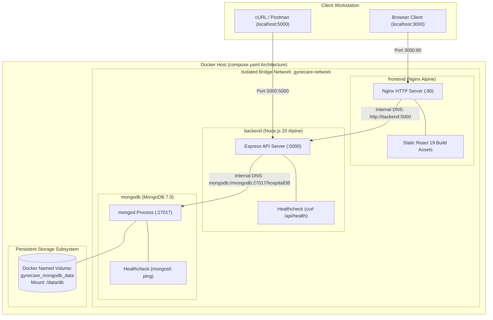

# Aim
To explore multi-container application architecture, design a declarative multi-service specification using Docker Compose (`compose.yaml`), orchestrate the complete three-tier GyneCare Hospital Management platform (React SPA frontend, Express.js backend API, and MongoDB database), configure custom bridge networking for internal DNS service discovery, manage persistent data volumes, and enforce container startup dependency sequencing via health checks.

---

# Objectives
- Understand multi-container orchestration principles and contrast multi-container composition against single-container execution.
- Author an enterprise-grade Docker Compose manifest (`compose.yaml`) coordinating frontend, backend, and database tiers.
- Establish an isolated user-defined bridge network (`gynecare-network`) enabling automated container-name-to-IP DNS resolution.
- Configure persistent state storage for MongoDB using named Docker volumes (`gynecare_mongodb_data`).
- Enforce deterministic startup sequencing using `depends_on` conditioned upon container health check readiness (`service_healthy`).
- Parameterize environment configurations using `.env` templates without committing secrets to source control.
- Practice the full Docker Compose operational lifecycle: `config`, `build`, `up -d`, `ps`, `logs`, `stop`, `start`, `down`, and `down -v`.
- Validate end-to-end multi-tier communication from browser UI to backend API and database records.

---

# Learning Outcomes
- Designing microservice application topologies declaratively in YAML.
- Mastering Docker internal networking: embedded DNS servers, virtual bridge switches, and network micro-segmentation.
- Implementing stateful data persistence across container deletion and recreation cycles using named volumes.
- Eliminating race conditions during application startup using robust health probe dependencies.
- Diagnosing multi-container distributed systems using aggregated log streams and container inspection utilities.

---

# Problem Statement / Purpose
Single-container deployments (as demonstrated in Assignment 4) are insufficient for enterprise multi-tier platforms like GyneCare. Manually launching individual containers with `docker run`, managing separate IP addresses, creating bridge networks, mounting volumes, and timing application startups is highly manual and prone to fatal race conditions (e.g., the backend crashing because MongoDB is not yet listening).
The purpose of Assignment 5 is to establish a unified, declarative multi-container orchestrator using Docker Compose, enabling the entire three-tier healthcare system to be provisioned, interconnected, health-checked, and decommissioned through a single automated command.

---

# Project Context
Assignment 5 completes the local containerization phase of the DevOps engineering curriculum. The multi-container architecture established in `compose.yaml` serves as the direct operational model that is subsequently adapted into Kubernetes Pods, Deployments, and Services in Assignments 7, 8, 9, and 10:
```
[Assignment 1: MERN Baseline Application]
       │
       ▼
[Assignment 2: Cloud Infrastructure (AWS EC2)]
       │
       ▼
[Assignment 3: Infrastructure as Code (Terraform)]
       │
       ▼
[Assignment 4: Single Container Packaging (Docker)]
       │
       ▼
[Assignment 5: Multi-Container Orchestration (Docker Compose)]  <-- Current Stage
       │
       ▼
[Assignment 6: Continuous Integration (Jenkins CI)]
```

---

# Concepts and Theory

### Multi-Container Composition vs. Monolithic Containers
- **Monolithic Container Anti-Pattern**: Running the web server, Node.js runtime, and database daemon inside a single container violates the single-responsibility principle, complicates scaling, and defeats logging/health isolation.
- **Microservice Container Composition**: Each tier runs in its own isolated container optimized for its specific workload. Containers scale independently, maintain distinct lifecycle states, and communicate exclusively over dedicated network protocols.

### Internal DNS & Service Discovery
Docker Engine embeds a local DNS server at `127.0.0.11` within all user-defined bridge networks. When a container issues a network request to a hostname matching another service name defined in `compose.yaml` (e.g., `mongodb` or `backend`), the embedded DNS server resolves the hostname directly to the target container's private bridge IP address. This eliminates hardcoded IP addresses.

### Container Health Probes and Dependency Ordering
Traditional `depends_on` configurations only wait for a container to transition to the `running` state (kernel process launched), not for the application inside to be *ready* to accept traffic. By coupling `depends_on` with `condition: service_healthy`, Docker Compose delays starting dependent containers until the underlying dependency's `HEALTHCHECK` command succeeds.

```
┌────────────────────────────────────────────────────────────────────────┐
│                      Startup Dependency Timeline                       │
│                                                                        │
│   mongodb container starts                                             │
│      │                                                                 │
│      ▼ (MongoDB initializes storage & opens port 27017)                │
│   mongodb healthcheck probe succeeds (service_healthy)                 │
│      │                                                                 │
│      ▼                                                                 │
│   backend container starts (connects to mongodb:27017 immediately)     │
│      │                                                                 │
│      ▼ (Express API boots & responds to /api/health)                   │
│   backend healthcheck probe succeeds (service_healthy)                 │
│      │                                                                 │
│      ▼                                                                 │
│   frontend container starts (proxies API requests without drop)        │
└────────────────────────────────────────────────────────────────────────┘
```

---

# Technologies and Tools Used

| Service Tier | Technology / Image | Port Mapping | Operational Purpose |
|---|---|---|---|
| **Orchestrator** | Docker Compose v5.5.0 | N/A | Multi-container coordination engine |
| **Frontend Service** | `client/Dockerfile` (Alpine Nginx) | `3000:80` | High-performance SPA delivery and reverse proxy |
| **Backend Service** | `Dockerfile` (Node.js 20 Alpine) | `5000:5000` | REST API service and business logic controller |
| **Database Service** | `mongo:7.0` | `27017:27017` | Document database for healthcare records |
| **Network** | Docker Bridge (`gynecare-network`) | Internal | Subnet providing isolated DNS resolution |
| **Storage** | Named Volume (`gynecare_mongodb_data`) | Host-managed | Persistent B-tree database files (`/data/db`) |

---

# Prerequisites
- Docker Engine and Docker Compose installed and operational (`docker compose version`)
- Cloned GyneCare project repository
- Free host ports `3000`, `5000`, and `27017`
- Valid `.env` configuration file created from `.env.example`

---

# Environment / System Requirements
- **Operating System**: Windows 10/11 (WSL2 backend), macOS, or Ubuntu 20.04/22.04 LTS
- **Hardware Resources**: Minimum 4 GB RAM, 2 CPU cores allocated to Docker
- **Disk Storage**: At least 4 GB free disk space for container images and database volumes
- **Permissions**: Administrative or docker group permissions to manage container sockets

---

# Architecture



---

# Architecture Explanation
1. **Frontend Presentation**: Nginx serves the pre-compiled React Single Page Application on host port `3000`. Requests targeting `/api/*` are reverse-proxied internally to `http://backend:5000`.
2. **Backend Application**: The Express API listens on port `5000`. It depends on MongoDB transitioning to `service_healthy` before initiating its own database connection pool.
3. **Data Tier Persistence**: MongoDB stores patient data in `/data/db`, which is mounted to the named volume `gynecare_mongodb_data`. If the MongoDB container is stopped, removed, or recreated, all clinical data remains intact on the host volume.
4. **Isolated Bridge Network**: All three services attach to `gynecare-network`. They communicate using container service names (`backend`, `mongodb`) resolved automatically by Docker's embedded DNS server.

---

# Project / Repository Structure

```text
BOT-MERN-Gynecare-Hospital-Management-System-/
├── compose.yaml                          # Master multi-container Compose specification
├── Dockerfile                            # Backend production container definition
├── .env.example                          # Secret-free environment variable template
├── client/                               # Frontend application
│   ├── Dockerfile                        # Multi-stage Dockerfile (Build -> Nginx)
│   ├── nginx.conf                        # Nginx reverse proxy configuration
│   └── ...
├── server/                               # Backend API service
│   ├── server.js                         # Application entry point
│   └── ...
├── docs/
│   └── assignment-5/
│       ├── README.md                     # Assignment quickstart guide
│       └── assignment-5-documentation.md # Multi-container technical report
└── evidence/
    └── assignment-5/
        └── README.md                     # Verification screenshots guide
```

---

# Configuration Overview

### Core Environment Parameters (`.env`)
```ini
# Application Ports
FRONTEND_PORT=3000
PORT=5000
MONGO_PORT=27017

# Database Connection
MONGO_DATABASE=hospitalDB
MONGO_URI=mongodb://mongodb:27017/hospitalDB

# Runtime Mode
NODE_ENV=production
```

---

# Step-by-Step Implementation

### Step 1: Validate Compose Configuration
Verify syntax, environment variable interpolation, and service schemas:
```bash
docker compose config
```

### Step 2: Build Service Images
Compile both the frontend Nginx image and backend Node.js image:
```bash
docker compose build
```

### Step 3: Launch Multi-Container Stack in Detached Mode
Provision the network, volume, and services with dependency sequencing:
```bash
docker compose up -d
```

### Step 4: Verify Service Health & Container States
Inspect running containers and verify health status:
```bash
docker compose ps
```

### Step 5: Monitor Aggregated Log Streams
Audit cross-service startup logs to verify database connection handshakes:
```bash
docker compose logs -f backend
```

### Step 6: Validate Application Access
Test both the web client and API endpoints:
```bash
curl -i http://localhost:5000/api/health
curl -i http://localhost:3000
```

### Step 7: Controlled Teardown
Stop the stack while preserving data persistence:
```bash
docker compose down
```

---

# Commands and Their Explanation

### Command 1: `docker compose config`
- **Purpose**: Parses `compose.yaml`, resolves environment variables from `.env`, validates YAML schema structure, and prints the canonical merged configuration.
- **Expected Behavior**: Outputs valid YAML or flags syntax errors before execution.
- **Verification**: Exit code 0 confirms valid specification.

### Command 2: `docker compose up -d`
- **Purpose**: Builds missing images, creates the network and volumes, starts containers in dependency order, and detaches to the background.
- **Arguments**: `-d` runs detached; `--build` forces image recompilation.
- **Expected Behavior**: Prints progress: network created, volume created, containers started.
- **Verification**: `docker compose ps` displays all services in `Up (healthy)` state.

### Command 3: `docker compose down` vs. `docker compose down -v`
- **`docker compose down`**: Stops and removes containers and networks while **preserving** named persistent volumes (`gynecare_mongodb_data`).
- **`docker compose down -v`**: Stops and destroys containers, networks, **and deletes all persistent volumes**, completely wiping the database.

---

# Configuration / Code Implementation

### Master Multi-Container Specification (`compose.yaml`)
```yaml
# ==============================================================================
# GyneCare Hospital Management System - Master Docker Compose Specification
# ==============================================================================

services:
  # Data Tier: Persistent MongoDB Document Store
  mongodb:
    image: mongo:7.0
    container_name: gynecare-mongodb
    restart: unless-stopped
    ports:
      - "${MONGO_PORT:-27017}:27017"
    environment:
      - MONGO_INITDB_DATABASE=${MONGO_DATABASE:-hospitalDB}
    volumes:
      - gynecare_mongodb_data:/data/db
    networks:
      - gynecare-network
    healthcheck:
      test: ["CMD", "mongosh", "--quiet", "--eval", "db.adminCommand('ping')"]
      interval: 10s
      timeout: 5s
      retries: 5
      start_period: 15s

  # Application Tier: Express.js REST API
  backend:
    build:
      context: .
      dockerfile: Dockerfile
    container_name: gynecare-backend
    restart: unless-stopped
    ports:
      - "${PORT:-5000}:5000"
    environment:
      - PORT=${PORT:-5000}
      - MONGO_URI=mongodb://mongodb:27017/${MONGO_DATABASE:-hospitalDB}
      - NODE_ENV=${NODE_ENV:-production}
    depends_on:
      mongodb:
        condition: service_healthy
    networks:
      - gynecare-network
    healthcheck:
      test: ["CMD", "curl", "-f", "http://localhost:5000/api/health"]
      interval: 15s
      timeout: 5s
      retries: 3
      start_period: 10s

  # Presentation Tier: React 19 SPA via Alpine Nginx
  frontend:
    build:
      context: ./client
      dockerfile: Dockerfile
    container_name: gynecare-frontend
    restart: unless-stopped
    ports:
      - "${FRONTEND_PORT:-3000}:80"
    depends_on:
      backend:
        condition: service_healthy
    networks:
      - gynecare-network

networks:
  gynecare-network:
    driver: bridge
    name: gynecare-network

volumes:
  gynecare_mongodb_data:
    name: gynecare_mongodb_data
```

---

# Detailed Explanation of Code

| Section / Key | Engineering Function |
|---|---|
| `services.mongodb.volumes` | Mounts `gynecare_mongodb_data` to `/data/db`, safeguarding database records against container lifecycle destruction. |
| `services.mongodb.healthcheck` | Uses `mongosh` to ping the admin database; verifies database engine is accepting TCP connections. |
| `services.backend.depends_on` | Defines `condition: service_healthy` on `mongodb`, preventing the API server from crashing due to early database unavailability. |
| `services.backend.environment` | Injects `mongodb://mongodb:27017/hospitalDB` where hostname `mongodb` is resolved via internal Docker DNS. |
| `services.frontend.ports` | Maps host port `3000` to internal Nginx HTTP port `80`. |
| `networks.gynecare-network` | Establishes an isolated bridge network enforcing network segmentation from default host bridge. |

---

# Integration With GyneCare
Assignment 5 brings the entire GyneCare architecture to life as a unified system:
- Seamlessly integrates the React frontend (`client/`), Express backend (`server/`), and MongoDB database.
- Provides the exact multi-tier architectural blueprint that is subsequently packaged as a Helm chart in Assignment 7 and deployed to Kubernetes in Assignments 8, 9, and 10.
- Serves as the primary local testing environment for verifying feature releases before triggering Jenkins CI pipelines.

---

# Validation and Testing

### 1. Cross-Container DNS Resolution & Health Check
```bash
docker exec -it gynecare-backend ping -c 2 mongodb
```

### 2. Backend Health Probe Verification
```bash
curl -s http://localhost:5000/api/health
```

### 3. Database Data Persistence Test
```bash
# Write test record via API, restart stack, and query database
docker compose restart
curl -s http://localhost:5000/api/doctors
```

---

# Verification / Observed Behaviour

1. **Deterministic Boot**: Docker Compose starts `mongodb`, waits ~12 seconds until healthy, launches `backend`, waits ~8 seconds until healthy, and finally starts `frontend`.
2. **Process Health**: `docker compose ps` displays all three containers in `Up (healthy)` state.
3. **Database Connectivity**: Backend logs output `MongoDB Connected: mongodb` confirming internal DNS resolution.
4. **Data Persistence**: Terminating containers with `docker compose down` and restarting with `docker compose up -d` leaves seeded doctor and hospital records completely intact.

---

# Expected Output

```text
NAME                IMAGE                  COMMAND                  SERVICE    STATUS              PORTS
gynecare-backend    gynecare-backend       "node server.js"         backend    Up (healthy)        0.0.0.0:5000->5000/tcp
gynecare-frontend   gynecare-frontend      "/docker-entrypoint.…"   frontend   Up                  0.0.0.0:3000->80/tcp
gynecare-mongodb    mongo:7.0              "docker-entrypoint.s…"   mongodb    Up (healthy)        0.0.0.0:27017->27017/tcp
```

---

# Security Considerations
- **Isolated Network Perimeter**: The database is accessible strictly within `gynecare-network`. External hosts cannot query MongoDB directly unless port 27017 is explicitly exposed.
- **Unprivileged Execution**: Both frontend and backend execute under unprivileged user contexts (`nginx` and `gynecareuser`).
- **Secret Isolation**: Production deployments store database credentials in environment files injected at runtime, preventing plaintext passwords in `compose.yaml`.
- **Read-Only Root Filesystems**: Containers can be hardened with `read_only: true` and temporary `tmpfs` mounts for `/tmp` to prevent runtime filesystem modifications.

---

# Troubleshooting

| Problem | Likely Cause | Diagnostic Command | Solution |
|---|---|---|---|
| **Backend Crashes on Start** | MongoDB health check failed or timeout exceeded | `docker compose logs mongodb` | Check MongoDB startup logs; verify sufficient host memory. |
| **Frontend Cannot Reach API** | CORS policy or incorrect proxy target | Open browser Developer Tools Network tab | Ensure Nginx `proxy_pass` points to `http://backend:5000` inside `nginx.conf`. |
| **Port 3000 / 5000 Bound** | Local background service listening on host port | `netstat -ano \| findstr :3000` | Modify port mapping in `.env` (e.g., `FRONTEND_PORT=3001`). |
| **Data Lost After Restart** | Stack removed via `docker compose down -v` | `docker volume ls` | Avoid `-v` flag unless an intentional database wipe is desired. |

---

# DevOps Relevance
- **Complete Environment Reproducibility**: New developers onboard by cloning the repository and executing `docker compose up -d` to launch the entire stack in under two minutes.
- **Microservice Coordination**: Demonstrates service discovery, health monitoring, and persistent storage patterns foundational to cloud-native platforms.
- **Pipeline Integration**: Jenkins CI pipelines spin up Compose environments to execute integration and end-to-end testing suites.

---

# Advanced / Professional Considerations
- **Compose Overrides**: Docker Compose supports multiple compose files (e.g., `compose.yaml` + `compose.override.yaml` for local development, `compose.prod.yaml` for production), enabling environment-specific configurations without duplicating code.
- **Resource Constraints**: Production Compose files specify CPU and memory limits (`deploy.resources.limits`) to prevent single-container memory leaks from degrading host stability.
- **Log Rotation**: Ingesting `logging` drivers with `max-size: "10m"` and `max-file: "3"` prevents unmanaged container logs from exhausting host disk space.

---

# Requirement-to-Implementation Traceability

| Assignment Requirement | Implementation Artifact | Verification Mechanism | Documentation Section |
|---|---|---|---|
| Multi-Container Specification | `compose.yaml` | `docker compose config` syntax audit | Step-by-Step Implementation |
| Multi-Tier Composition | `frontend`, `backend`, `mongodb` services | `docker compose ps` | Code Implementation |
| Service Discovery & DNS | `gynecare-network` (custom bridge) | Cross-container ping & API connectivity | Architecture Explanation |
| Persistent Data Storage | `gynecare_mongodb_data` named volume | Data persistence test across restarts | Configuration Overview |
| Startup Sequencing & Health | `depends_on: condition: service_healthy` | Sequential startup log timeline audit | Concepts & Theory |
| Lifecycle Management | Commands: `up`, `ps`, `logs`, `down` | Process lifecycle monitoring | Commands & Lifecycle |

---

# Evidence / Screenshot Requirements
- **Screenshot 1**: Terminal execution of `docker compose config` displaying validated merged configuration.
- **Screenshot 2**: Terminal output of `docker compose build` compiling frontend and backend images.
- **Screenshot 3**: Terminal output of `docker compose up -d` displaying network, volume, and service creation.
- **Screenshot 4**: Terminal execution of `docker compose ps` showing all three services in `Up (healthy)` state.
- **Screenshot 5**: Terminal output of `docker compose logs backend` showing successful MongoDB connection handshake.
- **Screenshot 6**: Browser view of `http://localhost:3000` rendering the GyneCare SPA with live doctor consultation data.
- **Screenshot 7**: Terminal output of `curl http://localhost:5000/api/health` displaying HTTP 200 OK.
- **Screenshot 8**: Terminal output of `docker compose down` confirming graceful container stop while preserving volume.

---

# Cleanup / Rollback / Termination
To stop and clean up the multi-container stack:
```bash
# Standard graceful shutdown (preserves persistent database volume)
docker compose down

# Full cleanup (removes containers, networks, AND deletes database volume)
docker compose down -v
```

---

# Learning Outcomes Achieved
- Mastered declarative multi-container orchestration using Docker Compose.
- Implemented internal DNS service discovery across independent container tiers.
- Configured persistent named volumes safeguarding clinical database state.
- Enforced deterministic container startup sequencing via health check probes.

---

# Assignment Completion Checklist
- [x] Multi-tier `compose.yaml` specification designed and validated
- [x] Custom bridge network configured for automated DNS resolution
- [x] Named persistent volume established for MongoDB data tier
- [x] Startup dependencies coupled to health check readiness probes
- [x] Environment variable interpolation secured via `.env.example`
- [x] Full operational lifecycle (`up`, `logs`, `down`) verified
- [x] Multi-tier web application access validated from client browser

---

# Result
The complete three-tier GyneCare Hospital Management platform was successfully orchestrated using Docker Compose. The React SPA frontend, Express API backend, and MongoDB database initialize deterministically, communicate over an isolated bridge network, preserve state on persistent named volumes, and respond reliably to health probes.

---

# Conclusion
Assignment 5 successfully demonstrates multi-container orchestration. By coordinating microservices, internal networking, persistent storage, and startup dependencies within a single declarative specification, Docker Compose bridges the gap between single-container development and enterprise-scale orchestration, setting the stage for Jenkins Continuous Integration in Assignment 6 and Kubernetes cluster deployment in Assignments 7 through 10.
