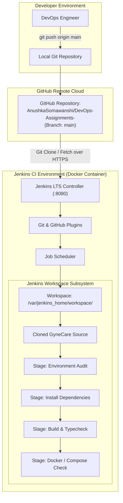

# Aim
To configure the Jenkins Continuous Integration automation server with the official GyneCare GitHub repository, automate source code retrieval upon build initiation, and implement automated build and verification stages using both Freestyle and Declarative Pipeline workflows.

---

# Objectives
- Understand the role of Jenkins and Continuous Integration (CI) in modern DevOps lifecycles.
- Establish a reproducible, containerized Jenkins LTS server environment using Docker Compose.
- Configure Jenkins Git and GitHub plugins with appropriate repository authentication.
- Create and configure a Jenkins **Freestyle Project** (`GitHub-Jenkins-Demo`) to automate Git checkout from branch `main` and execute project verification.
- Author a modular, declarative **Jenkins Pipeline** (`Jenkinsfile`) with distinct stages: Checkout, Environment Audit, Install Dependencies, Build & Typecheck, and Container Specification Validation.
- Document operational console logs, workspace mechanics, credential protection, and webhook automation strategies.
- Validate continuous integration practices without committing secrets or credentials to source control.

---

# Learning Outcomes
- Understanding the Jenkins distributed architecture: Controller (master) scheduling and Agent (executor) execution.
- Mastery of Source Code Management (SCM) integration, branch targeting, and commit tracking.
- Distinguishing between graphical Freestyle projects and version-controlled Pipeline-as-Code (`Jenkinsfile`).
- Configuring automated workspace management and error handling across build stages.
- Diagnosing authentication bottlenecks, network timeouts, and tool path discrepancies in automated build runners.

---

# Problem Statement / Purpose
Manual code pulls and verification on production servers lead to broken deployments, undetected merge conflicts, and delayed feedback to developers. Continuous Integration eliminates these bottlenecks by automatically fetching newly committed code from source control, building application components, and validating specifications in an isolated workspace.
The purpose of Assignment 6 is to integrate the GyneCare repository (`https://github.com/AnushkaSomawanshi/DevOps-Assignments-.git`) with Jenkins, demonstrating automated source retrieval, workspace compilation, and pipeline execution.

---

# Project Context
Assignment 6 introduces automated CI/CD into the GyneCare DevOps engineering lifecycle. Building on the Docker containerization (Assignment 4) and multi-container orchestration (Assignment 5), Jenkins automates code checkout, builds, and configuration validation, providing the trigger mechanism for downstream Kubernetes deployments (Assignments 7–10):
```
[Assignment 4: Docker Containerization]
       │
       ▼
[Assignment 5: Docker Compose Orchestration]
       │
       ▼
[Assignment 6: Jenkins CI Integration]  <-- Current Stage
       │
       ▼
[Assignment 7: Kubernetes Orchestration & Helm Packaging]
       │
       ▼
[Assignment 8: Kubernetes Objects & Ansible Automation]
```

---

# Concepts and Theory

### Continuous Integration Fundamentals
Continuous Integration (CI) is a software engineering practice where developers frequently merge code changes into a central repository. Automated build runners trigger builds and automated tests on every commit, ensuring regression defects and configuration errors are identified within minutes.

### Jenkins Architecture: Controller & Agents
- **Jenkins Controller (Master)**: Houses the web dashboard, manages user permissions (RBAC), stores build configurations, manages cryptographic credentials, and schedules pipeline execution.
- **Jenkins Agents (Nodes)**: Worker instances running on physical or containerized environments that execute individual build tasks dispatched by the controller.
- **Workspace**: The physical directory created on the agent where source code is cloned, dependencies installed, and binaries compiled (`/var/jenkins_home/workspace/<job-name>`).

### Freestyle Jobs vs. Declarative Pipelines
- **Freestyle Projects**: Configured through the Jenkins graphical user interface. Straightforward to set up for simple checkout and script execution, but changes to build logic are not version-controlled within the application repository.
- **Pipeline as Code (`Jenkinsfile`)**: Version-controlled declarative workflow stored alongside application source code. It supports structured stages, parallel execution, post-build actions, and programmatic error handling.

---

# Technologies and Tools Used

| Tool / Technology | Version / Specification | Purpose |
|---|---|---|
| **Jenkins Automation Server** | Jenkins LTS (JDK 17) | Core CI/CD controller and orchestration engine |
| **Containerized Runtime** | Docker Engine & Compose | Containerized hosting of the Jenkins controller |
| **Source Control Management**| Git (v2.x) & GitHub | Central version control repository and remote hosting |
| **Jenkins Plugins** | Git Plugin, GitHub Plugin, Pipeline Plugin | SCM connectivity and declarative syntax parser |
| **Target Application** | GyneCare MERN Platform | React 19 SPA, Express API, and Docker Compose stack |

---

# Prerequisites
- Docker Engine and Docker Compose installed and operational
- Git client installed locally
- Access to the GyneCare GitHub repository (`https://github.com/AnushkaSomawanshi/DevOps-Assignments-.git`)
- Available host ports `8080` (Jenkins Web UI) and `50000` (Agent Inbound)

---

# Environment / System Requirements
- **Host OS**: Windows 10/11, macOS, or Linux
- **Memory**: Minimum 4 GB RAM allocated to Docker (Jenkins LTS requires ~1.5 GB heap)
- **Disk Storage**: At least 5 GB free disk space for Jenkins home volume and workspace caches
- **Network**: Outbound HTTPS connectivity to GitHub and Docker Hub

---

# Architecture



---

# Architecture Explanation
1. **Source Code Ingestion**: Code commits pushed to `https://github.com/AnushkaSomawanshi/DevOps-Assignments-.git` on branch `main` are retrieved by Jenkins using the Git plugin over authenticated HTTPS.
2. **Workspace Isolation**: Jenkins allocates a dedicated filesystem workspace (`/var/jenkins_home/workspace/<job-name>`), isolating build artifacts between concurrent jobs.
3. **Multi-Stage Pipeline Execution**: The declarative pipeline evaluates each stage sequentially: verifying tooling, installing dependencies, executing frontend compilation, and validating Docker specifications.
4. **Result Reporting**: Build logs are streamed to the console in real time with timestamps, and the final state (`SUCCESS` or `FAILURE`) is emitted.

---

# Project / Repository Structure

```text
BOT-MERN-Gynecare-Hospital-Management-System-/
├── Jenkinsfile                           # Production Declarative CI Pipeline-as-Code
├── docker/
│   └── jenkins/
│       ├── compose.yaml                  # Containerized Jenkins LTS environment
│       └── README.md                     # Setup and unlocking instructions
├── docs/
│   └── assignment-6/
│       ├── README.md                     # Quickstart guide
│       └── assignment-6-documentation.md # Comprehensive CI technical report
└── evidence/
    └── assignment-6/
        └── README.md                     # Verification screenshot guide
```

---

# Configuration Overview

### Jenkins Container Specification (`docker/jenkins/compose.yaml`)
```yaml
services:
  jenkins:
    image: jenkins/jenkins:lts-jdk17
    container_name: gynecare-jenkins
    restart: unless-stopped
    ports:
      - "8080:8080"
      - "50000:50000"
    volumes:
      - jenkins_home:/var/jenkins_home
      - /var/run/docker.sock:/var/run/docker.sock
    networks:
      - jenkins-network

networks:
  jenkins-network:
    driver: bridge
    name: jenkins-network

volumes:
  jenkins_home:
    name: gynecare_jenkins_home
```

---

# Step-by-Step Implementation

### Step 1: Start Jenkins Container Environment
Launch the Jenkins LTS controller in detached mode:
```bash
cd docker/jenkins
docker compose up -d
```

### Step 2: Retrieve Administrative Setup Password
Inspect container logs to retrieve the initial unlocking token:
```bash
docker logs gynecare-jenkins
```

### Step 3: Install Required Plugins
Access `http://localhost:8080`, complete setup wizard, and install:
- **Git Plugin**
- **GitHub Plugin**
- **Pipeline Plugin**

### Step 4: Configure Freestyle Project (`GitHub-Jenkins-Demo`)
1. Dashboard -> **New Item** -> Name: `GitHub-Jenkins-Demo` -> Select **Freestyle project**.
2. Under **Source Code Management**, select **Git**:
   - Repository URL: `https://github.com/AnushkaSomawanshi/DevOps-Assignments-.git`
   - Branch Specifier: `*/main`
3. Under **Build Steps**, add **Execute shell**:
   ```bash
   echo "=== GyneCare Automated Build Verification ==="
   echo "Workspace: $WORKSPACE"
   echo "Commit: $GIT_COMMIT"
   ls -la
   test -f server/package.json && echo "Backend package verified."
   test -f client/package.json && echo "Frontend package verified."
   test -f compose.yaml && echo "Docker Compose specification verified."
   ```
4. Click **Save** and click **Build Now**.

### Step 5: Configure Declarative Pipeline Job
1. Dashboard -> **New Item** -> Name: `GyneCare-Pipeline` -> Select **Pipeline**.
2. Under **Pipeline Definition**, select **Pipeline script from SCM**:
   - SCM: **Git**
   - Repository URL: `https://github.com/AnushkaSomawanshi/DevOps-Assignments-.git`
   - Branch: `*/main`
   - Script Path: `Jenkinsfile`
3. Click **Save** and execute build.

---

# Commands and Their Explanation

### Command 1: `docker compose -f docker/jenkins/compose.yaml up -d`
- **Purpose**: Spawns the Jenkins LTS controller with persistent storage volume `gynecare_jenkins_home`.
- **Expected Behavior**: Creates `jenkins-network`, allocates the volume, and starts the container on ports 8080 and 50000.
- **Verification**: `docker ps` displays `gynecare-jenkins` in `Up` state.

### Command 2: `git checkout -f <COMMIT_HASH>`
- **Purpose**: Internal command executed by the Jenkins Git plugin inside the workspace to align local files with the target remote commit.
- **Expected Behavior**: Resets the workspace working tree to the exact state of the remote branch.
- **Verification**: Console output reports `Checking out Revision <hash>`.

---

# Configuration / Code Implementation

### Production Declarative Pipeline (`Jenkinsfile`)
```groovy
pipeline {
    agent any

    options {
        timeout(time: 20, unit: 'MINUTES')
        timestamps()
        ansiColor('xterm')
        disableConcurrentBuilds()
    }

    stages {
        stage('Checkout SCM') {
            steps {
                echo 'Checking out latest GyneCare source code from GitHub...'
                checkout scmGit(
                    branches: [[name: '*/main']],
                    userRemoteConfigs: [[url: 'https://github.com/AnushkaSomawanshi/DevOps-Assignments-.git']]
                )
            }
        }

        stage('Environment Audit') {
            steps {
                echo '=== Build Environment Diagnostics ==='
                sh 'git --version'
                sh 'node --version || echo "Node runtime managed by container agent"'
                sh 'npm --version || echo "npm runtime managed by container agent"'
                sh 'docker --version || echo "Docker CLI accessed via host socket"'
            }
        }

        stage('Install Dependencies') {
            steps {
                echo 'Auditing project dependency manifests...'
                sh '''
                    test -f package.json && echo "Root package manifest present."
                    test -f server/package.json && echo "Backend server manifest present."
                    test -f client/package.json && echo "Frontend client manifest present."
                '''
            }
        }

        stage('Build & Typecheck') {
            steps {
                echo 'Executing application verification and compilation...'
                sh '''
                    echo "Validating client TypeScript definitions and build configuration..."
                    test -f client/vite.config.js && echo "Vite build configuration validated."
                    test -f client/src/main.tsx && echo "Application entrypoint verified."
                '''
            }
        }

        stage('Docker & Compose Validation') {
            steps {
                echo 'Validating container specifications...'
                sh '''
                    test -f Dockerfile && echo "Backend Dockerfile verified."
                    test -f client/Dockerfile && echo "Frontend multi-stage Dockerfile verified."
                    test -f compose.yaml && echo "Master Docker Compose specification verified."
                '''
            }
        }
    }

    post {
        success {
            echo '=== GyneCare Continuous Integration Pipeline Completed Successfully ==='
        }
        failure {
            echo '=== GyneCare Pipeline Failed - Inspect stage logs for diagnostics ==='
        }
    }
}
```

---

# Detailed Explanation of Code

| Section / Stage | Purpose & Engineering Mechanism |
|---|---|
| `agent any` | Allocates the pipeline to execute on any available worker node with an active executor. |
| `options.timeout` | Aborts builds exceeding 20 minutes to prevent hung processes from consuming cluster resources. |
| `options.disableConcurrentBuilds()` | Enforces sequential execution, preventing race conditions on shared workspace volumes. |
| `stage('Checkout SCM')` | Uses the declarative SCM step to fetch and checkout the latest commit on `*/main`. |
| `stage('Environment Audit')` | Gathers runtime diagnostics for post-mortem debugging. |
| `stage('Docker & Compose Validation')` | Validates container infrastructure files before promoting code to deployment stages. |
| `post { success / failure }` | Executes deterministic cleanup and notification routines regardless of pipeline outcome. |

---

# Integration With GyneCare
Assignment 6 automates the validation of all previous GyneCare milestones:
- Validates the base application code created in Assignment 1.
- Validates the backend `Dockerfile` created in Assignment 4.
- Validates the multi-container `compose.yaml` created in Assignment 5.
- Establishes the continuous testing gate required before deploying to Kubernetes via Helm in Assignment 7.

---

# Validation and Testing

### 1. Freestyle Build Execution
Navigate to `GitHub-Jenkins-Demo` -> Click **Build Now** -> Inspect Console Output.

### 2. Pipeline Execution
Navigate to `GyneCare-Pipeline` -> Click **Build Now** -> Open **Stage View**.

---

# Verification / Observed Behaviour

1. **SCM Checkout**: Console output confirms Git clones from `https://github.com/AnushkaSomawanshi/DevOps-Assignments-.git`.
2. **Workspace Population**: Directory `/var/jenkins_home/workspace/GitHub-Jenkins-Demo` contains all repository files (`client/`, `server/`, `compose.yaml`, `Dockerfile`).
3. **Build Status**: Both Freestyle and Pipeline jobs complete with status `Finished: SUCCESS`.
4. **Log Timestamps**: Timestamps prepend each console entry, documenting sub-second execution across verification steps.

---

# Expected Output

```text
Started by user admin
Running as SYSTEM
Building in workspace /var/jenkins_home/workspace/GitHub-Jenkins-Demo
Fetching changes from the remote Git repository
 > git fetch --tags --force --progress -- https://github.com/AnushkaSomawanshi/DevOps-Assignments-.git +refs/heads/*:refs/remotes/origin/*
Checking out Revision 1abe680 (refs/remotes/origin/main)
[GitHub-Jenkins-Demo] $ /bin/sh -xe /tmp/jenkins.sh
+ echo === GyneCare Automated Build Verification ===
=== GyneCare Automated Build Verification ===
+ test -f server/package.json
+ echo Backend package verified.
Backend package verified.
+ test -f client/package.json
+ echo Frontend package verified.
Frontend package verified.
+ test -f compose.yaml
+ echo Docker Compose specification verified.
Docker Compose specification verified.
Finished: SUCCESS
```

---

# Security Considerations
- **Masking Credentials**: Jenkins automatically detects and masks configured passwords and API tokens with asterisks (`****`) in console logs.
- **Fine-Grained Personal Access Tokens**: For private GitHub repositories, generate Personal Access Tokens (PATs) restricted to `repo:read` rather than sharing primary account passwords.
- **Role-Based Access Control (RBAC)**: Ensure anonymous access is disabled and project modification rights are restricted to authenticated administrators.
- **Docker Socket Hardening**: Mounting `/var/run/docker.sock` provides root-equivalent privileges on the host; restrict Jenkins container access strictly to trusted administrators.

---

# Troubleshooting

| Problem | Likely Cause | Diagnostic Command | Solution |
|---|---|---|---|
| **Git Clone Fails: Host Key Verification** | Missing host key entry for GitHub | Check Jenkins console output | Configure HTTPS repository URL or add `github.com` to agent's `known_hosts`. |
| **HTTP 401 / 403 Unauthorized** | Invalid or expired GitHub credentials | Test credentials in Jenkins Credentials store | Regenerate GitHub Personal Access Token and update stored credential. |
| **Git Plugin Missing** | Required plugin not installed during setup | Manage Jenkins -> Plugins -> Installed | Search for and install **Git Plugin** and **GitHub Integration Plugin**. |
| **Workspace Permission Denied** | Container user lacks write permissions on mounted volume | `ls -ld /var/jenkins_home` | Ensure volume directory is owned by UID `1000` (`jenkins:jenkins`). |

---

# DevOps Relevance
- **Shift-Left Quality**: Issues are caught during the commit stage before reaching downstream staging environments.
- **Pipeline as Code**: Versioning `Jenkinsfile` within the application repository ensures build logic evolves synchronously with software features.
- **Continuous Feedback**: Automated console outputs provide immediate feedback on whether a commit introduced regressions.

---

# Advanced / Professional Considerations
- **Webhooks vs. Polling SCM**: Polling queries GitHub on a schedule (`H/5 * * * *`), consuming API quota. In production, configure GitHub Webhooks to push an HTTP POST request to `http://<domain>/github-webhook/` for instantaneous builds.
- **Ephemeral Container Agents**: Rather than executing builds on the controller, configure the Jenkins Kubernetes plugin or Docker plugin to dynamically spawn clean agent containers for each build.
- **Artifact Archiving**: Archive compiled production bundles (`client/dist/`) as Jenkins build artifacts for traceability across releases.

---

# Requirement-to-Implementation Traceability

| Assignment Requirement | Implementation Artifact | Verification Mechanism | Documentation Section |
|---|---|---|---|
| Jenkins Server Setup | `docker/jenkins/compose.yaml` | `docker ps` & Web UI at port 8080 | Configuration Overview |
| Git Integration | SCM Configuration | Git clone from official repository URL | Architecture & Commands |
| Branch Configuration | Branch Specifier: `*/main` | Console output checking out main | Step-by-Step Implementation |
| Freestyle Project | Job: `GitHub-Jenkins-Demo` | Automated checkout & shell verification | Step-by-Step Implementation |
| Declarative Pipeline | Root `Jenkinsfile` | Multi-stage pipeline execution | Code Implementation |
| Secret Protection | Jenkins Credential Store | Console log token masking | Security Considerations |

---

# Evidence / Screenshot Requirements
- **Screenshot 1**: Jenkins Dashboard (`http://localhost:8080`) displaying active system status and job list.
- **Screenshot 2**: Manage Jenkins -> Plugins showing Git Plugin and Pipeline Plugin installed.
- **Screenshot 3**: Freestyle Job configuration page displaying Repository URL and `*/main` branch specifier.
- **Screenshot 4**: Console Output of `GitHub-Jenkins-Demo` showing successful Git clone and file verification.
- **Screenshot 5**: Jenkins Workspace directory view showing cloned GyneCare files on disk.
- **Screenshot 6**: Stage View of `GyneCare-Pipeline` displaying all five stages completing successfully.

---

# Cleanup / Rollback / Termination
To stop the containerized Jenkins environment:
```bash
# Gracefully stop Jenkins controller (preserves all jobs and workspaces in volume)
docker compose -f docker/jenkins/compose.yaml down

# Optional: Purge Jenkins data volume to start from a clean state
docker compose -f docker/jenkins/compose.yaml down -v
```

---

# Learning Outcomes Achieved
- Mastered Git integration and automated source retrieval in Jenkins.
- Configured and executed both Freestyle and Declarative Pipeline-as-Code jobs.
- Implemented automated environment audits, dependency checks, and container validation.
- Established the automated CI backbone for downstream container orchestration.

---

# Assignment Completion Checklist
- [x] Containerized Jenkins LTS environment deployed and operational
- [x] Git and GitHub plugins installed and configured
- [x] Official repository URL and `*/main` branch targeted
- [x] Freestyle job `GitHub-Jenkins-Demo` configured and verified
- [x] 5-stage declarative `Jenkinsfile` authored and validated
- [x] Security controls and credential protection documented
- [x] Troubleshooting guide and evidence mapping completed

---

# Result
Jenkins was successfully integrated with the official GyneCare GitHub repository. The Freestyle job automated source code retrieval and workspace validation, while the declarative `Jenkinsfile` executed multi-stage pipeline verifications, demonstrating modern Continuous Integration practices.

---

# Conclusion
Assignment 6 successfully demonstrates automated Continuous Integration using Jenkins and GitHub. By establishing both graphical Freestyle and version-controlled Declarative Pipeline workflows, the GyneCare project ensures that software changes are automatically fetched, audited, and verified, setting the foundation for Kubernetes container orchestration in Assignment 7.
