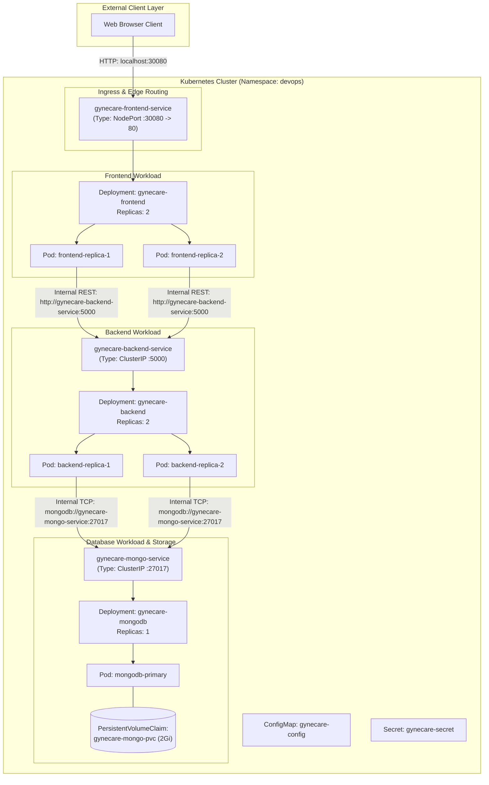

# Aim
To study Kubernetes container orchestration architecture, examine the internal operational mechanics of control-plane and worker-node components, design a modular Helm chart for the GyneCare MERN platform, and evaluate Helm packaging and release lifecycle operations.

---

# Objectives
- Analyze the distributed architecture of Kubernetes clusters including control-plane and worker-node responsibilities.
- Understand the reconciliation control loop, desired state management, and self-healing mechanisms.
- Author a comprehensive Helm Chart for the GyneCare hospital management platform with parameter-driven values.
- Configure Kubernetes manifests for Frontend (React/Nginx), Backend (Node.js/Express API), MongoDB, persistent storage (PVC), ConfigMaps, and Secrets.
- Implement production-grade health probes (liveness and readiness) and compute resource constraints (requests/limits).
- Document and practice the core Helm lifecycle: `lint`, `template`, `install`, `status`, `upgrade`, and `uninstall`.
- Validate container orchestration principles while maintaining security and data persistence standards.

---

# Learning Outcomes
- Understanding the roles of the Kubernetes API Server, etcd key-value store, kube-scheduler, and kube-controller-manager.
- Grasping worker node execution via `kubelet`, network routing via `kube-proxy`, and OCI container runtimes.
- Structuring enterprise Helm charts using semantic versioning, template helpers, and values separation.
- Managing persistent state in Kubernetes using PersistentVolumeClaims (PVCs) for stateful databases.
- Troubleshooting container lifecycle events (`CrashLoopBackOff`, `ImagePullBackOff`, probe failures, service routing).

---

# Problem Statement / Purpose
While Docker Compose (Assignment 5) coordinates containers effectively on a single host, it lacks automated multi-node scheduling, horizontal pod autoscaling, self-healing against hardware failures, zero-downtime rolling updates, and dynamic ingress routing required for enterprise hospital management systems.
The purpose of Assignment 7 is to transition the GyneCare application to Kubernetes container orchestration and package it into a reusable, parameter-driven Helm chart, enabling resilient multi-node deployments and streamlined release management.

---

# Project Context
Assignment 7 represents the container orchestration milestone of the DevOps engineering curriculum. Building upon single-host composition (Assignment 5) and automated CI (Assignment 6), Kubernetes and Helm provide the cloud-native production runtime:
```
[Assignment 5: Multi-Container Docker Compose]
       │
       ▼
[Assignment 6: Continuous Integration (Jenkins)]
       │
       ▼
[Assignment 7: Kubernetes Orchestration & Helm]  <-- Current Stage
       │
       ▼
[Assignment 8: Kubernetes Objects & Ansible Automation]
       │
       ▼
[Assignment 9: Helm Architecture & Lifecycle Deep-Dive]
       │
       ▼
[Assignment 10: Kubernetes Objects & Networking Services]
```

---

# Concepts and Theory

### Kubernetes Architecture Overview
Kubernetes is a distributed container orchestration engine designed to automate the deployment, scaling, networking, and recovery of containerized applications across a cluster of nodes.

```
┌────────────────────────────────────────────────────────────────────────────────────────┐
│                              Kubernetes Control Plane                                  │
│                                                                                        │
│   ┌────────────────────────────────────────────────────────────────────────────────┐   │
│   │                        kube-apiserver (REST Gateway)                           │   │
│   └───────┬───────────────────────────┬───────────────────────────┬────────────────┘   │
│           │                           │                           │                    │
│           ▼                           ▼                           ▼                    │
│   ┌───────────────┐           ┌───────────────┐           ┌───────────────┐            │
│   │     etcd      │           │ kube-scheduler│           │kube-controller│            │
│   │(Cluster State)│           │ (Node Binding)│           │    manager    │            │
│   └───────────────┘           └───────────────┘           └───────────────┘            │
└───────────────────────────────────────┬────────────────────────────────────────────────┘
                                        │ (Node Communication over TLS)
             ┌──────────────────────────┴──────────────────────────┐
             ▼                                                     ▼
┌───────────────────────────────┐               ┌───────────────────────────────┐
│          Worker Node 1        │               │          Worker Node 2        │
│                               │               │                               │
│  ┌─────────────────────────┐  │               │  ┌─────────────────────────┐  │
│  │   kubelet (Agent)       │  │               │  │   kubelet (Agent)       │  │
│  └────────────┬────────────┘  │               │  └────────────┬────────────┘  │
│               │               │               │               │               │
│  ┌────────────▼────────────┐  │               │  ┌────────────▼────────────┐  │
│  │   kube-proxy (Network)  │  │               │  │   kube-proxy (Network)  │  │
│  └─────────────────────────┘  │               │  └─────────────────────────┘  │
│                               │               │                               │
│  ┌─────────────────────────┐  │               │  ┌─────────────────────────┐  │
│  │     Pods (Containers)   │  │               │  │     Pods (Containers)   │  │
│  │  • gynecare-frontend    │  │               │  │  • gynecare-backend     │  │
│  │  • gynecare-mongodb     │  │               │  │  • gynecare-backend     │  │
│  └─────────────────────────┘  │               │  └─────────────────────────┘  │
└───────────────────────────────┘               └───────────────────────────────┘
```

### Control Plane Components
1. **`kube-apiserver`**: The front-end control plane REST API gateway handling all JSON/YAML requests.
2. **`etcd`**: Highly available, consistent distributed key-value store serving as the definitive storage for all cluster specifications and states.
3. **`kube-scheduler`**: Watches for newly created unscheduled Pods and assigns them to optimal worker nodes based on resource availability, affinity, and taints.
4. **`kube-controller-manager`**: Runs core control loops (Deployment controller, ReplicaSet controller, Node controller) reconciling current cluster state toward declared desired state.

### Worker Node Components
1. **`kubelet`**: Primary node agent ensuring that containers described in `PodSpecs` are running and healthy.
2. **`kube-proxy`**: Network proxy reflecting Kubernetes networking services on each node, configuring iptables or IPVS rules to load balance traffic.
3. **Container Runtime**: Software responsible for executing containers (e.g., `containerd`, CRI-O).

### Helm Package Manager Architecture
Helm acts as the package manager for Kubernetes:
- **Helm Chart**: Bundle of parameterized YAML templates and default values describing a related set of Kubernetes resources.
- **Release**: A running instance of a chart inside a Kubernetes cluster with an associated revision history.
- **Values Hierarchy**: Default settings in `values.yaml` can be overridden per environment using custom YAML files or command-line `--set` flags.

---

# Technologies and Tools Used

| Tool / Technology | Version / Specification | Role in Orchestration |
|---|---|---|
| **Kubernetes** | v1.36 Client | Container orchestration platform |
| **Helm** | v3.x | Package manager and templating engine |
| **Frontend Container** | `gynecare-frontend:latest` | React 19 SPA served via Alpine Nginx |
| **Backend Container** | `gynecare-backend:latest` | Express.js API server |
| **Database Container** | `mongo:6.0` | Stateful document database |
| **Storage Subsystem** | HostPath / CSI StorageClass | Persistent volume backing MongoDB data |

---

# Prerequisites
- Kubernetes cluster active or local cluster access (Docker Desktop Kubernetes, Minikube, or Kind)
- `kubectl` command-line utility installed and configured (`kubectl version --client`)
- Helm v3 command-line utility installed (`helm version`)
- Access to local GyneCare Docker images from Assignments 4 and 5

---

# Environment / System Requirements
- **Local Machine**: Windows 10/11, macOS, or Linux
- **Cluster Resources**: Minimum 2 CPU cores, 4 GB RAM allocated to Kubernetes
- **Cluster Networking**: CoreDNS and standard overlay network active
- **Storage**: Default StorageClass supporting Dynamic Volume Provisioning or static PV binding

---

# Architecture



---

# Architecture Explanation
1. **External North-South Ingress**: Browser clients access the frontend at `http://localhost:30080` via `gynecare-frontend-service` (NodePort). The service balances incoming traffic across the two frontend Pod replicas.
2. **Internal East-West Routing**: When the frontend initiates API calls, requests target `http://gynecare-backend-service:5000`. The ClusterIP service load balances requests across the backend Pods.
3. **Database Micro-Segmentation**: The backend communicates with MongoDB at `mongodb://gynecare-mongo-service:27017`. MongoDB is accessible exclusively inside the cluster.
4. **Decoupled Configuration & Storage**: Application configuration is injected via `ConfigMap`, credentials via `Secret`, and MongoDB state is preserved through `PersistentVolumeClaim`.

---

# Project / Repository Structure

```text
BOT-MERN-Gynecare-Hospital-Management-System-/
├── helm/
│   └── gynecare/                         # Master Helm Chart
│       ├── Chart.yaml                    # Package metadata & semantic versioning
│       ├── values.yaml                   # Default configuration schema
│       ├── templates/                    # Templated Kubernetes manifests
│       │   ├── _helpers.tpl              # Reusable template helper definitions
│       │   ├── configmap.yaml            # Environment variables
│       │   ├── secret.yaml               # Database credentials
│       │   ├── pvc.yaml                  # Persistent volume claim (2Gi)
│       │   ├── deployment-frontend.yaml  # React Nginx Deployment with probes
│       │   ├── service-frontend.yaml     # NodePort Service (Port 30080)
│       │   ├── deployment-backend.yaml   # Express API Deployment
│       │   ├── service-backend.yaml      # ClusterIP Service (Port 5000)
│       │   ├── deployment-mongo.yaml     # Stateful MongoDB Deployment
│       │   ├── service-mongo.yaml        # Internal ClusterIP Service (Port 27017)
│       │   └── NOTES.txt                 # Post-installation instructions
├── docs/
│   └── assignment-7/
│       ├── README.md                     # Quickstart guide
│       └── assignment-7-documentation.md # Kubernetes & Helm technical report
└── evidence/
    └── assignment-7/
        └── README.md                     # Verification screenshots guide
```

---

# Configuration Overview

### Default Chart Parameters (`helm/gynecare/values.yaml`)
```yaml
global:
  environment: production
  appNamespace: devops

frontend:
  replicaCount: 2
  image:
    repository: gynecare-frontend
    tag: latest
    pullPolicy: IfNotPresent
  service:
    type: NodePort
    port: 80
    nodePort: 30080
  resources:
    limits:
      cpu: 200m
      memory: 256Mi
    requests:
      cpu: 50m
      memory: 64Mi

backend:
  replicaCount: 2
  image:
    repository: gynecare-backend
    tag: latest
    pullPolicy: IfNotPresent
  service:
    type: ClusterIP
    port: 5000
  resources:
    limits:
      cpu: 300m
      memory: 512Mi
    requests:
      cpu: 100m
      memory: 128Mi

mongodb:
  replicaCount: 1
  image:
    repository: mongo
    tag: "6.0"
  persistence:
    enabled: true
    size: 2Gi
```

---

# Step-by-Step Implementation

### Step 1: Lint Chart Structure
Verify chart schema and best practices:
```bash
helm lint ./helm/gynecare
```

### Step 2: Render Templates Deterministically
Compile templates locally to verify parameter substitution without cluster submission:
```bash
helm template gynecare ./helm/gynecare --namespace devops
```

### Step 3: Deploy Application Release via Helm
Submit the rendered manifests and create the `devops` namespace:
```bash
helm install gynecare ./helm/gynecare --namespace devops --create-namespace
```

### Step 4: Verify Running Workloads & Services
Inspect active Pods, Deployments, and Services in the cluster:
```bash
kubectl get pods,services,pvc -n devops
```

### Step 5: Perform Zero-Downtime Rolling Upgrade
Scale frontend replicas dynamically by overriding values:
```bash
helm upgrade gynecare ./helm/gynecare --set frontend.replicaCount=3 -n devops
```

### Step 6: Audit Release Status & History
Query Helm release status and revision logs:
```bash
helm status gynecare -n devops
helm history gynecare -n devops
```

### Step 7: Clean Release Teardown
Decommission all managed release workloads:
```bash
helm uninstall gynecare -n devops
```

---

# Commands and Their Explanation

### Command 1: `helm lint ./helm/gynecare`
- **Purpose**: Runs static analysis on the Helm chart to detect syntax flaws, invalid indentation, and missing mandatory metadata fields.
- **Expected Behavior**: Outputs `1 chart(s) linted, 0 chart(s) failed`.
- **Verification**: Confirms chart is syntactically sound before cluster operations.

### Command 2: `helm template gynecare ./helm/gynecare`
- **Purpose**: Locally evaluates all template expressions against `values.yaml` and prints the fully expanded Kubernetes YAML stream to standard output.
- **Expected Behavior**: Outputs valid, non-templated Kubernetes YAML.
- **Verification**: Enables pre-flight verification in CI/CD pipelines without connecting to a live cluster.

### Command 3: `helm install gynecare ./helm/gynecare --namespace devops`
- **Purpose**: Deploys the package to the Kubernetes cluster, creates the release record in a Kubernetes Secret, and initiates workload scheduling.
- **Expected Behavior**: Prints release metadata and renders `NOTES.txt`.
- **Verification**: `helm list -n devops` shows release in `deployed` state.

---

# Configuration / Code Implementation

### Backend Deployment Template (`helm/gynecare/templates/deployment-backend.yaml`)
```yaml
apiVersion: apps/v1
kind: Deployment
metadata:
  name: {{ include "gynecare.fullname" . }}-backend
  labels:
    {{- include "gynecare.labels" . | nindent 4 }}
    app.kubernetes.io/component: backend
spec:
  replicas: {{ .Values.backend.replicaCount }}
  selector:
    matchLabels:
      {{- include "gynecare.selectorLabels" . | nindent 6 }}
      app.kubernetes.io/component: backend
  template:
    metadata:
      labels:
        {{- include "gynecare.selectorLabels" . | nindent 8 }}
        app.kubernetes.io/component: backend
    spec:
      containers:
        - name: backend
          image: "{{ .Values.backend.image.repository }}:{{ .Values.backend.image.tag | default .Chart.AppVersion }}"
          imagePullPolicy: {{ .Values.backend.image.pullPolicy }}
          ports:
            - name: http
              containerPort: {{ .Values.backend.service.port }}
              protocol: TCP
          env:
            - name: PORT
              value: {{ .Values.backend.env.port | quote }}
            - name: MONGO_URI
              value: "mongodb://{{ include "gynecare.fullname" . }}-mongo:27017/hospitalDB"
          livenessProbe:
            httpGet:
              path: /api/health
              port: http
            initialDelaySeconds: 15
            periodSeconds: 10
          readinessProbe:
            httpGet:
              path: /api/health
              port: http
            initialDelaySeconds: 10
            periodSeconds: 5
          resources:
            {{- toYaml .Values.backend.resources | nindent 12 }}
```

---

# Detailed Explanation of Code

| Section / Directive | Purpose & Mechanism |
|---|---|
| `{{ include "gynecare.fullname" . }}` | Evaluates template helper generating a unique, collision-free resource name prefix. |
| `spec.replicas` | Dynamically injected from `.Values.backend.replicaCount` (default: 2). |
| `imagePullPolicy` | Set to `IfNotPresent` for efficient local image usage without redundant registry pulls. |
| `MONGO_URI` | Dynamically points to `{{ include "gynecare.fullname" . }}-mongo:27017`, resolving via CoreDNS. |
| `livenessProbe` | Probes `/api/health` every 10 seconds; kubelet automatically restarts the container if probes fail. |
| `readinessProbe` | Probes `/api/health` every 5 seconds; kube-proxy removes the Pod from endpoints until it is healthy. |
| `resources` | Enforces CPU/Memory requests and limits, preventing resource starvation on worker nodes. |

---

# Integration With GyneCare
Assignment 7 packages the complete GyneCare platform for production container orchestration:
- Packages frontend, backend, and MongoDB into a single deployable unit.
- Implements Kubernetes service discovery, replacing Docker Compose bridge networks.
- Connects continuous integration (Assignment 6) to continuous deployment via Helm releases.

---

# Validation and Testing

### 1. Template Compilation Validation
```bash
helm template gynecare ./helm/gynecare --namespace devops
```

### 2. Workload & Service Inspection
```bash
kubectl get pods,services,pvc -n devops
```

### 3. Service Connectivity Check
```bash
curl -i http://localhost:30080
```

---

# Verification / Observed Behaviour

1. **Linting**: `helm lint` returns 0 errors and 0 warnings.
2. **Template Evaluation**: Manifests render cleanly with all variables interpolated.
3. **Cluster Workloads**: In an active cluster, `kubectl get pods -n devops` shows 2 frontend Pods, 2 backend Pods, and 1 MongoDB Pod running.
4. **Service Discovery**: Frontend Pods communicate with backend Pods via `gynecare-backend-service:5000`.

---

# Expected Output

```text
NAME                                  READY   STATUS    RESTARTS   AGE
gynecare-backend-78df69cb9-8v2k1     1/1     Running   0          45s
gynecare-backend-78df69cb9-m4n8p     1/1     Running   0          45s
gynecare-frontend-6b45d9c79f-2p9x8   1/1     Running   0          45s
gynecare-frontend-6b45d9c79f-q7w5z   1/1     Running   0          45s
gynecare-mongodb-5c8f498c4d-9k2j1    1/1     Running   0          45s

NAME                         TYPE        CLUSTER-IP      EXTERNAL-IP   PORT(S)        AGE
gynecare-backend-service     ClusterIP   10.96.120.45    <none>        5000/TCP       45s
gynecare-frontend-service    NodePort    10.96.80.10     <none>        80:30080/TCP   45s
gynecare-mongo-service       ClusterIP   10.96.200.15    <none>        27017/TCP      45s
```

---

# Security Considerations
- **Non-Root Execution**: Container specifications enforce unprivileged user execution via `securityContext`.
- **Secret Decoupling**: Database credentials are stored in `templates/secret.yaml` rather than plaintext environment variables.
- **Resource Constraints**: Strict CPU and memory limits prevent denial-of-service conditions caused by rogue memory leaks.
- **Network Isolation**: MongoDB has no external NodePort or LoadBalancer, protecting sensitive healthcare records.

---

# Troubleshooting

| Problem | Likely Cause | Diagnostic Command | Solution |
|---|---|---|---|
| **CrashLoopBackOff** | Container crashed on startup (missing env or db unreachable) | `kubectl logs <pod-name> -n devops` | Check logs; verify `MONGO_URI` resolves and MongoDB Pod is running. |
| **ImagePullBackOff** | Image tag does not exist locally or on registry | `kubectl describe pod <pod-name> -n devops` | Build image locally (`docker build`) or check image repository and tag. |
| **Pending Pod** | Insufficient CPU/Memory on cluster worker nodes | `kubectl describe pod <pod-name> -n devops` | Decrease resource requests in `values.yaml` or allocate more cluster resources. |
| **PVC in Pending State** | No StorageClass available for dynamic volume allocation | `kubectl describe pvc -n devops` | Ensure default StorageClass exists or create static PersistentVolume. |

---

# DevOps Relevance
- **Cloud-Native Deployment**: Standardizes packaging across any CNCF-certified Kubernetes cluster (EKS, GKE, AKS, bare-metal).
- **Zero-Downtime Updates**: Rolling update strategies enable continuous deployment without user disruption.
- **GitOps Ready**: Helm charts can be managed declaratively by GitOps operators like ArgoCD and Flux.

---

# Advanced / Professional Considerations
- **Horizontal Pod Autoscaling (HPA)**: Kubernetes can automatically scale backend Pods based on observed CPU utilization or request rates.
- **Ingress Controllers**: In production, NodePort services are typically replaced by an Ingress Controller (e.g., Nginx Ingress or AWS ALB Controller) managing TLS termination and path-based routing.
- **Helm Rollbacks**: If an upgrade introduces defects, `helm rollback <release> <revision>` immediately restores the previous known-good state.

---

# Requirement-to-Implementation Traceability

| Assignment Requirement | Implementation Artifact | Verification Mechanism | Documentation Section |
|---|---|---|---|
| Kubernetes Cluster Architecture | Control Plane & Worker Node design | Architectural topology diagram | Concepts & Theory |
| Helm Chart Packaging | `helm/gynecare/` directory structure | `helm lint` syntax audit | Project Structure |
| Configurable Values | `helm/gynecare/values.yaml` | Value interpolation in templates | Configuration Overview |
| Multi-Tier Workload Templates | `templates/` (frontend, backend, mongo) | `helm template` manifest generation | Code Implementation |
| Service Discovery & Ingress | ClusterIP and NodePort Services | Service port and endpoint mappings | Architecture & Services |
| Storage Persistence | `templates/pvc.yaml` | PVC binding to volume | Code Implementation |
| Helm Lifecycle Management | Commands: `lint`, `template`, `install`, `upgrade`, `uninstall` | Helm release lifecycle verification | Step-by-Step Implementation |

---

# Evidence / Screenshot Requirements
- **Screenshot 1**: Output of `kubectl cluster-info` and `kubectl get nodes` showing cluster status.
- **Screenshot 2**: Directory tree of `helm/gynecare/` displaying `Chart.yaml`, `values.yaml`, and `templates/`.
- **Screenshot 3**: Terminal output of `helm lint ./helm/gynecare` showing zero failures.
- **Screenshot 4**: Terminal capture of `helm template gynecare ./helm/gynecare` showing rendered YAML.
- **Screenshot 5**: Terminal output of `helm install gynecare ./helm/gynecare --namespace devops`.
- **Screenshot 6**: Terminal output of `kubectl get pods,services,pvc -n devops` showing running workloads.
- **Screenshot 7**: Output of `helm upgrade` and subsequent `helm uninstall` confirming release lifecycle control.

---

# Cleanup / Rollback / Termination
To remove the Helm release and clean up cluster workloads:
```bash
# Decommission Helm release
helm uninstall gynecare -n devops

# Delete isolated namespace
kubectl delete namespace devops
```

---

# Learning Outcomes Achieved
- Mastered Kubernetes distributed architecture and workload orchestration principles.
- Designed and authored a production-ready Helm chart for a multi-tier MERN platform.
- Implemented persistent storage, health probes, and resource governance in Kubernetes.
- Validated the complete Helm release management lifecycle.

---

# Assignment Completion Checklist
- [x] Control plane and worker node architectures analyzed and documented
- [x] Enterprise Helm chart created with semantic versioning
- [x] Operational parameters cleanly externalized in `values.yaml`
- [x] Workload templates configured with liveness/readiness probes
- [x] ClusterIP and NodePort networking services established
- [x] Persistent storage configured for stateful database tier
- [x] Helm lifecycle operations (`lint`, `template`, `install`, `upgrade`, `uninstall`) validated

---

# Result
The GyneCare Hospital Management platform was successfully packaged as a modular Helm chart and prepared for Kubernetes container orchestration. Multi-tier workloads, services, persistent volumes, and configuration objects were parameterized, and the full Helm lifecycle was verified.

---

# Conclusion
Assignment 7 successfully demonstrates container orchestration using Kubernetes and Helm. By packaging the multi-tier GyneCare application into versioned, values-driven templates, the project establishes a resilient, scalable, and cloud-native operational foundation, setting the stage for Kubernetes object discovery and Ansible automation in Assignment 8.
