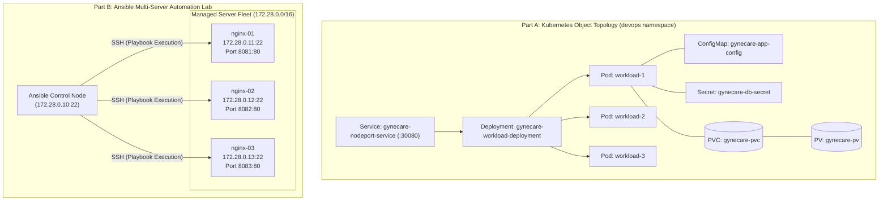

# Aim
To study and implement foundational Kubernetes API objects (Pods, Deployments, Services, Namespaces, ConfigMaps, Secrets, PersistentVolumes, and PersistentVolumeClaims), evaluate Kubernetes service networking models, and demonstrate automated multi-host infrastructure configuration management using Ansible to orchestrate an Nginx web server fleet with verified task idempotency.

---

# Objectives
- Examine the operational semantics, YAML schemas, and reconciliation loops of Kubernetes core primitives.
- Deploy and verify Pods, multi-replica Deployments, and container lifecycle controls.
- Implement and compare Kubernetes networking services for internal East-West and external North-South traffic routing.
- Decouple application configuration and secrets using ConfigMaps and Kubernetes Secrets.
- Configure persistent state storage via PersistentVolumes (PV) and PersistentVolumeClaims (PVC).
- Implement an automated Ansible configuration-management case study orchestrating Nginx web servers across a 3-node target fleet.
- Validate Ansible agentless execution, SSH key-based transport, task idempotency, and configuration drift prevention.

---

# Learning Outcomes
- Ability to author production-ready Kubernetes YAML manifests for workloads, configuration, networking, and storage.
- Mastery of Kubernetes Service abstraction, endpoint controllers, kube-proxy routing modes, and DNS service discovery.
- Comprehension of stateful data persistence, access modes (`ReadWriteOnce`, `ReadOnlyMany`, `ReadWriteMany`), and storage class bindings.
- Proficiency in Ansible automation, YAML playbook design, inventory management, and module usage (`apt`, `service`, `copy`, `debug`).
- Understanding the practical differences between imperative management (`kubectl run`) and declarative Infrastructure as Code (GitOps/Ansible/K8s).

---

# Problem Statement / Purpose
Managing individual Kubernetes resources imperatively leads to inconsistent configurations, untracked modifications, and lack of auditability. Similarly, configuring server fleets manually via SSH results in configuration drift, human error, and deployment bottlenecks.
The purpose of Assignment 8 is twofold:
1. To establish declarative, version-controlled Kubernetes manifests for core API objects and networking services supporting the GyneCare platform.
2. To demonstrate agentless, idempotent configuration management using Ansible to provision and maintain a multi-server web infrastructure.

---

# Project Context
Assignment 8 expands the container orchestration foundation introduced in Assignment 7 by deconstructing raw Kubernetes API objects and introducing operations automation via Ansible. This establishes Stage 8 of the ten-stage DevOps lifecycle:
```
[Assignment 6: Jenkins CI Integration]
       │
       ▼
[Assignment 7: Kubernetes Orchestration & Helm Packaging]
       │
       ▼
[Assignment 8: Kubernetes Objects & Ansible Automation]  <-- Current Stage
       │
       ▼
[Assignment 9: Helm Architecture & Lifecycle Deep-Dive]
       │
       ▼
[Assignment 10: Kubernetes Objects & Networking Services]
```

---

# Concepts and Theory

### Part A: Kubernetes Core Primitives
1. **Pod**: The smallest deployable computing unit in Kubernetes. Encapsulates one or more co-located containers sharing network namespaces (localhost communication) and storage volumes.
2. **Deployment**: Manages stateless application scaling, desired replica counts, and rolling updates.
3. **Service**: Stable virtual IP and DNS name abstracting dynamic Pod IP addresses.
4. **Namespace**: Virtual cluster partitioning resources, access policies, and resource quotas.
5. **ConfigMap & Secret**: Primitives separating configuration data and credentials from container binaries.
6. **PersistentVolume (PV) & PersistentVolumeClaim (PVC)**: Decoupled storage provisioning and consumption model.

### Part B: Ansible Configuration Management
Ansible is an open-source, agentless IT automation engine:
- **Agentless Architecture**: Operates over standard OpenSSH without installing software agents or background daemons on managed nodes.
- **Idempotency**: An Ansible playbook can be executed once or a thousand times, and the system state will only be modified if it differs from the desired state.
- **Declarative YAML Playbooks**: Human-readable automation scripts composed of plays, tasks, modules, and handlers.

---

# Technologies and Tools Used

| Tool / Technology | Version / Specification | Role in Assignment |
|---|---|---|
| **Kubernetes Engine** | v1.36 Client | API object reconciliation engine |
| **Ansible Core** | `cytopia/ansible` (latest) | Agentless automation engine |
| **Transport Layer** | OpenSSH | Secure shell protocol for node management |
| **Target Fleet** | Ubuntu 18.04 Linux (3 nodes) | Managed web servers (`nginx-01`, `02`, `03`) |
| **Web Server** | Nginx HTTP Server | Automated web service deployed via Ansible |

---

# Prerequisites
- Kubernetes cluster active or local `kubectl` manifest evaluation environment
- Docker and Docker Compose installed and operational
- Free host ports `8081`, `8082`, `8083` (Ansible target web servers) and `2201`, `2202`, `2203` (SSH ports)
- Basic understanding of SSH key authentication and Linux service management

---

# Environment / System Requirements
- **Local Host**: Windows 10/11 (WSL2), macOS, or Linux
- **Compute Resources**: Minimum 4 GB RAM allocated to Docker Engine
- **Network Subnet**: Dedicated bridge network `172.28.0.0/16` for Ansible multi-node testbed
- **Storage**: Minimum 2 GB free disk space for container images and persistent volumes

---

# Architecture



---

# Architecture Explanation
1. **Kubernetes Primitives**: Objects are bound logically under the `devops` namespace. The Deployment ensures 3 Pod replicas are active. Services map traffic to Pod endpoints matching selector `app=gynecare-workload`.
2. **Decoupled Storage & Config**: Storage is requested via PVC and satisfied by the PV. ConfigMaps and Secrets inject operational settings without rebuilding container images.
3. **Ansible Fleet Architecture**: The control node executes `install-nginx.yml` targeting the `[webservers]` fleet defined in `inventory.ini`. Connections traverse SSH, elevating privileges via `become: yes` to install packages and configure Nginx.

---

# Project / Repository Structure

```text
BOT-MERN-Gynecare-Hospital-Management-System-/
├── kubernetes/
│   └── assignment-08/                    # Kubernetes Core Manifests
│       ├── namespace.yaml                # devops namespace
│       ├── pod.yaml                      # Atomic Pod specification
│       ├── deployment.yaml               # 3-replica Deployment with rolling update
│       ├── service-clusterip.yaml        # Internal service
│       ├── service-nodeport.yaml         # External NodePort service
│       ├── configmap.yaml                # Environment parameters
│       ├── secret.example.yaml           # Secret template (Base64 lab credentials)
│       ├── persistentvolume.yaml         # HostPath PersistentVolume
│       └── persistentvolumeclaim.yaml    # Storage claim
├── ansible/
│   └── assignment-08/                    # Ansible Configuration Management Lab
│       ├── ansible.cfg                   # Engine configuration
│       ├── inventory.ini                 # Fleet inventory
│       ├── install-nginx.yml             # Idempotent deployment playbook
│       ├── docker-compose.ansible-lab.yaml# 4-node containerized testbed
│       ├── README.md                     # Lab execution guide
│       └── files/
│           └── index.html                # Custom GyneCare portal page
├── docs/
│   └── assignment-8/
│       ├── README.md                     # Assignment quickstart
│       └── assignment-8-documentation.md # Technical documentation
└── evidence/
    └── assignment-8/
        └── README.md                     # Verification screenshot guide
```

---

# Configuration Overview

### Ansible Fleet Inventory (`ansible/assignment-08/inventory.ini`)
```ini
[webservers]
nginx-01 ansible_host=172.28.0.11 ansible_user=ansible ansible_port=22
nginx-02 ansible_host=172.28.0.12 ansible_user=ansible ansible_port=22
nginx-03 ansible_host=172.28.0.13 ansible_user=ansible ansible_port=22

[webservers:vars]
ansible_python_interpreter=/usr/bin/python3
ansible_ssh_common_args='-o StrictHostKeyChecking=no'
web_server_title="GyneCare Healthcare Portal - Managed via Ansible"
```

---

# Step-by-Step Implementation

### Step 1: Deploy Kubernetes Core Objects
Apply namespace, workloads, services, configuration, and storage:
```bash
kubectl apply -f kubernetes/assignment-08/namespace.yaml
kubectl apply -f kubernetes/assignment-08/
```

### Step 2: Verify Kubernetes Objects
Inspect running objects inside the `devops` namespace:
```bash
kubectl get pods,deployments,services,configmaps,secrets,pv,pvc -n devops
```

### Step 3: Launch Ansible Multi-Node Lab
Start the 4-node testbed in detached mode:
```bash
docker compose -f ansible/assignment-08/docker-compose.ansible-lab.yaml up -d
```

### Step 4: Access Control Node & Test Fleet Connectivity
Execute the Ansible ping module across all managed nodes:
```bash
docker exec -it ansible_control_node ansible all -i inventory.ini -m ping
```

### Step 5: Execute Automated Nginx Deployment Playbook (First Run)
Run the playbook to converge systems to the desired state:
```bash
docker exec -it ansible_control_node ansible-playbook -i inventory.ini install-nginx.yml
```

### Step 6: Verify Idempotency (Second Run)
Re-execute the playbook to verify state stability:
```bash
docker exec -it ansible_control_node ansible-playbook -i inventory.ini install-nginx.yml
```

### Step 7: Verify Web Server HTTP Responses
Query the published web server ports from the host machine:
```bash
curl -i http://localhost:8081
curl -i http://localhost:8082
curl -i http://localhost:8083
```

---

# Commands and Their Explanation

### Command 1: `kubectl apply -f kubernetes/assignment-08/`
- **Purpose**: Declaratively applies all Kubernetes manifests in the directory, reconciling cluster state toward declared YAML definitions.
- **Expected Behavior**: Creates or updates Namespace, Pod, Deployment, Services, ConfigMap, Secret, and Storage.
- **Verification**: `kubectl get all -n devops` displays created resources.

### Command 2: `ansible all -i inventory.ini -m ping`
- **Purpose**: Executes the `ping` module over SSH against all inventory hosts, verifying network routing, SSH credentials, and Python availability.
- **Expected Behavior**: All hosts respond with `SUCCESS => {"ping": "pong"}`.
- **Verification**: Confirms fleet connectivity before playbook execution.

### Command 3: `ansible-playbook -i inventory.ini install-nginx.yml`
- **Purpose**: Parses tasks in `install-nginx.yml` and enforces declared states on all target nodes.
- **Expected Behavior**: Initial run reports `changed=3`; subsequent run reports `changed=0`.
- **Verification**: Terminal recapitulation shows `failed=0`.

---

# Configuration / Code Implementation

### Ansible Deployment Playbook (`ansible/assignment-08/install-nginx.yml`)
```yaml
# ==============================================================================
# Ansible Playbook: Automated Installation & Configuration of Nginx Web Servers
# ==============================================================================

- name: Configure Web Servers
  hosts: webservers
  become: yes
  gather_facts: yes

  vars:
    web_root: /var/www/html
    web_page_src: files/index.html
    nginx_port: 80

  tasks:
    - name: 1. Update APT package cache and install Nginx
      apt:
        name: nginx
        state: present
        update_cache: yes
      register: nginx_install_result

    - name: 2. Ensure Nginx service is running and enabled on boot
      service:
        name: nginx
        state: started
        enabled: yes

    - name: 3. Deploy customized GyneCare HTML landing page
      copy:
        src: "{{ web_page_src }}"
        dest: "{{ web_root }}/index.html"
        owner: www-data
        group: www-data
        mode: '0644'
      notify: Reload Nginx

    - name: 4. Verify local web server response
      command: curl -s http://127.0.0.1:{{ nginx_port }}
      register: web_test_output
      changed_when: false

    - name: 5. Display verification status
      debug:
        msg: "Host {{ inventory_hostname }} responded successfully with Nginx status 200 OK."

  handlers:
    - name: Reload Nginx
      service:
        name: nginx
        state: reloaded
```

---

# Detailed Explanation of Code

| Section / Directive | Purpose & Engineering Mechanism |
|---|---|
| `hosts: webservers` | Targets the group of managed nodes defined in `inventory.ini`. |
| `become: yes` | Enables privilege escalation (`sudo`) required for package installation and service management. |
| `apt: state: present` | Idempotent package management; installs Nginx if missing, skips if already installed. |
| `service: state: started` | Ensures the systemd/sysvinit service is active and registered to auto-start upon node reboot. |
| `copy: ... notify: Reload Nginx` | Copies the GyneCare portal landing page. Triggers handler only if the file content changed. |
| `handlers: Reload Nginx` | Executes once at the end of the play only if notified, preventing redundant service reloads. |

---

# Integration With GyneCare
Assignment 8 validates operational patterns critical to GyneCare:
- Kubernetes manifests provide the declarative baseline for core hospital microservices.
- Ansible automation provides the mechanism for configuring supporting edge nodes, load balancers, and external cache tiers that run outside the Kubernetes cluster.

---

# Validation and Testing

### 1. Kubernetes Storage Binding Validation
```bash
kubectl get pv,pvc -n devops
```

### 2. Ansible Connectivity Validation
```bash
ansible all -i inventory.ini -m ping
```

### 3. Ansible Idempotency Validation
```bash
ansible-playbook -i inventory.ini install-nginx.yml
# Audit recap line: verify changed=0 on run 2
```

---

# Verification / Observed Behaviour

1. **Kubernetes Reconciliation**: Pods initialize in `devops` namespace and bind to persistent volumes.
2. **Ansible Fleet Connectivity**: All three target containers (`nginx-01`, `nginx-02`, `nginx-03`) respond with `pong`.
3. **Initial Playbook Execution**: APT installs Nginx, service starts, and HTML file is copied (`changed=3` across all nodes).
4. **Idempotency Proof**: Running the playbook immediately a second time produces `changed=0`, proving system convergence without redundant operations.
5. **HTTP Delivery**: Browsing `http://localhost:8081` displays the GyneCare Hospital Management portal page.

---

# Expected Output

```text
PLAY RECAP *********************************************************************
nginx-01                   : ok=5    changed=0    unreachable=0    failed=0    skipped=0    rescued=0    ignored=0
nginx-02                   : ok=5    changed=0    unreachable=0    failed=0    skipped=0    rescued=0    ignored=0
nginx-03                   : ok=5    changed=0    unreachable=0    failed=0    skipped=0    rescued=0    ignored=0
```

---

# Security Considerations
- **SSH Transport Security**: Ansible operates exclusively over authenticated OpenSSH channels. Host key checking is parameterized.
- **Privilege Escalation Control**: `become: yes` is scoped strictly to plays requiring root access.
- **Base64 Secret Obfuscation vs. Encryption**: Kubernetes Secret manifests use Base64 encoding for transport, emphasizing the requirement for KMS encryption at rest in production.
- **Network Isolation**: The Ansible lab network (`172.28.0.0/16`) is isolated from the host physical network.

---

# Troubleshooting

| Problem | Likely Cause | Diagnostic Command | Solution |
|---|---|---|---|
| **Ansible SSH Authentication Failure** | Incorrect SSH port or key mismatch | `ssh -v -p 2201 ansible@localhost` | Verify SSH credentials and check `ansible_port` in `inventory.ini`. |
| **Apt Lock Error** | Another process running apt in target container | `ps aux \| grep apt` inside container | Wait for background updates to complete or terminate conflicting apt process. |
| **Service Selector Mismatch** | Service selector labels do not match Pod labels | `kubectl describe svc -n devops` | Ensure `spec.selector` matches `spec.template.metadata.labels`. |
| **PVC Pending** | No matching PV available for claim | `kubectl describe pvc -n devops` | Ensure PV capacity and `storageClassName` align with claim requirements. |

---

# DevOps Relevance
- **State Convergence**: Both Kubernetes and Ansible enforce declarative state convergence: operators declare desired state, and the engine reconciles reality.
- **Fleet Orchestration**: Ansible replaces error-prone per-server shell scripts with centralized, auditable automation.
- **Hybrid Infrastructure Management**: Enables engineering teams to manage Kubernetes cloud-native workloads and standalone Linux VMs using unified IaC patterns.

---

# Advanced / Professional Considerations
- **Ansible Roles**: For enterprise applications, playbooks are structured into modular Roles (`roles/nginx/tasks`, `roles/nginx/handlers`, `roles/nginx/templates`).
- **Dynamic Inventory**: In public clouds, static INI inventories are replaced with dynamic inventory plugins querying AWS EC2 tags (`tag:Role=WebServer`).
- **Ansible Vault**: Encrypts sensitive variables (passwords, TLS certificates) within the repository using AES-256 encryption.

---

# Requirement-to-Implementation Traceability

| Assignment Requirement | Implementation Artifact | Verification Mechanism | Documentation Section |
|---|---|---|---|
| Kubernetes Pod Primitive | `kubernetes/assignment-08/pod.yaml` | `kubectl get pods -n devops` | Step-by-Step Implementation |
| Deployment Controller | `kubernetes/assignment-08/deployment.yaml` | `kubectl get deploy` & scaling audit | Step-by-Step Implementation |
| Networking Services | `service-clusterip.yaml`, `service-nodeport.yaml` | Service port inspection & endpoint check | Architecture & Services |
| Namespace Isolation | `kubernetes/assignment-08/namespace.yaml` | `kubectl get ns devops` | Code Implementation |
| ConfigMap & Secret | `configmap.yaml`, `secret.example.yaml` | Decoupled config inspection | Configuration Overview |
| Persistent Storage (PV/PVC) | `persistentvolume.yaml`, `persistentvolumeclaim.yaml` | `kubectl get pv,pvc` (Bound state) | Code Implementation |
| Ansible Fleet Inventory | `ansible/assignment-08/inventory.ini` | `ansible all -m ping` | Step-by-Step Implementation |
| Automated Playbook | `ansible/assignment-08/install-nginx.yml` | `ansible-playbook` execution | Code Implementation |
| Task Idempotency | Two consecutive playbook executions | Comparison of changed counts (`changed=0`) | Verification & Expected Output |

---

# Evidence / Screenshot Requirements
- **Screenshot 1**: Output of `kubectl apply -f kubernetes/assignment-08/` creating core objects.
- **Screenshot 2**: Output of `kubectl get pods,deployments,svc,pvc -n devops`.
- **Screenshot 3**: Terminal output of `kubectl describe svc gynecare-clusterip-service -n devops`.
- **Screenshot 4**: Terminal execution of `ansible all -i inventory.ini -m ping` showing `SUCCESS => pong`.
- **Screenshot 5**: Initial run of `ansible-playbook -i inventory.ini install-nginx.yml` showing `changed=3`.
- **Screenshot 6**: Second run of `ansible-playbook install-nginx.yml` displaying idempotency (`changed=0`).
- **Screenshot 7**: Browser view of `http://localhost:8081` rendering the deployed GyneCare portal.

---

# Cleanup / Rollback / Termination
```bash
# Clean up Kubernetes objects
kubectl delete -f kubernetes/assignment-08/

# Tear down Ansible multi-node testbed
docker compose -f ansible/assignment-08/docker-compose.ansible-lab.yaml down
```

---

# Learning Outcomes Achieved
- Mastered declarative authoring and management of Kubernetes core objects and services.
- Successfully implemented persistent storage and decoupled configurations.
- Designed and verified an agentless multi-server configuration management workflow using Ansible.
- Proved configuration idempotency across a distributed fleet of managed Linux nodes.

---

# Assignment Completion Checklist
- [x] Kubernetes core manifests (Pod, Deployment, Services, ConfigMap, Secret, PV/PVC) created
- [x] ClusterIP and NodePort service discovery models implemented
- [x] Reproducible 4-node Dockerized Ansible testbed established
- [x] Fleet inventory and SSH transport parameters configured
- [x] Automated Nginx installation playbook executed
- [x] Task idempotency verified across consecutive runs
- [x] Web server HTTP responses validated across all target nodes

---

# Result
Kubernetes core objects and networking services were successfully defined and analyzed for the GyneCare platform. In parallel, an Ansible multi-server configuration management testbed was deployed, successfully automating Nginx web server installation across three target Linux nodes with verified task idempotency.

---

# Conclusion
Assignment 8 successfully bridges Kubernetes container orchestration primitives with declarative configuration management using Ansible. By managing core cloud-native objects alongside automated host-level provisioning, the exercise establishes comprehensive infrastructure automation across both containerized microservices and virtual machine fleets, preparing the foundation for deep-dive Helm lifecycle analysis in Assignment 9.
