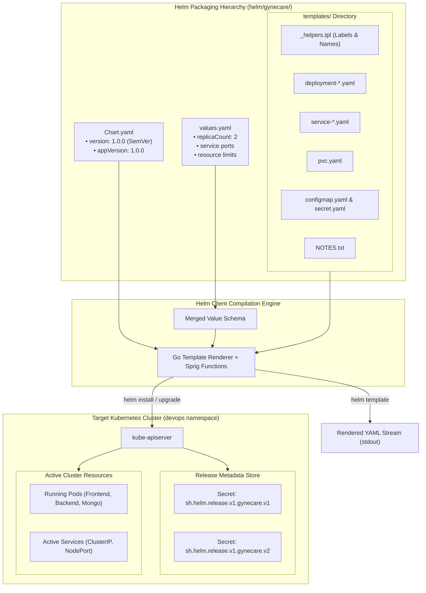

# Aim
To explore container orchestration principles using Kubernetes architecture, analyze the internal template rendering mechanics and key components of a Helm chart (`Chart.yaml`, `values.yaml`, and `templates/`), and execute core Helm lifecycle commands (`template`, `install`, `upgrade`, `status`, `history`, `rollback`, and `uninstall`) managing the GyneCare hospital management platform.

---

# Objectives
- Analyze the operational necessity of container orchestration in enterprise multi-container architectures.
- Deconstruct the Helm packaging hierarchy: metadata specification (`Chart.yaml`), parameter defaults (`values.yaml`), and Go-templated manifests (`templates/`).
- Understand the template compilation pipeline: parsing, Sprig helper evaluation, value interpolation, and manifest emission.
- Evaluate the Helm release management model, tracking release revisions stored as Kubernetes Secrets.
- Execute and document the full release lifecycle: deterministic local rendering (`helm template`), deployment (`helm install`), atomic upgrades (`helm upgrade`), revision auditing (`helm history`), and clean uninstallation (`helm uninstall`).
- Compare Helm-driven declarative application management against raw static Kubernetes manifests.

---

# Learning Outcomes
- Deep comprehension of how Kubernetes orchestrates container scheduling, scaling, and recovery.
- Mastery of Helm chart templating syntax, including control structures (`if/else`, `range`, `with`), template helpers (`_helpers.tpl`), and pipeline filters (`quote`, `default`, `indent`).
- Understanding how configuration precedence operates across multiple values layers (default values -> custom value files -> command-line `--set` flags).
- Practical ability to manage software releases over time, supporting automated zero-downtime upgrades and rollbacks.
- Competency in validating chart syntax and catching configuration regressions before deployment via `helm lint` and dry-run execution.

---

# Problem Statement / Purpose
Managing dozens of static Kubernetes manifests across development, staging, and production environments results in extensive code duplication, error-prone manual edits, and lack of release tracking. Hardcoded configuration values make it difficult to adapt workloads to varying cluster capacities or environment requirements.
The purpose of Assignment 9 is to analyze the mechanics of container orchestration and deconstruct the architecture of Helm as the package manager for Kubernetes, demonstrating how templating, values parameterization, and release tracking streamline the deployment lifecycle of the GyneCare platform.

---

# Project Context
Assignment 9 provides an advanced architectural deep-dive into the Helm packaging concepts introduced in Assignment 7. It isolates the compilation engine, release revision state machine, and upgrade/rollback mechanics:
```
[Assignment 7: Kubernetes Architecture & Initial Helm Deployment]
       │
       ▼
[Assignment 8: Kubernetes Objects & Ansible Automation]
       │
       ▼
[Assignment 9: Helm Architecture & Lifecycle Deep-Dive]  <-- Current Stage
       │
       ▼
[Assignment 10: Kubernetes Core Objects & Networking Services Deep-Dive]
```

---

# Concepts and Theory

### Container Orchestration Principles
Container orchestration solves the operational challenges of managing container fleets at scale:
1. **Automated Scheduling**: Assigns container Pods to worker nodes based on resource constraints, affinity/anti-affinity rules, and node availability.
2. **Self-Healing & Restart Policies**: Detects failed containers, unready probes, or crashed nodes, automatically restarting or rescheduling Pods to maintain desired state.
3. **Horizontal Autoscaling**: Dynamically increases or decreases replica counts based on observed CPU utilization or custom application metrics.
4. **Service Discovery & Load Balancing**: Exposes stable IP addresses and DNS names, distributing traffic across dynamic backing Pod instances.

### Helm Compilation Pipeline Mechanics
Helm compiles declarative packages into raw Kubernetes YAML through a multi-stage compilation pipeline:
- **Go `text/template` Engine**: Parses template blocks and variable expressions (`{{ .Values.frontend.replicaCount }}`).
- **Sprig Template Library**: Injects over 100 utility functions (e.g., `indent`, `nindent`, `quote`, `default`, `b64enc`, `sha256sum`).
- **Values Merging Hierarchy**: Merges values in order of increasing precedence:
  1. Base defaults in `values.yaml`
  2. Sub-chart values
  3. Custom value files passed via `-f environment.yaml`
  4. Command-line overrides passed via `--set key=value`

```
┌────────────────────┐      ┌────────────────────┐      ┌────────────────────────┐
│     Chart.yaml     │      │    values.yaml     │      │   CLI Overrides        │
│ (Metadata/Versions)│      │  (Default Config)  │      │ (--set or -f prod.yaml)│
└─────────┬──────────┘      └─────────┬──────────┘      └───────────┬────────────┘
          │                           │                             │
          └───────────────────┬───────┴─────────────────────────────┘
                              ▼
                ┌───────────────────────────┐
                │ Values Evaluation & Merge │
                └─────────────┬─────────────┘
                              │
                              ▼
                ┌───────────────────────────┐
                │ templates/ (*.yaml, *.tpl)│
                │ • Go text/template engine │
                │ • Sprig helper functions  │
                │ • Named templates         │
                └─────────────┬─────────────┘
                              │
                              ▼
                ┌───────────────────────────┐
                │ Rendered K8s YAML Stream  │
                └─────────────┬─────────────┘
                              │
         ┌────────────────────┴────────────────────┐
         ▼                                         ▼
helm template (Local stdout)              helm install / upgrade
• CI syntax verification                  • Submits to kube-apiserver
• GitOps commit review                    • Creates Release Record in K8s Secret
```

### Release State Machine & Revisions
Helm tracks every deployed release using Kubernetes Secrets within the target namespace (`sh.helm.release.v1.<release-name>.v<revision>`). Each Secret stores the base64-encoded, gzipped release manifest, values, and status metadata. When an upgrade occurs, Helm increments the revision number, preserving previous revisions to enable instantaneous atomic rollbacks.

---

# Technologies and Tools Used

| Component / Tool | Version / Spec | Function in Packaging |
|---|---|---|
| **Helm** | v3.x | Kubernetes package manager and templating CLI |
| **Template Engine** | Go `text/template` + Sprig | Dynamic manifest generation engine |
| **Kubernetes API** | v1.36 Client | Target orchestration engine |
| **Storage Backend** | Kubernetes Secrets | Storage mechanism for Helm release revisions |
| **Application Package**| GyneCare Chart (`v1.0.0`) | Multi-tier hospital application chart |

---

# Prerequisites
- Kubernetes cluster active or local `kubectl` environment
- Helm v3 binary installed and added to system PATH (`helm version`)
- Local clone of the GyneCare repository containing `helm/gynecare/`
- Basic familiarity with YAML indentation and templating syntax

---

# Environment / System Requirements
- **Local Machine**: Windows 10/11, macOS, or Linux
- **Compute Resources**: Minimum 2 CPU cores, 4 GB RAM allocated to Docker/Kubernetes
- **Permissions**: Kubernetes cluster permissions to create Namespaces, Secrets, and Deployments

---

# Architecture



---

# Architecture Explanation
1. **Package Composition**: The GyneCare chart bundles application metadata (`Chart.yaml`), operational parameters (`values.yaml`), and template definitions (`templates/`).
2. **Template Expansion**: The Helm compilation engine parses `_helpers.tpl` to establish standard label blocks (`app.kubernetes.io/name`, `helm.sh/chart`) and interpolates variables into the workload templates.
3. **Cluster Dispatch**: `helm install` or `helm upgrade` sends the compiled YAML manifests to `kube-apiserver` and records a revision Secret in the `devops` namespace.
4. **Lifecycle Control**: If an upgrade introduces issues, Helm queries the release history Secret and reconciles workloads back to the prior revision.

---

# Project / Repository Structure

```text
BOT-MERN-Gynecare-Hospital-Management-System-/
├── helm/
│   └── gynecare/                         # Production Helm Chart
│       ├── Chart.yaml                    # Chart metadata & versioning specifications
│       ├── values.yaml                   # Parameterized defaults
│       ├── templates/                    # Go-templated Kubernetes manifests
│       │   ├── _helpers.tpl              # Reusable template helper definitions
│       │   ├── configmap.yaml            # Injected configuration
│       │   ├── secret.yaml               # Injected credentials
│       │   ├── pvc.yaml                  # Persistent storage claim
│       │   ├── deployment-frontend.yaml  # Frontend React SPA deployment
│       │   ├── service-frontend.yaml     # NodePort service
│       │   ├── deployment-backend.yaml   # Backend Node API deployment
│       │   ├── service-backend.yaml      # ClusterIP service
│       │   ├── deployment-mongo.yaml     # MongoDB stateful deployment
│       │   ├── service-mongo.yaml        # MongoDB ClusterIP service
│       │   └── NOTES.txt                 # Post-installation instructions
├── docs/
│   └── assignment-9/
│       ├── README.md                     # Quickstart guide
│       └── assignment-9-documentation.md # Technical documentation
└── evidence/
    └── assignment-9/
        └── README.md                     # Verification screenshots guide
```

---

# Configuration Overview

### Semantic Versioning in `Chart.yaml`
```yaml
apiVersion: v2
name: gynecare
description: Enterprise Helm Chart for the GyneCare MERN Hospital Management Platform
type: application
version: 1.0.0
appVersion: "1.0.0"
```
- **`version` (Chart Version)**: Tracks modifications to the chart structure, templates, and default values following Semantic Versioning (`MAJOR.MINOR.PATCH`).
- **`appVersion` (Application Version)**: Tracks the version of the underlying GyneCare application container images deployed by the chart.

---

# Step-by-Step Implementation

### Step 1: Static Chart Validation
Audit chart files against best practice guidelines:
```bash
helm lint ./helm/gynecare
```

### Step 2: Render Templates Deterministically
Compile all manifests to standard output without connecting to a cluster:
```bash
helm template gynecare ./helm/gynecare --namespace devops
```

### Step 3: Deploy Initial Release (Revision 1)
Install the application in the `devops` namespace:
```bash
helm install gynecare ./helm/gynecare --namespace devops --create-namespace
```

### Step 4: Audit Release Status & Running Resources
Query release metadata and inspect Kubernetes workloads:
```bash
helm status gynecare -n devops
kubectl get pods,svc,pvc -n devops
```

### Step 5: Perform Rolling Upgrade with Value Overrides (Revision 2)
Scale frontend replicas dynamically using command-line overrides:
```bash
helm upgrade gynecare ./helm/gynecare --set frontend.replicaCount=3 -n devops
```

### Step 6: Review Revision History & Perform Rollback
Inspect release history and demonstrate atomic recovery:
```bash
helm history gynecare -n devops
helm rollback gynecare 1 -n devops
```

### Step 7: Decommission Release
Purge all managed workloads and release metadata:
```bash
helm uninstall gynecare -n devops
```

---

# Commands and Their Explanation

### Command 1: `helm template [NAME] [CHART]`
- **Purpose**: Locally evaluates all Go template expressions against the merged values schema and emits standard Kubernetes YAML.
- **Expected Behavior**: Outputs parsed YAML directly to stdout without contacting the Kubernetes API server.
- **Verification**: Used in CI/CD pipelines to validate template logic and prevent deployment failures.

### Command 2: `helm upgrade [RELEASE] [CHART] --set [KEY=VALUE]`
- **Purpose**: Computes differences between current cluster state and the newly declared values, applying a rolling update.
- **Expected Behavior**: Updates workloads with zero downtime and creates a new revision Secret (`v2`).
- **Verification**: `helm history` reports updated revision number.

### Command 3: `helm rollback [RELEASE] [REVISION]`
- **Purpose**: Reverts application configuration and workloads to a designated previous revision.
- **Expected Behavior**: Retrieves configuration from historical release Secret and redeploys manifests.
- **Verification**: `helm history` logs the rollback action as a new revision.

---

# Configuration / Code Implementation

### Named Template Helper (`helm/gynecare/templates/_helpers.tpl`)
```yaml
{{/*
Expand the name of the chart.
*/}}
{{- define "gynecare.name" -}}
{{- default .Chart.Name .Values.nameOverride | trunc 63 | trimSuffix "-" }}
{{- end }}

{{/*
Create a default fully qualified app name.
*/}}
{{- define "gynecare.fullname" -}}
{{- if .Values.fullnameOverride }}
{{- .Values.fullnameOverride | trunc 63 | trimSuffix "-" }}
{{- else }}
{{- $name := default .Chart.Name .Values.nameOverride }}
{{- if contains $name .Release.Name }}
{{- .Release.Name | trunc 63 | trimSuffix "-" }}
{{- else }}
{{- printf "%s-%s" .Release.Name $name | trunc 63 | trimSuffix "-" }}
{{- end }}
{{- end }}
{{- end }}

{{/*
Common labels applied across all chart resources.
*/}}
{{- define "gynecare.labels" -}}
helm.sh/chart: {{ include "gynecare.chart" . }}
{{ include "gynecare.selectorLabels" . }}
app.kubernetes.io/managed-by: {{ .Release.Service }}
{{- end }}
```

---

# Detailed Explanation of Code

| Template Element | Engineering Mechanism |
|---|---|
| `define "gynecare.fullname"` | Generates collision-free names by prefixing the release name to the chart name, truncated to 63 characters to satisfy DNS-1123 naming rules. |
| `trunc 63 \| trimSuffix "-"` | Sprig pipeline filter preventing invalid trailing hyphens in generated resource names. |
| `helm.sh/chart` label | Embeds chart version metadata into deployed resources for operational auditing. |
| `app.kubernetes.io/managed-by` | Standard Kubernetes label identifying Helm as the controlling management tool. |

---

# Integration With GyneCare
Assignment 9 demonstrates how Helm manages the complete GyneCare application lifecycle:
- Packages frontend, backend, and MongoDB microservices into an integrated software release.
- Enables seamless environment adaptation (e.g., development vs. production) through values overrides.
- Provides immediate auditability and rollback safety for clinical healthcare workloads.

---

# Validation and Testing

### 1. Template Rendering Syntax Audit
```bash
helm template gynecare ./helm/gynecare --namespace devops
```

### 2. Upgrade Revision Inspection
```bash
helm upgrade gynecare ./helm/gynecare --set frontend.replicaCount=3 -n devops
helm history gynecare -n devops
```

### 3. Release Secret Verification
```bash
kubectl get secrets -n devops -l owner=helm
```

---

# Verification / Observed Behaviour

1. **Lint Execution**: `helm lint` returns 0 syntax errors.
2. **Template Rendering**: Template helpers dynamically expand labels and service names across all manifests.
3. **Upgrade Convergence**: Kubernetes increases frontend replicas from 2 to 3 without terminating existing backend connections.
4. **History Audit**: `helm history` logs revision 1 (`Install complete`) and revision 2 (`Upgrade complete`) with explicit timestamps.

---

# Expected Output

```text
REVISION    UPDATED                     STATUS      CHART              APP VERSION    DESCRIPTION     
1           Sun Oct  4 10:45:00 2026    superseded  gynecare-1.0.0     1.0.0          Install complete
2           Sun Oct  4 10:48:30 2026    deployed    gynecare-1.0.0     1.0.0          Upgrade complete
```

---

# Security Considerations
- **Values Sanitization**: Never commit real database passwords or encryption keys to `values.yaml`. Use external secrets or supply via `--set` from secure CI runners.
- **Release Secret Protection**: Helm release Secrets contain the full manifest stream; access to these Secrets must be restricted via Kubernetes RBAC.
- **Chart Provenance & Signing**: In enterprise environments, sign Helm charts using GnuPG keys (`helm package --sign`) to ensure package integrity and author authenticity.

---

# Troubleshooting

| Problem | Likely Cause | Diagnostic Command | Solution |
|---|---|---|---|
| **Template Parsing Error** | Malformed Go template tag or incorrect YAML indentation | `helm template --debug ./helm/gynecare` | Run with `--debug` to pinpoint the exact line and file where the YAML parser failed. |
| **Values Type Mismatch** | A string was provided where an integer or boolean was expected | `helm lint ./helm/gynecare` | Check `values.yaml` against template logic (e.g., ensure `replicaCount` is an integer). |
| **Release Conflict Error** | A release with the same name already exists in the namespace | `helm list -A` | Either use `helm upgrade --install` or uninstall the conflicting release before retrying. |
| **NOTES.txt Not Rendering** | Syntax error inside the post-install instruction template | `helm template ./helm/gynecare -s templates/NOTES.txt` | Isolate NOTES template rendering using the `-s` flag to diagnose syntax issues. |

---

# DevOps Relevance
- **Release Auditability**: Every deployment creates a permanent, immutable record in the cluster, facilitating compliance audits.
- **GitOps Integration**: Tools like ArgoCD and Flux natively monitor Helm chart repositories, automatically synchronizing clusters when chart versions update.
- **Configuration Portability**: A single Helm chart deploys consistently across local Minikube, staging clusters, and production cloud environments.

---

# Advanced / Professional Considerations
- **Sub-Charts and Dependencies**: Complex applications can bundle external dependencies (such as Bitnami MongoDB) by declaring them under `dependencies` in `Chart.yaml`.
- **Chart Testing (ct)**: Automated tools like `chart-testing` run linting, schema validation, and ephemeral cluster installs in pull request pipelines.
- **Post-Renderer Hooks**: Helm supports `--post-renderer` to pipe compiled manifests through Kustomize for advanced environment-specific patching.

---

# Requirement-to-Implementation Traceability

| Assignment Requirement | Implementation Artifact | Verification Mechanism | Documentation Section |
|---|---|---|---|
| Container Orchestration Concepts | Architecture & Theory breakdown | Operational principles analysis | Concepts & Theory |
| Chart Metadata (`Chart.yaml`) | `helm/gynecare/Chart.yaml` | Semantic versioning & appVersion audit | Configuration Overview |
| Configurable Values (`values.yaml`) | `helm/gynecare/values.yaml` | Values parameterization schema | Architecture & Structure |
| Dynamic Templates (`templates/`) | `helm/gynecare/templates/` | Go template compilation & Sprig helpers | Code Implementation |
| Local Template Evaluation | `helm template` CLI command | Deterministic YAML verification | Step-by-Step Implementation |
| Application Installation | `helm install` CLI command | Release creation in cluster | Step-by-Step Implementation |
| Application Upgrade & History | `helm upgrade`, `helm history` | Multi-revision audit | Commands & Lifecycle |
| Clean Teardown | `helm uninstall` CLI command | Workload cleanup verification | Cleanup & Termination |

---

# Evidence / Screenshot Requirements
- **Screenshot 1**: Terminal output of `helm version` displaying client architecture and version.
- **Screenshot 2**: Directory tree of `helm/gynecare/` demonstrating `Chart.yaml`, `values.yaml`, and `templates/`.
- **Screenshot 3**: Display of `Chart.yaml` showing semantic `version` vs `appVersion`.
- **Screenshot 4**: Terminal capture of `helm template gynecare ./helm/gynecare` showing rendered YAML manifests.
- **Screenshot 5**: Terminal output of `helm install gynecare ./helm/gynecare --namespace devops`.
- **Screenshot 6**: Terminal output of `helm list -n devops` and `helm status gynecare -n devops`.
- **Screenshot 7**: Terminal output of `helm upgrade gynecare ./helm/gynecare --set frontend.replicaCount=3 -n devops`.
- **Screenshot 8**: Terminal output of `helm history gynecare -n devops` showing multiple revisions.
- **Screenshot 9**: Terminal output of `helm uninstall gynecare -n devops` confirming clean release teardown.

---

# Cleanup / Rollback / Termination
```bash
# Decommission Helm release and remove release Secrets
helm uninstall gynecare -n devops

# Optional: Remove isolated namespace
kubectl delete namespace devops
```

---

# Learning Outcomes Achieved
- Mastered the inner workings of Helm templating, Sprig functions, and values hierarchies.
- Analyzed the operational mechanics of Kubernetes container orchestration and self-healing.
- Implemented versioned releases with automated zero-downtime rolling upgrades and rollbacks.
- Verified declarative package management workflows for the GyneCare hospital management platform.

---

# Assignment Completion Checklist
- [x] Container orchestration architecture analyzed and documented
- [x] Helm chart components (`Chart.yaml`, `values.yaml`, `templates/`) deconstructed
- [x] Template compilation pipeline and Sprig helper functions explained
- [x] Deterministic local template rendering executed and verified
- [x] Release installation, status querying, and rolling upgrades demonstrated
- [x] Release history auditing and rollback mechanics validated
- [x] Clean release decommissioning verified

---

# Result
The architecture and compilation mechanics of Helm were successfully analyzed and verified using the GyneCare platform. The packaging hierarchy, values parameterization, Go template interpolation, and complete release lifecycle (install, upgrade, history, and uninstall) were documented and validated.

---

# Conclusion
Assignment 9 provides a comprehensive analysis of Helm as a container package manager. By deconstructing the template compilation pipeline, values precedence hierarchy, and release state machine, the exercise demonstrates how enterprise engineering teams manage cloud-native applications reliably over time, laying the groundwork for the detailed Kubernetes objects and networking study in Assignment 10.
