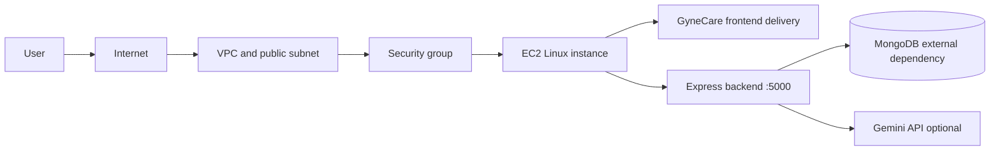

# Assignment 2 - AWS EC2

## 1. Assignment Overview

This assignment applies the AWS EC2 virtual-machine lifecycle to the existing GyneCare application. The required lifecycle is create, configure, connect, deploy, validate, monitor, stop or terminate, and clean up.

The repository contains the EC2 architecture, deployment procedure, Terraform option, validation criteria, and cleanup process. Live resource values belong to execution evidence and are not embedded in this report.

## 2. Assignment Objective

Demonstrate how a cloud virtual machine is selected, launched, secured, accessed, configured, used to host GyneCare, monitored, and removed responsibly.

## 3. Assignment Requirements

1. Select an AWS region and Availability Zone.
2. Choose an AMI and instance type.
3. Configure VPC, subnet, route, security group, key pair, and EBS.
4. Launch and connect to a Linux EC2 instance.
5. Install Git, Node.js, npm, and GyneCare dependencies.
6. Configure `PORT`, `MONGO_URI`, and `GEMINI_API_KEY` without committing secrets.
7. Start GyneCare and validate `GET /api/health`.
8. Observe instance, network, storage, and application health.
9. Stop or terminate the instance and clean up associated resources.

## 4. Concepts Covered

EC2 is compute as a virtual machine. The VPC provides network isolation, the subnet places the instance in an Availability Zone, routes provide connectivity, a security group filters traffic, a key pair enables SSH, and EBS provides persistent block storage. Stopping preserves an instance for later use; terminating removes it according to volume settings.

## 5. Technology Stack

- AWS EC2, VPC, subnet, security group, EBS, and CloudWatch
- Linux, Git, Node.js, npm
- GyneCare React/Vite frontend and Express/Mongoose backend
- MongoDB as the current database

## 6. Existing Application Context

GyneCare is an existing MERN application. The frontend is in `client/` and the backend is in `server/`. The backend connects to MongoDB before listening on port `5000`, seeds baseline data, and exposes `GET /api/health`. The frontend development server uses port `5173` and proxies `/api` to the backend. See [system architecture](../../../SYSTEM_ARCHITECTURE.md) for the complete application description.

## 7. Architecture



MongoDB is shown as external because the application currently uses a configured MongoDB URI; this repository does not provision MongoDB on EC2.

## 8. Repository Components

| Component | Location | Role |
|---|---|---|
| Application | `client/`, `server/` | Existing GyneCare source |
| Environment template | `.env.example`, `server/.env.example` | Secret-free configuration contract |
| Terraform option | `infrastructure/terraform/aws-ec2/` | Reproducible EC2 configuration |
| Evidence | `evidence/assignment-2/README.md` | Actual evidence register only |

## 9. Implementation

### EC2 configuration

Before launch, record the actual region, Availability Zone, AMI ID, instance type, VPC ID, subnet ID, route to an Internet Gateway if public access is required, security group ID, key-pair name, public/private addressing, and encrypted EBS size. Use placeholders until a real instance exists.

Recommended learning configuration is a small instance and an existing/default VPC, subject to region and account availability. Do not add network resources merely to make the assignment look larger.

### Server setup

The commands must be adapted to the selected Linux distribution and are guidance until executed:

```bash
ssh -i <private-key> <linux-user>@<public-ip>
sudo apt update
sudo apt install -y git nodejs npm
git clone <repository-url>
cd BOT-MERN-Gynecare-Hospital-Management-System-/server
npm install
cp .env.example .env
npm start
```

The backend requires reachable MongoDB. `GEMINI_API_KEY` is required only for the chatbot integration. Validate the foreground process before adding PM2 or a system service.

## 10. Configuration

Required backend values are:

```text
PORT=5000
MONGO_URI=<private MongoDB connection string>
GEMINI_API_KEY=<private provider key>
```

Store them in an ignored `server/.env` file or an approved secret manager. Never place real values in Markdown, Terraform variables, Git, or an AMI image.

### Security-group policy

| Port | Purpose | Source | Design rule |
|---|---|---|---|
| 22/TCP | SSH administration | Administrator IP `/32` | Open only during administration |
| 80/TCP | HTTP or redirect | Internet if required | Configuration option |
| 443/TCP | HTTPS application | Internet | Preferred public application path |
| 5000/TCP | Backend development port | Private/local only | Do not expose publicly by default |
| 27017/TCP | MongoDB | None publicly | Never expose by default |

## 11. Commands and Workflow

```text
Launch -> Configure -> Connect -> Install -> Deploy -> Validate -> Monitor -> Stop/Terminate -> Clean up
```

Use `npm install` and `npm start` from `server/`. Validate locally on the host with:

```bash
curl http://127.0.0.1:5000/api/health
```

A public validation URL is only valid after an approved reverse proxy, load balancer, or port mapping has been configured. Do not invent an address.

## 12. Deployment and Validation Procedure

The existing endpoint returns JSON containing `ok: true` when the backend is running:

```bash
curl http://127.0.0.1:5000/api/health
```

Validation should also confirm Node/npm versions, MongoDB connectivity, seed completion, frontend loading, process status, application logs, EC2 status checks, and approved network access.

### Expected successful execution

Successful execution should demonstrate that the instance reaches a healthy running state, SSH accepts the configured key, Node.js and npm are available, dependencies install, the backend starts without fatal errors, `/api/health` returns `ok: true`, the frontend can reach the API, and CloudWatch exposes the expected instance observations.

### Reproducibility

Repeat the workflow with the selected region, verified AMI, subnet, key pair, environment values, repository revision, and documented security-group rules. Record non-sensitive infrastructure metadata and authentic validation artifacts in the [Assignment 2 evidence register](../../../evidence/assignment-2/README.md).

## 13. Security Considerations

Use least-privilege IAM, restricted SSH, encrypted EBS, protected key pairs, patched Linux packages, private database access, and environment-based secrets. Avoid direct exposure of port `5000` and never expose MongoDB publicly. HTTPS and a reverse proxy are future hardening steps unless actually configured.

## 14. Monitoring

CloudWatch and host checks should cover instance state, status checks, CPU utilization, network in/out, EBS/filesystem capacity, process health, application logs, and `/api/health`. Interpret observations as `metric -> observation -> diagnosis -> action`. No CloudWatch result is recorded because no instance exists.

## 15. Troubleshooting

These are potential issues, not observed incidents:

| Issue | Investigation |
|---|---|
| SSH timeout | Instance state, public route, security group, network ACL, address |
| Permission denied | Linux username, key pair, key permissions |
| Port unavailable | Process status, bind address, proxy, security group |
| Backend exits | Node version, logs, `MONGO_URI`, MongoDB reachability |
| Missing data | Seed startup and database connectivity |
| Chatbot failure | `GEMINI_API_KEY` and provider response |

## 16. Cost Considerations

Review regional pricing and free-tier eligibility before launch. Stop temporary instances, terminate finished instances, remove unused EBS volumes and snapshots, release unattached Elastic IPs, and review data transfer. See [cost management](../../cost-management.md).

## 17. Cleanup

Stopping pauses compute use but can retain EBS and related resources. Terminating removes the instance and may remove its root volume according to delete-on-termination. After the assignment, stop or terminate as required, inspect EBS volumes, snapshots, Elastic IPs, security groups, and monitoring resources, and verify that no unexpected billable resource remains.

## 18. Technical Notes

The Terraform alternative is available at `infrastructure/terraform/aws-ec2/`. Live provisioning requires an authenticated AWS environment, verified regional inputs, a reachable MongoDB deployment, and authorized infrastructure access. This report intentionally contains no instance identifiers, addresses, metrics, or fabricated execution output.

## 19. Requirement Traceability

| Requirement | Repository implementation | Validation | Evidence |
|---|---|---|---|---|
| Create EC2 | `infrastructure/terraform/aws-ec2/` and this guide | Reviewed plan or console configuration | A2-E01 |
| Connect to VM | SSH workflow in this README | Successful SSH command | A2-E02 |
| Deploy GyneCare | `server/` and environment workflow | Process and application checks | A2-E03 |
| Validate application | Existing `/api/health` endpoint | Actual curl response | A2-E04 |
| Monitor VM | CloudWatch monitoring procedure | Metrics and logs | A2-E05 |
| Terminate VM | Cleanup procedure | Actual lifecycle state | A2-E06 |

## 20. Implementation Evidence

The short [Assignment 2 evidence register](../../../evidence/assignment-2/README.md) identifies what must be captured and where it belongs. It contains no tutorials or fabricated artifacts.

## 21. Limitations

Terraform, AWS CLI, AWS credentials, MongoDB, and a live EC2 host are unavailable. The repository therefore contains configuration and reproducible instructions, not deployment proof. The current frontend is not served by the backend in production.

## 22. Future Improvements

Add a tested production frontend-serving or reverse-proxy arrangement, HTTPS, centralized logs, a managed MongoDB network policy, IAM role documentation, and a repeatable deployment script after the base lifecycle is validated.

## 23. Conclusion

This repository addresses the EC2 assignment without claiming resources that were not created. The application context, infrastructure decisions, commands, security controls, validation path, cleanup process, and evidence requirements are all traceable from this README.
