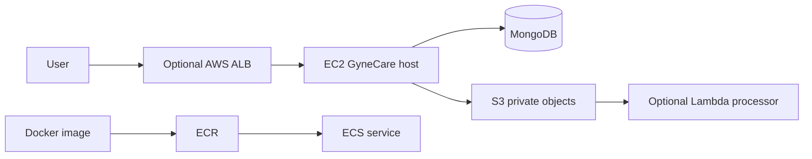

# Assignment 3 - AWS and Azure Cloud Services

> [!NOTE]
> For the core curriculum assignments, **Assignment 3 (Terraform Infrastructure as Code)** is located at [docs/assignment-3/](../../assignment-3/). See [Assignment 3 Documentation](../../assignment-3/assignment-3-documentation.md). This document serves as supplementary reference on cloud provider service equivalence.

## 1. Assignment Overview

This assignment compares major AWS and Azure service categories and relates them to GyneCare. It intentionally does not require an expensive production deployment of every service.

The report distinguishes service design, GyneCare relevance, configuration approach, validation criteria, security, and cost without embedding provider-specific execution output.

## 2. Assignment Objective

Explain how compute, object storage, serverless functions, databases, load balancing, and container services support a real application, then compare AWS services with Azure equivalents while distinguishing actual work from theory and prepared configuration.

## 3. Assignment Requirements

Cover AWS EC2, S3, Lambda, RDS, Elastic Load Balancing, and ECS; cover Azure Virtual Machines, Blob Storage, Functions, Azure Database, Azure Load Balancer, and Azure Container Instances or AKS. For each, explain purpose, operation, GyneCare relevance, configuration, validation, security, cost, and status.

## 4. Concepts Covered

IaaS virtual machines, object storage, event-driven serverless compute, managed relational databases, Layer 7 load balancing, container registries and orchestration, IAM, network boundaries, health checks, logs, scaling, and cloud-provider service equivalence.

## 5. Technology Stack

- AWS: EC2, S3, Lambda, RDS, Elastic Load Balancing, ECS
- Azure: Virtual Machines, Blob Storage, Functions, Azure Database, Load Balancer, ACI/AKS
- GyneCare: React/Vite, Express/Node.js, MongoDB/Mongoose
- Docker image from Assignment 4 and Terraform configuration from Assignment 5

## 6. Existing Application Context

GyneCare currently uses a React frontend, an Express backend, MongoDB through Mongoose, and an optional Gemini chatbot integration. RDS and Azure Database are relational services and must not be described as replacements for MongoDB unless the application is actually migrated. See [system architecture](../../../SYSTEM_ARCHITECTURE.md).

## 7. Architecture



This is a learning architecture, not a claim that all components are deployed. A single ALB target does not provide true high availability.

## 8. Repository Components

| Component | Location | Purpose |
|---|---|---|
| EC2 configuration | `infrastructure/terraform/aws-ec2/` | Assignment 2/5 infrastructure path |
| Docker image source | `docker/python-app/` | Assignment 4 container input for ECS discussion |
| Assignment status | This README | Complete service explanation and traceability |
| Evidence metadata | `evidence/assignment-3/README.md` | Actual evidence register only |

## 9. Implementation

### AWS services

| Service | Purpose and operation | GyneCare use case | Configuration and validation | Security/cost |
|---|---|---|---|---|---|
| EC2 | Virtual Linux compute | Host Node and frontend delivery | Assignment 2 workflow; validate SSH and `/api/health` | Restricted SSH, EBS cost, terminate when finished |
| S3 | Durable object storage | Private assets, exports, backups, or deployment artifacts | Bucket region, encryption, Block Public Access, versioning, lifecycle; validate controlled access | Least privilege; storage/request/transfer cost |
| Lambda | Event-driven function | Process a private S3 upload or background task | Runtime, handler, trigger, execution role, CloudWatch logs; invoke a test event | Narrow IAM role; request/duration cost |
| RDS | Managed relational database | Additional relational learning exercise only | Engine, private subnet, encryption, backups, security group; validate connectivity | Never substitute for MongoDB; instance/storage cost |
| Elastic Load Balancing | Routes traffic to healthy targets | ALB in front of one or more application hosts | Listener, target group, `/api/health` check, routing; inspect target health | Public listener and hourly/data cost; one target is not HA |
| ECS | Runs containers as tasks/services | Future home for Assignment 4 image | ECR image, task definition, IAM, networking, logs, service; validate task health | Fargate/EC2 capacity and logs cost |

### Azure equivalents

| AWS category | Azure service | GyneCare relevance | Configuration and validation |
|---|---|---|---|---|
| VM compute | Azure Virtual Machines | VM-hosted application | Image, size, VNet/subnet, NSG, SSH, health check | DOCUMENTED |
| Object storage | Azure Blob Storage | Private objects and exports | Storage account, private access, encryption, lifecycle; validate authorized access | DOCUMENTED |
| Serverless | Azure Functions | Event-driven processing | Function runtime, trigger, managed identity, logs; invoke test | DOCUMENTED |
| Relational database | Azure SQL Database or Azure Database services | Relational comparison, not current MongoDB | Private networking, encryption, backups, connectivity | DOCUMENTED |
| Load balancing | Azure Load Balancer | Traffic distribution and probes | Frontend, backend pool, health probe, rule; inspect health | DOCUMENTED |
| Containers | Azure Container Instances or AKS | Run or orchestrate container images | Image, registry, networking, identity, logs; inspect workload | DOCUMENTED |

No Azure deployment occurred in this repository.

## 10. Configuration

Secure defaults apply to every service: private data stores, encryption, Block Public Access for S3, least-privilege IAM or managed identities, restricted security groups/NSGs, centralized logs, and environment-based secrets. No service credentials or endpoints are committed.

## 11. Commands and Workflow

The workflow is conceptual until a service is intentionally selected:

```text
Choose service -> Define purpose -> Configure identity/network -> Deploy bounded example -> Validate -> Monitor -> Clean up
```

The actual repository commands currently available are the EC2 Terraform workflow and Docker commands described in Assignments 2, 4, and 5. Cloud consoles, provider CLIs, and live outputs are not available in this implementation.

## 12. Validation

Validation methods include EC2 SSH and `/api/health`, S3 authorized object operations, Lambda test invocation and CloudWatch logs, RDS client connectivity, ALB target health and HTTP response, ECS task health and logs, and equivalent Azure service health checks. No such cloud execution result is recorded as completed.

## 13. Security Considerations

Do not expose MongoDB or relational database ports publicly. Use IAM roles instead of static keys, private subnets for data services, encryption at rest and in transit, restricted ingress, protected logs, and controlled secret storage. A service table is not deployment evidence.

## 14. Monitoring

Use CloudWatch for AWS metrics and logs, and Azure Monitor/Application Insights for Azure workloads. Observe compute health, request errors, target health, function failures, task restarts, storage access, database performance, and log retention. Review cost and unused resources alongside health.

## 15. Troubleshooting

Potential issues include S3 access denied, incorrect bucket policy or region, missing Lambda trigger permissions, RDS network isolation, unhealthy load-balancer targets, ECS image/task failures, and Azure subscription, identity, region, or network errors. These are potential failure modes, not observed incidents.

## 16. Cost Considerations

S3 has storage, request, and transfer costs; Lambda has request and duration costs; RDS, EC2, ELB, and ECS can incur runtime costs; logs and data transfer also matter. Delete test buckets, functions, databases, load balancers, services, tasks, volumes, and log groups when appropriate. See [cost management](../../cost-management.md).

## 17. Cleanup

For any future bounded example, record ownership, stop or delete the service, remove triggers and security rules, empty test storage before deletion, delete databases deliberately, remove ECS services/tasks and log groups, and verify no billable resources remain. No cloud resource is claimed by this repository.

## 18. Technical Notes

EC2 and ECS are connected to the implementation path in Assignments 2, 4, and 5. S3, Lambda, RDS, ELB, and Azure services are described as bounded integration options; no production deployment of those services is represented in this report. RDS and Azure Database remain relational comparisons and do not replace GyneCare's MongoDB architecture.

## 19. Requirement Traceability

| Requirement | Repository implementation | Validation | Evidence |
|---|---|---|---|---|
| AWS EC2 | Terraform and Assignment 2 workflow | SSH, health, lifecycle | A3-E01 / A2 register |
| AWS S3 | Service design in this README | Authorized bucket test | A3-E02 |
| AWS Lambda | Bounded design described here | Invocation and logs | A3-E03 |
| AWS RDS | Relational comparison and security guidance | Connectivity test | A3-E04 |
| AWS ELB | ALB design and health-check explanation | Target health | A3-E05 |
| AWS ECS | Docker-to-ECS configuration path | Task/service health | A3-E06 |
| Azure equivalents | Comparison tables in this README | Provider validation | A3-E07 |

## 20. Implementation Evidence

See the short [Assignment 3 evidence register](../../../evidence/assignment-3/README.md). It identifies actual artifacts required without duplicating this explanation.

## 21. Limitations

AWS CLI, Azure CLI, cloud credentials, and deployed resources are unavailable. The assignment therefore demonstrates service understanding and bounded configuration decisions, not universal production deployment.

## 22. Future Improvements

Implement one low-cost, meaningful service example such as a private S3 artifact bucket or Lambda processor, then add real validation and cleanup evidence. Do so only after credentials, budget, identity, and deletion steps are approved.

## 23. Conclusion

The service progression is connected to GyneCare while preserving MongoDB and avoiding false deployment claims. Each service has a purpose, status, validation approach, security posture, and cleanup path.
