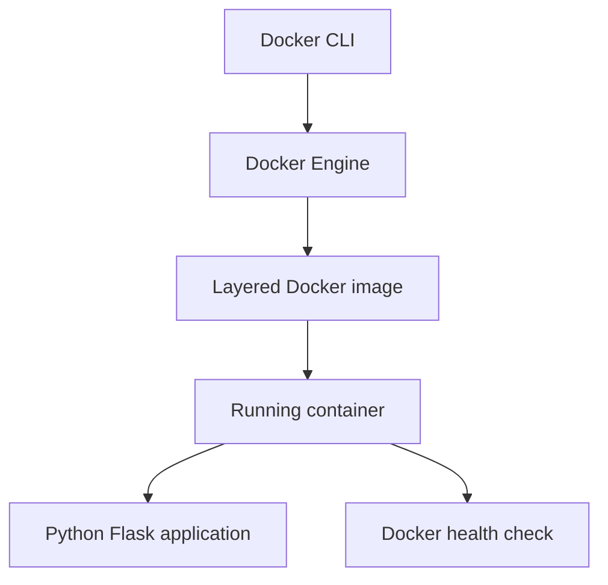
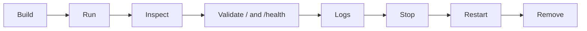

# Assignment 4 - Docker

## 1. Assignment Overview

This assignment explores Docker architecture and commands, creates a Dockerfile, and containerizes a simple Python application. The required implementation is isolated from GyneCare so the existing MERN application remains intact.

The repository contains the Python application, image definition, dependency manifest, build-context exclusions, health check, and complete Docker execution procedure. Docker Engine is an external prerequisite for runtime validation.

## 2. Assignment Objective

Demonstrate the path from source code to image to running container, then inspect, validate, log, stop, restart, and remove the container responsibly.

## 3. Assignment Requirements

1. Explain Docker CLI, Engine, images, containers, layers, registries, volumes, networks, and Dockerfiles.
2. Implement a small Python application with `GET /` and `GET /health`.
3. Build it with a lightweight Docker base image.
4. Install dependencies, expose the application port, use non-root execution, and define startup and health behavior.
5. Execute and document Docker commands and the complete lifecycle without fabricating output.
6. Evaluate MERN containerization separately and avoid damaging the existing application.

## 4. Concepts Covered

An image is an immutable layered package; a container is a running instance of an image. The Docker Engine manages images, containers, networks, and volumes. The CLI sends commands to the Engine. A registry stores images for distribution. A Dockerfile describes image construction; volumes persist data outside a container and networks connect services.

## 5. Technology Stack

- Python 3.12 slim base image
- Flask 3.1.2 and Gunicorn 23.0.0
- Docker Engine and CLI
- Non-root Linux user and Docker health check

## 6. Existing Application Context

GyneCare itself remains in `client/` and `server/`. The demo is deliberately independent because Assignment 4 requires a simple Python container and Docker daemon validation is currently unavailable. See [system architecture](../../../SYSTEM_ARCHITECTURE.md) for the MERN application.

## 7. Architecture



## 8. Repository Components

```text
docker/python-app/
├── app.py
├── requirements.txt
├── Dockerfile
├── .dockerignore
└── README.md
```

- `app.py`: Flask application and two JSON endpoints.
- `requirements.txt`: pinned Flask and Gunicorn dependencies.
- `Dockerfile`: image, environment, working directory, installation, user, port, health check, and command.
- `.dockerignore`: excludes caches, environments, Git metadata, logs, and local secrets.
- This README: implementation and validation guide.

## 9. Implementation

The application returns `{"message": "GyneCare DevOps Docker Demo"}` from `/` and `{"status": "healthy"}` from `/health`. The image runs Gunicorn bound to `0.0.0.0:8080` as `appuser`. The Dockerfile uses `FROM python:3.12-slim`, `ENV`, `WORKDIR`, `COPY`, `RUN`, `USER`, `EXPOSE`, `HEALTHCHECK`, and `CMD`.

## 10. Configuration

The container uses `PORT=8080`, maps host port `8080` to container port `8080`, and does not require secrets. Dependencies are installed with `pip --no-cache-dir`. The runtime user is created during the image build and is not root.

## 11. Commands and Workflow

Run from `docker/python-app/`:

| Command | Purpose in this assignment |
|---|---|
| `docker --version` | Confirm CLI version |
| `docker info` | Confirm Engine availability |
| `docker build -t gynecare-python-demo:local .` | Build image |
| `docker images` | List local images |
| `docker run --name gynecare-python-demo -p 8080:8080 gynecare-python-demo:local` | Start container |
| `docker ps` / `docker ps -a` | Inspect running/all containers |
| `docker logs gynecare-python-demo` | Inspect Gunicorn output |
| `docker exec -it gynecare-python-demo sh` | Inspect a running container when needed |
| `docker inspect gynecare-python-demo` | Inspect configuration and health |
| `docker stop gynecare-python-demo` | Stop the demo container |
| `docker start gynecare-python-demo` | Start it again |
| `docker restart gynecare-python-demo` | Restart it |
| `docker rm gynecare-python-demo` | Remove the demo container |
| `docker rmi gynecare-python-demo:local` | Remove the demo image after cleanup |
| `docker network ls` | Inspect Docker networks |
| `docker volume ls` | Inspect Docker volumes |

Do not remove unrelated containers, images, networks, or volumes.

## 12. Deployment and Validation Procedure



Run:

```bash
docker build -t gynecare-python-demo:local .
docker run --name gynecare-python-demo -p 8080:8080 gynecare-python-demo:local
curl http://localhost:8080/
curl http://localhost:8080/health
docker ps
docker logs gynecare-python-demo
docker inspect gynecare-python-demo
docker stop gynecare-python-demo
docker start gynecare-python-demo
docker restart gynecare-python-demo
docker rm -f gynecare-python-demo
docker rmi gynecare-python-demo:local
```

The Docker Desktop Linux engine must be running before these commands can execute. This report records procedures and expected results, not terminal output. A successful run should produce a tagged local image, a reachable container on port `8080`, JSON responses from `/` and `/health`, visible application logs, a healthy inspection result, and a clean stop/restart/remove sequence.

### Expected successful execution

The complete execution flow is build, run, inspect, send HTTP requests, review logs and health, stop, restart, and remove. Each stage should be checked before advancing to the next stage.

### Reproducibility

Use the repository checkout, Docker Engine, the `docker/python-app/` working directory, and the exact image tag shown above. Repeat the build, run, HTTP validation, inspection, log review, and cleanup sequence without changing the application source.

## 13. Security Considerations

Use a small trusted base image, avoid copying `.env` files, run as non-root, keep dependencies current, do not bake secrets into layers, and inspect the build context. The health endpoint is intentionally unauthenticated because it exposes no sensitive data.

## 14. Monitoring

For this demo, container health, exit state, logs, and resource inspection are the relevant observations. A production deployment would forward logs and health metrics to a platform such as ECS/CloudWatch, but that is not implemented here.

## 15. Troubleshooting

Potential issues include an unavailable Docker daemon, dependency installation failure, host-port conflict, container exit, failed Gunicorn startup, unhealthy `/health`, and accidental inclusion of local files. Check `docker info`, build output, `docker ps -a`, logs, port mappings, and `.dockerignore`. The unavailable daemon is an observed environment limitation, not an application failure.

## 16. Cost Considerations

Local Docker has no cloud runtime charge, but registry storage and hosted container platforms can incur costs. Remove test images, containers, registry artifacts, log groups, and ECS/ACI services when no longer needed.

## 17. Cleanup

Stop the demo container, remove it, then remove the demo image. Inspect networks and volumes before any removal and do not affect unrelated resources. No cleanup result is claimed until the daemon is available.

## 18. Technical Notes

The Python source, dependencies, Dockerfile, and `.dockerignore` are implemented in `docker/python-app/`. Python syntax can be checked independently; image build, endpoint, log, and lifecycle checks require Docker Engine. The MERN application remains uncontainerized by this assignment so its existing architecture is not changed without a validated need.

## 19. Requirement Traceability

| Requirement | Repository implementation | Validation | Evidence |
|---|---|---|---|---|
| Python application | `docker/python-app/app.py` | Python syntax and HTTP endpoint calls | A4-E04 |
| Dockerfile | `docker/python-app/Dockerfile` | Image build and inspect | A4-E02 |
| Docker commands | This README command table | CLI output and logs | A4-E01, A4-E05 |
| Container lifecycle | Run/stop/start/restart/remove workflow | Lifecycle output | A4-E06 |
| Health validation | `/health` endpoint and `HEALTHCHECK` | HTTP response and inspect result | A4-E04 |

## 20. Implementation Evidence

The short [Assignment 4 evidence register](../../../evidence/assignment-4/README.md) lists only the artifacts required to prove execution. It does not duplicate this guide.

## 21. Limitations

The Docker daemon was unavailable. The MERN application was not containerized, and no Compose or registry deployment is claimed. Frontend/backend application validation remains separate from this mandatory Python exercise.

## 22. Future Improvements

Run the lifecycle with Docker Engine, capture actual command evidence, add image scanning, consider a multi-stage build if justified, and evaluate a Compose or ECS deployment only after the existing MERN runtime is validated.

## 23. Conclusion

The required Python container is implemented with a reproducible, non-root, health-checked design. Runtime claims remain pending until Docker Engine execution is possible.
