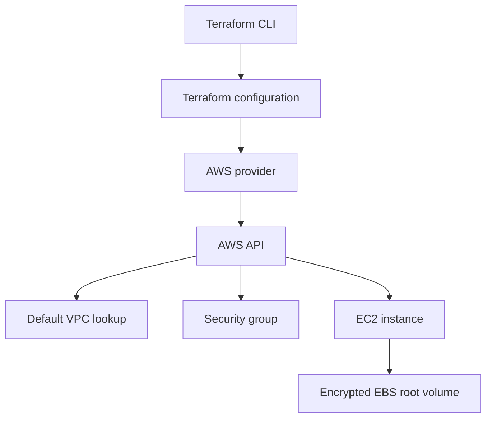

# Assignment 5 - Terraform Infrastructure as Code

## 1. Assignment Overview

This assignment demonstrates Infrastructure as Code by defining an AWS EC2 instance and its security group with Terraform. It builds conceptually on Assignment 2 while avoiding credentials, state files, and automatic provisioning.

The repository contains a complete, bounded EC2 configuration, provider constraints, typed inputs, outputs, state protections, execution workflow, and cleanup procedure. Live provisioning requires an authenticated AWS environment and verified regional inputs.

## 2. Assignment Objective

Describe desired infrastructure declaratively, preview changes, provision only with authorization, inspect outputs, and destroy only resources created by the configuration.

## 3. Assignment Requirements

1. Define the Terraform and AWS provider versions.
2. Use variables for region, AMI, instance type, key, project, environment, subnet, SSH range, and volume size.
3. Create an EC2 resource and security group with encrypted EBS.
4. Expose useful non-secret outputs.
5. Protect state and variable files.
6. Document `init`, `fmt`, `validate`, `plan`, `apply`, `output`, and `destroy`.
7. Validate safely and do not apply without credentials, region/AMI/key verification, cost review, and authorization.

## 4. Concepts Covered

Infrastructure as Code is declarative desired-state configuration. A provider translates Terraform resources to AWS API calls. Variables parameterize environments; outputs expose computed values. The state file maps configuration to real resources. The dependency graph orders resources. `plan` previews changes, `apply` reconciles state, and `destroy` removes managed resources. Idempotency means repeated application converges on the same state; drift is an out-of-band difference. Modules package reusable configuration. Remote state and locking support team workflows.

## 5. Technology Stack

- Terraform >= 1.6.0
- HashiCorp AWS provider ~> 5.0
- AWS EC2, default VPC lookup, security group, encrypted gp3 EBS
- Standard AWS credential resolution; no credentials in files

## 6. Existing Application Context

GyneCare is an existing React/Vite and Express/Mongoose application using MongoDB. This configuration provisions only an EC2 host and access controls; it does not replace application code or provision MongoDB. See [system architecture](../../../SYSTEM_ARCHITECTURE.md) and [Assignment 2](../assignment-2-aws-ec2/README.md).

## 7. Architecture



The default VPC and caller-supplied subnet are deliberate bounded assumptions. They must be verified before planning.

## 8. Repository Components

```text
infrastructure/terraform/aws-ec2/
├── versions.tf
├── provider.tf
├── main.tf
├── variables.tf
├── outputs.tf
├── terraform.tfvars.example
├── .gitignore
└── README.md
```

- `versions.tf`: Terraform and AWS provider constraints.
- `provider.tf`: AWS region and default tags.
- `main.tf`: default VPC data lookup, security group, EC2 instance, and encrypted EBS.
- `variables.tf`: typed configurable inputs.
- `outputs.tf`: instance identifiers and addresses.
- `terraform.tfvars.example`: placeholders only.
- `.gitignore`: state, plugins, variable files, and crash logs.
- This README: complete workflow and traceability.

## 9. Implementation

The configuration defines `aws_security_group.gynecare` and `aws_instance.gynecare`. The security group permits SSH only from `ssh_cidr_blocks`, HTTP/HTTPS from the Internet, and all outbound traffic. The instance uses a caller-supplied AMI, key pair, subnet, type, public address, and encrypted gp3 root volume. No MongoDB port is opened.

## 10. Configuration

Implemented variables are:

| Variable | Purpose |
|---|---|
| `aws_region` | Provider region |
| `project_name` | Resource names/tags |
| `environment` | Environment tag |
| `ami_id` | Verified regional Linux AMI |
| `instance_type` | EC2 capacity |
| `key_name` | Existing EC2 key pair |
| `subnet_id` | Existing subnet in the default VPC |
| `ssh_cidr_blocks` | Restricted administrative source ranges |
| `root_volume_size` | Encrypted EBS size |

Implemented outputs are `instance_id`, `public_ip`, `private_ip`, `public_dns`, and `availability_zone`. They expose infrastructure metadata, not secrets.

Create a local variable file from the example:

```bash
cp terraform.tfvars.example terraform.tfvars
```

Replace placeholders locally. `terraform.tfvars` is ignored and must not be committed.

## 11. Commands and Workflow

Run from this directory:

```bash
terraform init
terraform fmt
terraform fmt -check
terraform validate
terraform plan -var-file=terraform.tfvars
terraform apply -var-file=terraform.tfvars
terraform output
terraform destroy -var-file=terraform.tfvars
```

- `init` downloads providers.
- `fmt` standardizes configuration; `fmt -check` verifies it.
- `validate` checks syntax and internal consistency without contacting AWS for provisioning.
- `plan` previews resources and must be reviewed.
- `apply` creates or changes resources and requires explicit authorization.
- `output` displays declared outputs after state exists.
- `destroy` removes resources managed by this configuration and must never target unrelated infrastructure.

The command sequence above is the complete execution workflow. Each command should be reviewed before advancing to the next stage; no terminal output is embedded in this report.

## 12. Deployment and Validation Procedure

Before `apply`, verify Terraform installation, AWS identity, region, AMI, key pair, subnet/VPC relationship, expected plan, cost, and cleanup ownership. The intended validation sequence is `fmt`, `fmt -check`, `init`, `validate`, and reviewed `plan`.

### Expected successful execution

Successful execution should show the AWS provider initializing, formatting checks passing, validation accepting the configuration, a plan containing the intended EC2 and security-group resources, outputs for the instance attributes after apply, and a destroy plan limited to resources managed by this state.

### Reproducibility

Use the pinned provider constraints, a copied local `terraform.tfvars` with verified values, standard AWS credential resolution, and the command sequence in this README. Review the plan before apply and preserve the state needed for controlled cleanup.

## 13. Security Considerations

Use AWS profiles, environment-based credentials, or instance roles. Never put access keys in provider files or variables. Protect `.terraform/`, state, `.tfvars`, crash logs, SSH private keys, and environment files. State can contain sensitive infrastructure details; teams should use encrypted remote state with locking. Restrict SSH CIDRs and keep database ports closed.

## 14. Monitoring

Terraform itself reports planned infrastructure changes; EC2 and CloudWatch monitor the resulting instance. After an authorized apply, inspect instance state, status checks, CPU, network, EBS, application health, and logs. Terraform does not replace runtime monitoring.

## 15. Troubleshooting

Potential issues include Terraform missing from `PATH`, provider authentication failure, invalid AMI for the selected region, missing key pair, invalid subnet/VPC relationship, provider version mismatch, plan errors, state locks, and drift. Resolve identity, region, inputs, and state ownership before retrying. No such issue is claimed as an observed deployment failure.

## 16. Cost Considerations

EC2 runtime, EBS storage, public addressing, data transfer, and CloudWatch usage can incur costs. Review the plan and account budget before apply. Stop or terminate the instance, remove unused volumes and addresses, and destroy only resources created for the exercise. See [cost management](../../cost-management.md).

## 17. Cleanup

Use `terraform destroy -var-file=terraform.tfvars` only when the state belongs to this configuration and the resources are disposable. Review the plan, confirm ownership, then inspect the account for retained EBS, addresses, snapshots, logs, and security groups. No destroy operation was run.

## 18. Technical Notes

Terraform CLI, AWS CLI, AWS credentials, verified regional inputs, and a live account are external execution requirements. The configuration is intentionally not applied automatically. State and provider caches remain local and ignored by Git.

## 19. Requirement Traceability

| Requirement | Repository implementation | Validation | Evidence |
|---|---|---|---|---|
| Provider | `versions.tf`, `provider.tf` | `terraform init` and `validate` | A5-E01, A5-E03 |
| Variables | `variables.tf`, example tfvars | `fmt` and reviewed inputs | A5-E02 |
| EC2 and security group | `main.tf` | Reviewed `plan` | A5-E04 |
| Outputs | `outputs.tf` | `terraform output` after apply | A5-E05 |
| State protection | `.gitignore` and workflow | Ignore/state review | A5-E01 |
| Destroy lifecycle | Workflow in this README | Destroy result | A5-E06 |

## 20. Implementation Evidence

See the short [Assignment 5 evidence register](../../../evidence/assignment-5/README.md). It contains only required evidence metadata, not another Terraform tutorial.

## 21. Limitations

Terraform CLI, AWS CLI, AWS credentials, verified regional inputs, and a live account are unavailable. Therefore no plan, apply, output, instance, or destroy result is claimed.

## 22. Future Improvements

Add validated remote state and locking for team use, reusable modules only when repetition appears, optional user-data after application startup is proven, and CI validation that never applies infrastructure automatically.

## 23. Conclusion

The Terraform configuration demonstrates provider, variables, resources, outputs, dependencies, security controls, and state discipline while keeping cloud execution explicit and reversible.
